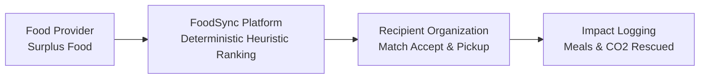

# FoodSync AI

> **Real-Time Food Waste Redistribution Platform**  
> *Connecting surplus food providers with local recipient organizations in real time.*

[](https://github.com/KShruti772/FoodSync-AI)
[](https://github.com/KShruti772/FoodSync-AI)

---

## 📌 Problem Statement

Every day, commercial food providers (restaurants, caterers, grocery stores, and event organizers) produce surplus, edible food that goes to waste due to the lack of rapid, reliable redistribution channels. Concurrently, nearby recipient organizations (shelters, food banks, orphanages) struggle with food insecurity.

## 💡 Our Solution

FoodSync AI provides an intelligent, automated food redistribution system that validates surplus listings, executes deterministic multi-factor compatibility & urgency ranking, notifies the best-matched nearby organizations, coordinates logistics, and quantifies social and environmental impact.

---

## 🏗️ System Architecture & Workflow



### Official Finalized Stack:
- **Frontend**: Next.js (App Router) + TypeScript + Tailwind CSS
- **Backend**: Python + FastAPI + Pydantic + SQLAlchemy 2.x + Alembic
- **Primary Database**: PostgreSQL 15+
- **Authentication**: Argon2id + Short-lived JWT (24h)
- **Testing**: Pytest + HTTPX (Backend), Vitest (Frontend), Playwright (E2E)

---

## 📚 Project Documentation & Implementation Contracts

All features and development workflows are governed by these authoritative contracts in `docs/`:

| Document | Purpose |
| :--- | :--- |
| 📖 **[Project Overview](docs/PROJECT_OVERVIEW.md)** | Problem statement, standard terminology, user roles, redistribution lifecycle, and MVP vs Phase 2 scope. |
| 🏛️ **[System Architecture](docs/ARCHITECTURE.md)** | Multi-tier architecture, layer responsibilities, system design vs methodology, and state machine. |
| 🛠️ **[Development Guide](docs/DEVELOPMENT_GUIDE.md)** | Directory layout, code ownership, naming conventions, layer boundaries, and "Do Not" rules. |
| 📡 **[API Contract](docs/API_CONTRACT.md)** | Standard REST `/api/v1` contracts, Pydantic schemas, privacy masking, error codes, and examples. |
| 🗄️ **[Database Schema](docs/DATABASE_SCHEMA.md)** | PostgreSQL relational schema, ER diagram, field types, constraints, indexes, and relationships. |
| 🧠 **[AI Matching Engine](docs/AI_MATCHING.md)** | Deterministic multi-factor heuristic scoring formula, Haversine distance, tie-breaking, and test cases. |
| 🎨 **[UI Guidelines](docs/UI_GUIDELINES.md)** | Tailwind design tokens, typography, component catalog, user journeys, and privacy reveal rules. |
| 🧪 **[Testing Guide](docs/TESTING_GUIDE.md)** | Pytest + HTTPX test strategy, mandatory security/concurrency/privacy test matrices, and commands. |
| 🔒 **[Security Guidelines](docs/SECURITY_GUIDELINES.md)** | Argon2id hashing, admin registration protection, Pydantic validation, RBAC, double-reservation prevention, and CORS. |
| 👥 **[Team Workflow](docs/TEAM_WORKFLOW.md)** | Git branching, shared `main` rules, PR review policy, doc synchronization, and daily commands. |

---

## 👥 Team & Role Distribution

| Teammate | Role | Primary Assigned Branch |
| :--- | :--- | :--- |
| **Shruti** | **Team Lead / Backend + AI / System Architecture** | `feature/backend-ai` |
| **Lokeshwari** | **Database Developer** | `feature/database` |
| **Atharva** | **Frontend Developer** | `feature/frontend` |
| **Vishwajeet** | **Testing / UI QA** | `feature/ui-testing` |
| **All Team** | **Integration / Staging** | `main` *(Protected)* |

---

## 📂 Repository Structure

```
FoodSync-AI/
├── docs/                              # Frozen architecture & implementation contracts
├── frontend/                          # Next.js + Tailwind CSS client
├── backend/                           # FastAPI REST API, SQLAlchemy models & services
│   ├── alembic/                       # Alembic database migrations
│   ├── app/                           # Backend application source code
│   └── tests/                         # Pytest unit and integration test suites
├── tests/                             # End-to-end test suites
│   └── e2e/                           # Playwright browser test suites
├── .env.example                       # Template for environment configuration
├── .gitignore                         # Version control exclusions
└── README.md                          # Root project overview & navigation
```

---

## 🚦 Project Status

> [!IMPORTANT]
> **Architecture is frozen; no blocking architectural decisions remain.**  
> Ready for module implementation on feature branches.