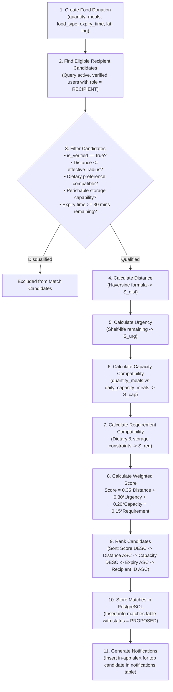
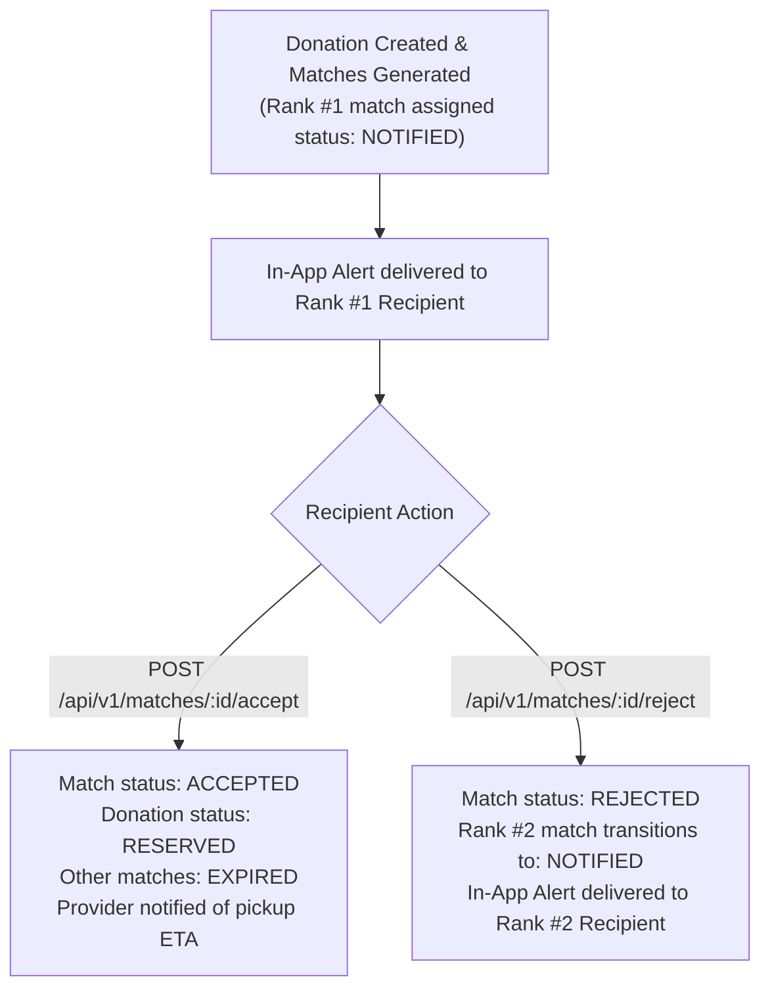

# AI Matching Engine — FoodSync AI

> **Status**: Architecture Frozen — MVP Heuristic Scoring Specification  
> **Module Owner**: Shruti (`feature/backend-ai`)  
> **Location**: `backend/app/services/matching/`  
> **Repository**: [KShruti772/FoodSync-AI](https://github.com/KShruti772/FoodSync-AI)  
> **Engine Type**: Deterministic Multi-Factor Heuristic Scoring & Ranking (No Machine Learning / No LLMs)

---

## 1. Engine Objective & Architectural Scope

The FoodSync AI Matching Engine is a **transparent, deterministic heuristic ranking service** located in `backend/app/services/matching/`. Its sole responsibility is to evaluate available surplus food donations and rank verified nearby recipient organizations using verifiable mathematical criteria.

### Engineering Philosophy:
- **Deterministic Heuristic for MVP (Not a Trained ML Model)**: The MVP does **not** use deep neural networks, embeddings, Large Language Models, vector databases, or external AI APIs. It relies on a mathematical multi-factor formula.
- **Modular Design for Future ML**: The matching service is designed with a clean, decoupled interface so that a future trained machine learning model or route optimization engine can augment or replace the heuristic without breaking API contracts or downstream services.
- **Explainability**: Every match output includes a complete breakdown of component sub-scores so that recommendations can be audited and debugged.
- **Configurable Heuristics**: All numeric weights and distance thresholds are **configurable MVP heuristics** defined in environment variables (`.env`), not hardcoded or claimed as scientifically validated constants.
- **Synchronous Execution**: The matching algorithm executes **synchronously** within the `POST /api/v1/donations` request handler, immediately writing ranked rows to the PostgreSQL `matches` table and generating in-app notifications.
- **Side-Effect Free Queries**: The endpoint `GET /api/v1/donations/{id}/matches` is purely a read-only query that retrieves pre-computed matches from the database with **zero side effects**.

---

## 2. Matching Pipeline Flow



---

## 3. Mathematical Scoring Framework

The total compatibility score $S_{total} \in [0.0, 1.0]$ between a donation $D$ and a candidate recipient $R$ is calculated as:

$$\text{Score} = 0.35 \times \text{Distance} + 0.30 \times \text{Urgency} + 0.20 \times \text{Capacity} + 0.15 \times \text{Requirement}$$
$$S_{total} = w_{dist} \cdot S_{dist} + w_{urg} \cdot S_{urg} + w_{cap} \cdot S_{cap} + w_{req} \cdot S_{req}$$

### Final Default Heuristic Weights:
$$\sum w_i = 1.00 \quad \implies \quad w_{dist} = 0.35, \quad w_{urg} = 0.30, \quad w_{cap} = 0.20, \quad w_{req} = 0.15$$

*(All weights are configurable in `.env` via `MATCH_WEIGHT_DISTANCE`, `MATCH_WEIGHT_URGENCY`, `MATCH_WEIGHT_CAPACITY`, and `MATCH_WEIGHT_REQUIREMENT`).*

---

### 3.1 Geographic Radius & Proximity Score ($S_{dist}$)

#### Authoritative Effective Radius Rule:
$$\text{effective\_radius} = \min(\text{system\_max\_radius}, \; R.\text{max\_travel\_distance\_km})$$
Where $\text{system\_max\_radius} = 15.0\text{ km}$ (default configurable heuristic).

#### Distance Calculation (Haversine Formula):
Physical distance $d$ in kilometers between provider coordinates $(\text{lat}_D, \text{lng}_D)$ and recipient coordinates $(\text{lat}_R, \text{lng}_R)$ is calculated as:

$$d = 2r \arcsin \left( \sqrt{\sin^2\left(\frac{\Delta \text{lat}}{2}\right) + \cos(\text{lat}_D)\cos(\text{lat}_R)\sin^2\left(\frac{\Delta \text{lng}}{2}\right)} \right)$$

Where Earth's mean radius $r = 6371.0\text{ km}$.

#### Filtering & Normalization:
- **Hard Filter**: If $d > \text{effective\_radius}$, the candidate is **disqualified** and excluded from the candidate pool.
- **Normalized Score**:
  $$S_{dist} = 1.0 - \frac{d}{\text{effective\_radius}}$$
  *(When $d = 0\text{ km} \implies S_{dist} = 1.0$; when $d = \text{effective\_radius} \implies S_{dist} = 0.0$)*.

---

### 3.2 Expiry & Time Urgency Score ($S_{urg}$)

Calculates urgency based on the remaining shelf-life $T_{remain} = T_{expiry} - T_{current}$:

$$S_{urg} = 
\begin{cases} 
0.0 & \text{if } T_{remain} < 30\text{ minutes} \quad \text{(Disqualified: insufficient time to transport)} \\
1.0 & \text{if } 30\text{ minutes} \le T_{remain} \le 2\text{ hours} \quad \text{(Critical Urgency)} \\
0.8 & \text{if } 2\text{ hours} < T_{remain} \le 6\text{ hours} \quad \text{(High Urgency)} \\
0.5 & \text{if } 6\text{ hours} < T_{remain} \le 24\text{ hours} \quad \text{(Moderate Urgency)} \\
0.3 & \text{if } T_{remain} > 24\text{ hours} \quad \text{(Stable / Non-urgent)}
\end{cases}$$

---

### 3.3 Quantity & Capacity Fit Score ($S_{cap}$)

Compares donation quantity $Q_D$ (`quantity_meals`) against recipient daily capacity $C_R$ (`daily_capacity_meals`):
*(Both variables are strictly measured in harmonized **`MEALS`** units).*

$$S_{cap} = 
\begin{cases}
1.0 & \text{if } 0.5 \cdot C_R \le Q_D \le C_R \quad \text{(Ideal Fit: 50\%–100\% capacity utilization)} \\
\dfrac{Q_D}{0.5 \cdot C_R} & \text{if } Q_D < 0.5 \cdot C_R \quad \text{(Under-utilization: small batch for large organization)} \\
\max\left(0.0, \; 1.0 - \dfrac{Q_D - C_R}{C_R}\right) & \text{if } Q_D > C_R \quad \text{(Capacity Overrun: candidate requires partial batch)}
\end{cases}$$

---

### 3.4 Dietary Preference Score ($S_{pref}$)

Evaluates compatibility against `recipient_profiles.dietary_preferences`:

- If `dietary_preferences == 'ALL'`: $S_{pref} = 1.0$ for all food types.
- If `dietary_preferences == 'VEGETARIAN_ONLY'`:
  - If `food_type IN ('VEGETARIAN_COOKED', 'PACKAGED_GROCERY', 'PRODUCE_RAW', 'BAKERY')`: $S_{pref} = 1.0$
  - If `food_type == 'NON_VEGETARIAN_COOKED'`: **Disqualified** ($S_{pref} = 0.0$, excluded from candidate pool).
- If `dietary_preferences == 'VEGAN_ONLY'`:
  - If non-dairy/vegan compatible: $S_{pref} = 1.0$.
  - Otherwise: **Disqualified**.

---

### 3.5 Storage Type Hard Filter

- If donation is `perishable == true` and recipient's `storage_types` (JSONB) does **not** contain `"REFRIGERATED"` or `"FROZEN"`, the candidate is **hard-disqualified**.

---

## 4. Deterministic Tie-Breaking Protocol

To ensure absolute repeatability in tests and production, if two candidate recipients produce identical total compatibility scores ($S_{total}$), ties are broken strictly in the following priority order:

```
1. Compatibility Score (Descending)     -> Highest score first
2. Distance (Ascending)                 -> Nearest candidate first
3. Recipient Daily Capacity (Descending)-> Higher capacity organization first
4. Earlier Expiry Time (Ascending)      -> Most urgent window first
5. Recipient User ID (Ascending)        -> Alphabetical tie-breaker (Strict Determinism)
```

---

## 5. Input & Output Contract

### Engine Invocation Input (Internal Python Service Call):
```python
# Internal service invocation from donation_service.py
ranked_matches = matching_service.find_and_create_matches(
    db_session=session,
    donation_id="don_11223344",
    quantity_meals=50,
    food_type="VEGETARIAN_COOKED",
    perishable=True,
    expiry_time=datetime(2026, 9, 2, 19, 0, tzinfo=timezone.utc),
    latitude=18.5204,
    longitude=73.8567
)
```

### Stored Match Record & API Response (EXAMPLE DATA ONLY):
```json
{
  "match_id": "mat_554433",
  "donation_id": "don_11223344",
  "recipient_id": "usr_rcp_001",
  "recipient_name": "Hope Children Shelter",
  "compatibility_score": 0.92,
  "distance_km": 2.4,
  "status": "PROPOSED",
  "rank": 1,
  "matched_factors": {
    "distance_score": 0.84,
    "urgency_score": 1.00,
    "capacity_fit_score": 1.00,
    "dietary_preference_score": 1.00
  }
}
```

---

## 6. Deterministic Test Case Matrix

The test suite in `backend/tests/unit/test_matching_engine.py` must validate the following explicit scenarios:

| Test ID | Test Scenario | Input Conditions | Expected Outcome |
| :--- | :--- | :--- | :--- |
| `TC-MAT-01` | **Same Location** | Provider & Recipient at exact same lat/lng ($d = 0.0\text{ km}$) | $S_{dist} = 1.00$. Highest possible distance score. |
| `TC-MAT-02` | **Exact Maximum Radius** | $d = \text{effective\_radius} = 15.0\text{ km}$ | $S_{dist} = 0.00$. Qualified with minimum distance score. |
| `TC-MAT-03` | **Outside Radius** | $d = 15.1\text{ km} > \text{effective\_radius}$ | **Hard-Disqualified**. Candidate omitted from `matches`. |
| `TC-MAT-04` | **Expired / Too Soon** | $T_{remain} = 20\text{ mins} < 30\text{ mins}$ | **Disqualified**. Matching engine rejects or returns empty list. |
| `TC-MAT-05` | **Incompatible Dietary** | Non-veg food donation; Recipient profile is `VEGETARIAN_ONLY` | **Hard-Disqualified**. $S_{pref} = 0.0$, omitted from matches. |
| `TC-MAT-06` | **Capacity Overrun** | $Q_D = 200\text{ meals}$, Recipient capacity $C_R = 100\text{ meals}$ | $S_{cap} = 0.00$. Score heavily penalized. |
| `TC-MAT-07` | **Multiple Candidates** | 3 qualified candidates at $2\text{ km}$, $6\text{ km}$, and $10\text{ km}$ | Output matches sorted in strict descending order of $S_{total}$. |
| `TC-MAT-08` | **Equal Scores (Tie)** | 2 candidates with identical $S_{total} = 0.85$, $d_1 = 3.0\text{ km}, d_2 = 5.0\text{ km}$ | Candidate 1 ranked #1 (Distance tie-breaker). |
| `TC-MAT-09` | **Storage Incompatible**| Perishable cooked meal; Recipient `storage_types = '["DRY"]'` | **Hard-Disqualified** (Lacks refrigeration/freezer). |

---

## 7. Match Acceptance & Rejection Workflow (No Background Schedulers)

For MVP reliability, coordination follows an explicit event-driven cycle:



---

## 8. Architectural Status

> [!IMPORTANT]
> **Architecture is frozen; no blocking architectural decisions remain.**
