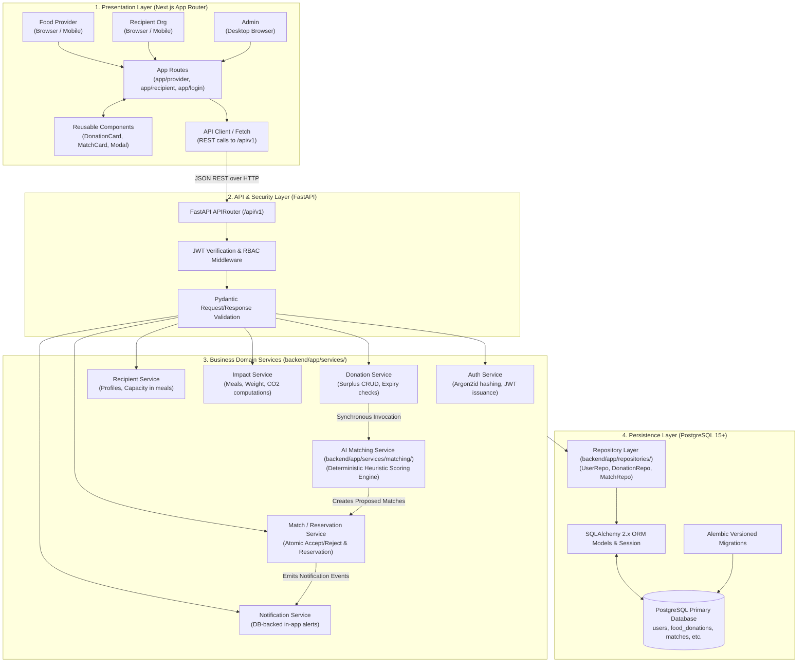
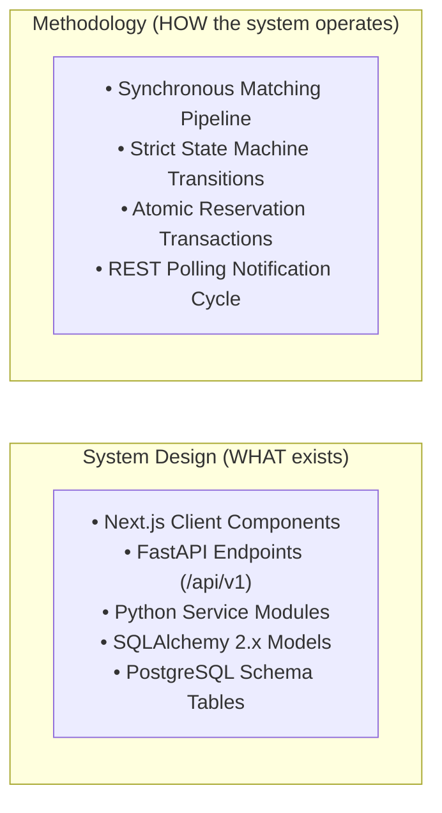
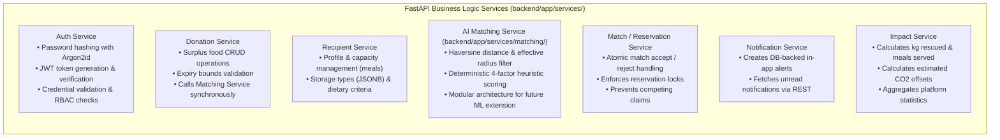
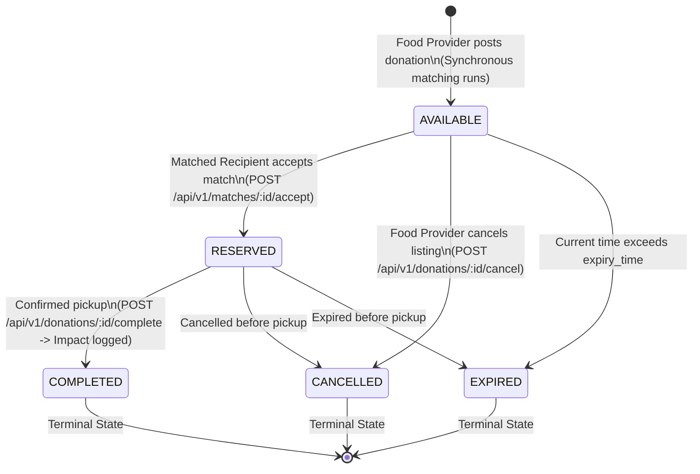

# System Architecture — FoodSync AI

> **Status**: Architecture Frozen — Single Source of Truth  
> **Repository**: [KShruti772/FoodSync-AI](https://github.com/KShruti772/FoodSync-AI)

---

## 1. Finalized MVP Technology Stack & Rationale

The FoodSync AI MVP stack is frozen as follows:

| Layer / Concern | Selected Technology | Role & Architectural Scope |
| :--- | :--- | :--- |
| **Frontend Framework** | **Next.js + TypeScript** | React-based web client using Next.js App Router for server/client component rendering and state management. |
| **Styling System** | **Tailwind CSS** | Utility-first, responsive design system adhering to accessible contrast tokens. |
| **Backend Framework** | **Python + FastAPI** | High-performance asynchronous REST API framework with Pydantic validation. |
| **Request & Schema Validation**| **Pydantic** | Strict runtime type-checking, payload sanitization, and automatic response filtering. |
| **Data Access / ORM** | **SQLAlchemy 2.x** | Type-safe relational mapping, unit-of-work session management, and parameterized queries. |
| **Database Migrations** | **Alembic** | Version-controlled, declarative database schema migrations. |
| **Primary Database** | **PostgreSQL 15+** | Relational persistence, strict foreign key and check constraints, ACID transactions, and spatial queries. |
| **Authentication & Hashing** | **Argon2id + JWT** | Cryptographically secure password hashing (`passlib[argon2]`) and signed 24h JWT access tokens. |
| **Automated Testing** | **Pytest + HTTPX** (Backend)<br>**Vitest** (Frontend)<br>**Playwright** (E2E) | Unit tests for domain scoring, API integration tests with FastAPI `TestClient`, and browser flows. |
| **API Style** | **REST (JSON over HTTP)** | Standardized HTTP methods (`GET`, `POST`, `PATCH`, `DELETE`) with `/api/v1` prefix. |
| **Matching Execution** | **Synchronous Heuristic** | Executed directly within the donation creation request cycle for MVP simplicity and zero queue overhead. |
| **Notifications** | **Database-Backed In-App** | Stored in PostgreSQL `notifications` table, retrieved by the frontend via REST polling. |

### Architectural Rationale for Framework Choices:
1. **Why FastAPI & Python**:
   - **AI/Data-Science Roadmap**: FoodSync AI's matching roadmap requires direct mathematical computation and future data-science/ML libraries. Python provides native integration without multi-language IPC overhead.
   - **Automated Contracts & Validation**: FastAPI natively couples Pydantic validation with automatic OpenAPI (Swagger) schema generation, ensuring strict contract enforcement.
2. **Why PostgreSQL**:
   - **Relational Integrity**: FoodSync AI operates heavily connected business entities (users, donations, recipient profiles, matches, notifications, impact logs) that require strict foreign key cascades, check constraints, and ACID transactions.
   - **Concurrency Safety**: Atomic conditional updates and row-level locking in PostgreSQL prevent double-reservation race conditions when multiple recipients view the same surplus listing.
   - *Note on SQLite/MongoDB*: MongoDB is not supported. SQLite is never used for production and may only serve as an optional, isolated in-memory test utility.

---

## 2. High-Level Architecture Flow

FoodSync AI is structured as a clean, modular monolith with decoupled frontend and backend applications. The strict one-way dependency direction is:

```text
Frontend (Next.js Client)
    ↓ (REST JSON /api/v1 over HTTP)
Backend API (FastAPI Route Controllers & Middleware)
    ↓ (Pydantic Schemas & DTOs)
Domain / Business Services (Auth, Donation, Recipient, Matching, Reservation, Notification, Impact)
    ↓ (Entity Repositories)
Repositories / Data Access (SQLAlchemy 2.x Queries)
    ↓ (Declarative ORM Mapping)
SQLAlchemy Models
    ↓ (ACID Transactions)
PostgreSQL 15+
```



---

## 3. Core Distinction: System Design vs. Methodology

To maintain conceptual clarity across the engineering team:



| Dimension | Definition | Scope in FoodSync AI MVP |
| :--- | :--- | :--- |
| **System Design** *(WHAT exists)* | The static architectural topology, physical codebase structure, module boundaries, database tables, and API contracts. | Directory layouts, FastAPI routes, Pydantic schemas, SQLAlchemy models, PostgreSQL tables (`DATABASE_SCHEMA.md`), design tokens (`UI_GUIDELINES.md`). |
| **Methodology** *(HOW the system operates)* | The dynamic runtime lifecycle, business rules, mathematical scoring formulas, state transitions, and coordination patterns. | Synchronous donation-matching workflow, state transition rules (`AVAILABLE` $\rightarrow$ `RESERVED` $\rightarrow$ `COMPLETED`), heuristic scoring equation ($w_{dist}, w_{urg}, w_{cap}, w_{req}$). |

---

## 4. Module & Service Responsibilities



### 1. Auth Service
- Hashes passwords using **Argon2id**.
- Issues signed, 24-hour JWT access tokens containing user ID and role.
- Validates bearer tokens on protected endpoints via FastAPI dependency injection.

### 2. Donation Service
- Handles creation, retrieval, and cancellation of surplus listings.
- Enforces data integrity (e.g. `quantity_meals > 0`, `expiry_time > now() + 30m`).
- Synchronously invokes the `AI Matching Service` when a new donation is created.

### 3. Recipient Service
- Manages recipient organization profiles (daily meal capacity, storage facilities, dietary preferences).
- Supplies verified recipient constraints to the matching engine.

### 4. AI Matching Service (`backend/app/services/matching/`)
- Encapsulates the deterministic multi-factor scoring formula:
  $$\text{Score} = 0.35 \times \text{Distance} + 0.30 \times \text{Urgency} + 0.20 \times \text{Capacity} + 0.15 \times \text{Requirement}$$
  $$S_{total} = 0.35 \cdot S_{dist} + 0.30 \cdot S_{urg} + 0.20 \cdot S_{cap} + 0.15 \cdot S_{req}$$
- Distance initially uses Haversine calculation.
- Filters candidates based on active verification, effective radius ($\min(15\text{ km}, R.\text{max\_travel\_distance\_km})$), and dietary/storage compatibility.
- Ranks candidates with strict deterministic tie-breaking and persists records to PostgreSQL.
- Designed with a clean modular interface so a future trained ML model can augment or replace the heuristic without altering downstream services. (The MVP matching system is a deterministic weighted heuristic, not a trained ML model).

### 5. Match / Reservation Service
- Processes recipient actions (`POST /api/v1/matches/{match_id}/accept` and `POST /api/v1/matches/{match_id}/reject`).
- Atomically verifies:
  1. Authenticated user is the intended candidate recipient.
  2. Match exists in `PROPOSED` or `NOTIFIED` status.
  3. Associated donation is still in `AVAILABLE` status and unexpired.
  4. Competing reservation does not already exist.
- Performs atomic database state transition to `RESERVED` and sets competing matches to `EXPIRED`.
- Unlocks exact pickup details and donor contact info to the authorized accepted recipient.

### 6. Notification Service
- Creates database records in `notifications` table on match generation, reservation, and completion.
- Serves unread alerts to frontend dashboards via standard REST polling (`GET /api/v1/notifications`).

### 7. Impact Service
- Computes verified social and environmental impact ($\text{meals rescued} = Q_D$, $\text{weight} = Q_D \times 0.5\text{ kg}$, $\text{CO}_2\text{ offset} = \text{weight} \times 2.5$).
- Records immutable completed records in `impact_logs`.

---

## 5. Domain Lifecycle & State Machine



### Valid State Transitions:
1. `AVAILABLE` $\rightarrow$ `RESERVED`: Recipient accepts proposed match.
2. `RESERVED` $\rightarrow$ `COMPLETED`: Recipient/Provider confirms food transfer (impact record created).
3. `AVAILABLE` $\rightarrow$ `CANCELLED`: Provider withdraws available listing.
4. `RESERVED` $\rightarrow$ `CANCELLED`: Transaction cancelled before pickup.
5. `AVAILABLE / RESERVED` $\rightarrow$ `EXPIRED`: System or query detects `now() > expiry_time`.

---

## 6. Architectural Status

> [!IMPORTANT]
> **Architecture is frozen; no blocking architectural decisions remain.**
