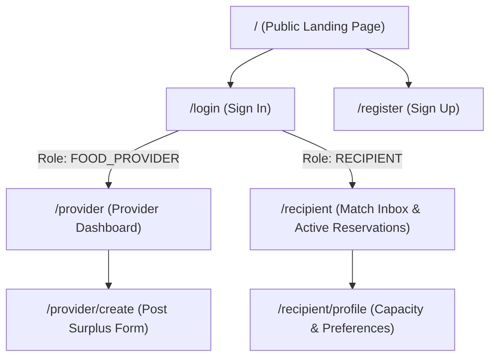
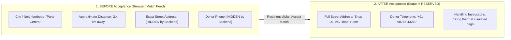

# Atharva's Frontend Developer Guide — FoodSync AI

> **Status**: Architecture Frozen — Authoritative Handbook for Frontend Development  
> **Target Audience**: Atharva (Frontend Developer)  
> **Assigned Working Branch**: `feature/frontend`  
> **Primary Role**: Frontend Developer (Next.js App Router, TypeScript, Tailwind CSS, API Integration, Client State)  
> **Primary Repository Codebase Area**: `frontend/`  
> **Repository**: [KShruti772/FoodSync-AI](https://github.com/KShruti772/FoodSync-AI)

---

## 🌟 Core Team Principle

> **"Atharva brings FoodSync AI to life in the browser. He implements the production Next.js web application, TypeScript components, Tailwind CSS styling, client-side state, and REST API communication based on Vishwajeet's UI/UX specifications. Vishwajeet leads UI/UX design specifications, wireframes, and QA testing across all test suites. Shubham implements the FastAPI backend, API routes, and domain services. Lokeshwari builds the database models, repositories, and migrations. Shruti leads the team, system architecture, and AI matching engine."**

---

## 👥 Final Team Ownership Model

| Teammate | Role | Assigned Branch | Scope & Owned Directories |
| :--- | :--- | :--- | :--- |
| **Shruti** | **Team Lead / AI / Architecture** | `feature/ai-matching` | `backend/app/services/matching/` *(Matching Algorithm & Scoring Logic)*<br>System Architecture, Project Lead, Cross-Layer Coordination |
| **Shubham** | **Backend Developer** | `feature/backend` | `backend/app/api/`<br>`backend/app/core/`<br>`backend/app/schemas/`<br>`backend/app/services/` *(Domain Services except matching engine)*<br>`backend/app/utils/`<br>`backend/app/main.py` |
| **Atharva** | **Frontend Developer** | `feature/frontend` | `frontend/app/`<br>`frontend/components/`<br>`frontend/hooks/`<br>`frontend/lib/`<br>`frontend/services/`<br>`frontend/types/`<br>*(Next.js App Router, TypeScript & Tailwind CSS)* |
| **Lokeshwari** | **Database Developer** | `feature/database` | `backend/app/models/`<br>`backend/app/repositories/`<br>`backend/alembic/`<br>*(PostgreSQL Schema, SQLAlchemy 2.x Models & Migrations)* |
| **Vishwajeet** | **UI/UX + Testing / QA Lead** | `feature/ui-testing` | `frontend/components/__tests__/` *(Component UI Tests)*<br>`backend/tests/` *(Backend Unit & Integration Tests)*<br>`tests/e2e/` *(Playwright Browser E2E Tests)*<br>`docs/` *(UI/UX Specs, Test Matrices & User Flows)* |

---

# SECTION 1 — Welcome & Role Definition

Welcome to the **FoodSync AI** engineering team, Atharva!

As the **Frontend Developer**, you own the entire user-facing web experience. You transform wireframes, user journeys, and REST API contracts into an intuitive, responsive, accessible, and fast web application.

### Your High-Level Responsibilities:
1. **Next.js App Router**: Build structured pages and layouts in `frontend/app/` for Food Providers and Recipients.
2. **Modular UI Components**: Construct reusable, accessible React components in `frontend/components/` using Tailwind CSS.
3. **TypeScript Interfaces**: Maintain strict type definitions in `frontend/types/` matching backend Pydantic schemas.
4. **API Integration & Client Services**: Implement clean HTTP fetch wrappers in `frontend/services/` to communicate with Shubham's FastAPI backend.
5. **Client State & Custom Hooks**: Manage authentication tokens, current user session, and in-app notification polling via `frontend/hooks/`.
6. **UI Feedback States**: Implement the 6 mandatory UI states (Loading, Empty, Success, Error, Disabled, Unauthorized) across every view.
7. **Privacy UX Compliance**: Strictly enforce location privacy (masking exact street addresses until a match is accepted).

---

# SECTION 2 — Frontend vs. UI/UX (Crucial Distinction)

To ensure seamless teamwork between Atharva and Vishwajeet, understand this separation of responsibilities:

```text
┌─────────────────────────────────────────────────────────────┐
│ VISHWAJEET (UI/UX Design & QA)                              │
│ • Defines what the user sees, feels, and experiences.       │
│ • Creates user flows, wireframes, and screen requirements.  │
│ • Defines accessibility rules (WCAG 2.1 AA) and states.     │
│ • Writes test cases and tests Atharva's built UI.           │
├─────────────────────────────────────────────────────────────┤
│ ATHARVA (Frontend Implementation)                           │
│ • Writes the production Next.js, React, and TypeScript code.│
│ • Styles components using Tailwind CSS utility classes.     │
│ • Connects buttons and forms to FastAPI REST endpoints.     │
│ • Manages client state, localStorage, and token lifecycle.  │
│ • Resolves frontend bugs reported by Vishwajeet.            │
└─────────────────────────────────────────────────────────────┘
```

### Practical Example:
- **Vishwajeet specifies**: *"The Match Decision Modal must display the compatibility percentage, show a loading spinner on submit, disable double-clicks, and keep the street address hidden until accepted."*
- **Atharva implements**: Atharva writes `MatchActionModal.tsx`, binds TypeScript props, calls `matchService.acceptMatch(matchId)`, renders `LoadingSkeleton`, and handles error toasts.

---

# SECTION 3 — What You Own

Atharva has primary implementation ownership over the entire `frontend/` directory:

```text
frontend/
├── app/                               # ⭐ Next.js App Router (Pages & Layouts)
│   ├── layout.tsx                     # Root shell with Navbar & notification polling
│   ├── page.tsx                       # Public Landing page with impact statistics
│   ├── login/page.tsx                 # User authentication form
│   ├── register/page.tsx              # Provider & Recipient registration form
│   ├── provider/                      # Food Provider portal
│   │   ├── page.tsx                   # Active listings dashboard & match status
│   │   └── create/page.tsx            # Surplus food donation creation form
│   └── recipient/                     # Recipient Organization portal
│       ├── page.tsx                   # Match inbox & active reservations
│       └── profile/page.tsx           # Capacity & dietary preferences management
│
├── components/                        # ⭐ Reusable UI Component Library
│   ├── common/                        # Generic primitives (Button, InputField, Modal, etc.)
│   ├── navigation/                    # Navbar, Sidebar, UserMenu
│   └── domain/                        # Business widgets (DonationCard, MatchCard, NotificationBell)
│
├── hooks/                             # ⭐ Custom React Hooks
│   ├── useAuth.ts                     # Auth context, JWT handling, current user state
│   └── useNotifications.ts            # 30-second REST polling for in-app alerts
│
├── lib/                               # ⭐ Utility Helpers
│   ├── utils.ts                       # Tailwind class merge (clsx / tailwind-merge)
│   └── formatters.ts                  # Date, time, and distance display formatters
│
├── services/                          # ⭐ REST API Client Wrappers
│   ├── apiClient.ts                   # Centralized Fetch client with JWT header injection
│   ├── authService.ts                 # /api/v1/auth endpoints
│   ├── donationService.ts             # /api/v1/donations endpoints
│   ├── matchService.ts                # /api/v1/matches endpoints
│   ├── notificationService.ts         # /api/v1/notifications endpoints
│   └── impactService.ts               # /api/v1/impact endpoints
│
└── types/                             # ⭐ TypeScript Interfaces (matching API Contracts)
```

---

# SECTION 4 — What You Do NOT Own

| Area / Directory | Primary Owner | Why Atharva Does NOT Own It |
| :--- | :--- | :--- |
| `backend/app/api/` | **Shubham** (`feature/backend`) | Shubham builds the FastAPI REST controllers. Atharva calls them via HTTP. |
| `backend/app/core/`, `schemas/`, `services/` | **Shubham** (`feature/backend`) | Backend business logic, Pydantic schemas, and security middleware. |
| `backend/app/services/matching/` | **Shruti** (`feature/ai-matching`) | Mathematical AI matching algorithm and scoring weights. |
| `backend/app/models/`, `repositories/`, `alembic/` | **Lokeshwari** (`feature/database`) | PostgreSQL database models and migrations. **Frontend NEVER connects directly to PostgreSQL.** |
| `frontend/components/__tests__/`, `backend/tests/`, `tests/e2e/` | **Vishwajeet** (`feature/ui-testing`) | Vishwajeet owns test suite authoring. Atharva cooperates by fixing discovered frontend defects. |

---

# SECTION 5 — Frontend Basics (Beginner Guide)

If you are new to modern web application frameworks, here is a simple breakdown:

| Concept | Plain English Definition | FoodSync AI Example |
| :--- | :--- | :--- |
| **Frontend** | The client application running inside the user's web browser. | The interactive web portal accessible at `http://localhost:3000`. |
| **Next.js** | A production React framework providing App Router, routing, and optimization. | Managing routes like `/provider/create` without manual routing libraries. |
| **React** | A JavaScript library for building user interfaces out of reusable components. | Rendering the interactive `DonationCard` when surplus food is posted. |
| **TypeScript** | JavaScript with strict type checking to prevent runtime bugs. | Enforcing that `quantity_meals` is always a number, not a string. |
| **Tailwind CSS** | A utility-first CSS framework for rapid, consistent styling. | Using `bg-emerald-500 text-white rounded-lg` instead of raw CSS files. |
| **Component** | A self-contained, reusable piece of UI (like a Lego brick). | `Button.tsx`, `InputField.tsx`, `MatchActionModal.tsx`. |
| **Page** | A component mapped directly to a browser URL route. | `frontend/app/provider/page.tsx` mapped to `/provider`. |
| **Hook** | A special React function for managing state and side effects. | `useAuth()` providing the currently logged-in user object. |
| **Client State** | Temporary data stored in browser memory during a user session. | Remembering form inputs or whether a modal is currently open. |
| **API Client** | Code responsible for sending HTTP requests to the backend server. | `apiClient.post('/api/v1/matches/42/accept')`. |
| **JSON** | Text format used to transmit structured data between frontend and backend. | `{"email": "provider@cafe.com", "role": "FOOD_PROVIDER"}`. |

---

# SECTION 6 — Frontend Technology Stack & Design Tokens

FoodSync AI adheres to the frozen design tokens specified in [`docs/UI_GUIDELINES.md`](file:///Users/shrutikondabathula/FoodSync-AI/docs/UI_GUIDELINES.md):

```text
┌─────────────────────────────────────────────────────────────┐
│ Web Framework        : Next.js 14+ (App Router)              │
├─────────────────────────────────────────────────────────────┤
│ UI Library           : React 18+                             │
├─────────────────────────────────────────────────────────────┤
│ Type Safety          : TypeScript 5+ (Strict Mode)           │
├─────────────────────────────────────────────────────────────┤
│ Styling System       : Tailwind CSS 3+                       │
├─────────────────────────────────────────────────────────────┤
│ Icons Library        : Lucide React (SVG Icons)              │
├─────────────────────────────────────────────────────────────┤
│ HTTP Communication   : Native Fetch API with Custom Client   │
└─────────────────────────────────────────────────────────────┘
```

### Design System Color Tokens:
- **Brand Primary**: Emerald (`#10B981` / `bg-emerald-500`, hover: `#059669` / `hover:bg-emerald-600`)
- **Secondary Accent**: Teal (`#0D9488` / `bg-teal-600`)
- **Background Light**: Slate-50 (`#F8FAFC` / `bg-slate-50`)
- **Card Surface**: Pure White (`#FFFFFF` / `bg-white`, border: `#E2E8F0` / `border-slate-200`)
- **Status Badges**:
  - `AVAILABLE`: Sky / Blue (`bg-sky-100 text-sky-800`)
  - `RESERVED`: Amber / Yellow (`bg-amber-100 text-amber-800`)
  - `COMPLETED`: Emerald / Green (`bg-emerald-100 text-emerald-800`)
  - `CANCELLED` / `EXPIRED`: Slate / Red (`bg-slate-100 text-slate-700`)

---

# SECTION 7 — Component Architecture (`frontend/components/`)

Atharva organizes components into three clean tiers:

### 1. Common Primitives (`frontend/components/common/`)
- `Button.tsx`: Variants (`primary`, `secondary`, `outline`, `danger`) with loading spinner state.
- `InputField.tsx`: Accessible input wrapping label, validation helper text, and error styles.
- `SelectDropdown.tsx`: Dropdown for roles, food types, and dietary preferences.
- `StatusBadge.tsx`: Color-coded pill tag for donation and match statuses.
- `Modal.tsx`: Accessible dialog overlay with backdrop and `Escape` key trigger.
- `LoadingSkeleton.tsx`: Animated pulse skeleton cards for data fetching states.
- `EmptyState.tsx`: Illustrated placeholder for zero-item lists.

### 2. Navigation Elements (`frontend/components/navigation/`)
- `Navbar.tsx`: Header containing brand logo, user role badge, and `NotificationBell`.
- `Sidebar.tsx`: Mobile and desktop responsive navigation menu.

### 3. Domain Business Widgets (`frontend/components/domain/`)
- `DonationCard.tsx`: Summary card rendering surplus listings with masked address.
- `MatchCard.tsx`: Recipient card rendering compatibility score breakdown.
- `MatchActionModal.tsx`: Modal for accepting or rejecting a proposed match.  
  *(Note on Naming: Use `MatchActionModal`, not legacy `ClaimActionModal`).*
- `ImpactWidget.tsx`: Stat cards showing rescued meals and estimated $\text{CO}_2$ saved.
- `NotificationBell.tsx`: Dropdown feed displaying polled alerts.

---

# SECTION 8 — Pages & Application Routing (`frontend/app/`)



> [!IMPORTANT]
> **No Admin Web Screens in MVP**: Administrator accounts are provisioned via backend deployment CLI. Do not invent unapproved `/admin` web routes.

---

# SECTION 9 — Custom React Hooks (`frontend/hooks/`)

### 1. `useAuth.ts`
Manages user authentication state, token storage, and logout:
```typescript
// Conceptual structure of useAuth:
export interface AuthContextType {
  user: UserProfile | null;
  token: string | null;
  login: (credentials: LoginCredentials) => Promise<void>;
  logout: () => void;
  isAuthenticated: boolean;
  role: 'FOOD_PROVIDER' | 'RECIPIENT' | 'ADMIN' | null;
}
```

### 2. `useNotifications.ts`
Polls the backend REST endpoint every 30 seconds for real-time in-app alerts:
```typescript
// Polls GET /api/v1/notifications every 30s
export function useNotifications() {
  // Fetches unread alerts, tracks unread count badge, provides markAsRead()
}
```

---

# SECTION 10 — API Client & Communication (`frontend/services/`)

The frontend communicates with FastAPI exclusively over HTTP REST. **There is zero direct connection to PostgreSQL.**

### Centralized Fetch Client (`frontend/services/apiClient.ts`):
```typescript
const BASE_URL = process.env.NEXT_PUBLIC_API_URL || 'http://localhost:8000/api/v1';

export async function apiRequest<T>(endpoint: string, options: RequestInit = {}): Promise<T> {
  const token = typeof window !== 'undefined' ? localStorage.getItem('access_token') : null;
  
  const headers: HeadersInit = {
    'Content-Type': 'application/json',
    ...(token ? { Authorization: `Bearer ${token}` } : {}),
    ...options.headers,
  };

  const response = await fetch(`${BASE_URL}${endpoint}`, {
    ...options,
    headers,
  });

  if (response.status === 401) {
    if (typeof window !== 'undefined') {
      localStorage.removeItem('access_token');
      window.location.href = '/login';
    }
    throw new Error('Session expired. Please log in again.');
  }

  if (!response.ok) {
    const errorData = await response.json().catch(() => ({}));
    throw new Error(errorData.message || `HTTP error ${response.status}`);
  }

  return response.json();
}
```

---

# SECTION 11 — Authentication & Security Invariants

1. **JWT Storage**: Store the access token securely in `localStorage` or `HttpOnly` cookies.
2. **Frontend is NOT the Security Boundary**:
   - The backend is the sole authority on role permissions, resource ownership, and donation states.
   - Even if a user manually changes client state, the FastAPI backend will reject unauthorized API calls with `401` or `403`.
   - Atharva uses client role checks strictly to provide a clean user experience (e.g. redirecting a Recipient away from `/provider/create`).

---

# SECTION 12 — The 6 Mandatory UI States

Every screen and data component implemented by Atharva must handle all 6 UI states gracefully:

```text
┌─────────────────┬────────────────────────────────────────────────────────────┐
│ UI State        │ Implementation Requirement                                 │
├─────────────────┼────────────────────────────────────────────────────────────┤
│ 1. Loading      │ Render LoadingSkeleton cards with pulse animation.         │
│                 │ Never display a freezing blank screen or raw spinner.      │
├─────────────────┼────────────────────────────────────────────────────────────┤
│ 2. Empty        │ Render EmptyState widget with friendly icon and CTA.       │
│                 │ "No active donations found in your radius."                │
├─────────────────┼────────────────────────────────────────────────────────────┤
│ 3. Error        │ Render clear red alert box with a working "Retry" button.  │
│                 │ Never display raw JSON HTTP error tracebacks to users.     │
├─────────────────┼────────────────────────────────────────────────────────────┤
│ 4. Success      │ Render data cards with color-coded StatusBadge and toast.  │
│                 │ "Match accepted! Pickup coordination details unlocked."    │
├─────────────────┼────────────────────────────────────────────────────────────┤
│ 5. Disabled     │ Form submit buttons styled with disabled:opacity-50.       │
│                 │ Prevent accidental double-clicks during in-flight network. │
├─────────────────┼────────────────────────────────────────────────────────────┤
│ 6. Unauthorized │ Permission warning banner or automated redirect to /login. │
│                 │ Block unauthenticated access to protected portals.         │
└─────────────────┴────────────────────────────────────────────────────────────┘
```

---

# SECTION 13 — Location Privacy UX

> [!CAUTION]
> **Data Privacy Invariant**: Hiding sensitive text using CSS (`display: none`) is NOT security. The frontend must only render what the backend authorizes.



- **Before Match Acceptance**: Render only `city_area` and `distance_km`.
- **After Authorized Match Acceptance**: When `POST /api/v1/matches/{id}/accept` succeeds, transition UI to `RESERVED` and display full unlocked pickup details.

---

# SECTION 14 — Matching UI & Explainability

The MVP matching algorithm is **deterministic and explainable** ($w_{dist}=0.35, w_{urg}=0.30, w_{cap}=0.20, w_{req}=0.15$):

### Atharva's Match UI Implementation:
1. **Compatibility Badge**: Render the score percentage clearly (`bg-teal-600 text-white`, e.g., `"92% Match"`).
2. **Score Factor Breakdown**: Display explanatory badges:
   - **Distance**: `"2.4 km away (Within travel radius)"`
   - **Urgency**: `"Expires in 3 hours"`
   - **Capacity**: `"50 meals (Fits your daily capacity of 100)"`
   - **Dietary**: `"Vegetarian matches your preference"`
3. **Decision Actions**: Provide clear **"Accept Match"** and **"Decline"** buttons.  
   *(Strictly avoid the word "Claim").*

---

# SECTION 15 — Accessibility (a11y) & Mobile Responsiveness

- **WCAG 2.1 AA Compliance**: Ensure a minimum contrast ratio of $4.5:1$ for body text against backgrounds (`text-slate-900` on `bg-white`).
- **Keyboard Navigation**: All interactive elements (buttons, modals, dropdowns) must support `Tab`, `Enter`, and `Escape` key handling with focus rings (`focus:ring-2 focus:ring-emerald-500`).
- **Form Labels**: Every input must have an associated `<label>` or explicit `aria-label`.
- **Mobile-First Layout**: Use responsive Tailwind prefixes:
  - Mobile ($375\text{px}$): Single-column stacked cards.
  - Tablet ($768\text{px}$): Two-column grids with collapsable sidebar.
  - Desktop ($1440\text{px}$): Multi-column dashboard with persistent navigation.

---

# SECTION 16 — Testing Collaboration with Vishwajeet

**Vishwajeet** (`feature/ui-testing`) is the primary owner and author of test suites:
- `frontend/components/__tests__/` (Vitest Component UI Tests)
- `tests/e2e/` (Playwright Browser Journey Tests)

### How Atharva Cooperates with Vishwajeet:
1. **Build to Spec**: Atharva implements components based on Vishwajeet's wireframes and UI checklists.
2. **QA Review**: Vishwajeet tests the UI across viewports, error states, and accessibility.
3. **Defect Resolution**: When Vishwajeet reports a bug (e.g. form submit button doesn't disable during loading), Atharva resolves the issue on `feature/frontend`.
4. **Retesting**: Vishwajeet retests and verifies regression.

---

# SECTION 17 — Working with Shubham (Backend Developer)

- **API Contracts**: Coordinate with Shubham on request payload shapes and response keys defined in [`docs/API_CONTRACT.md`](file:///Users/shrutikondabathula/FoodSync-AI/docs/API_CONTRACT.md).
- **HTTP Status Codes**: Ensure frontend handles backend error codes correctly (`400`, `401`, `403`, `404`, `409 Conflict`, `422 Unprocessable Entity`).
- **Mock Data**: While Shubham implements endpoints, Atharva can use mock TypeScript fixtures matching the API contract to build UI components without blocking.

---

# SECTION 18 — Working with Shruti (Team Lead & AI)

- **System Architecture**: Contact Shruti for high-level architectural decisions, scope adjustments, and cross-layer coordination.
- **Matching Display Logic**: Confirm how heuristic sub-scores (`matched_factors`) are structured in the API response.

---

# SECTION 19 — Git Workflow for `feature/frontend`

Atharva works strictly on `feature/frontend`. **Never commit or push directly to `main`**.

### Daily Step-by-Step Git Commands:

```bash
# 1. Start of day: Check working directory is clean
git status

# 2. Switch to main and pull latest team integration
git switch main
git pull origin main

# 3. Switch to your frontend feature branch and merge main
git switch feature/frontend
git merge main

# 4. Implement components and pages under frontend/

# 5. Verify local build and linting pass cleanly
npm run lint

# 6. Check modified files
git status
git diff

# 7. Stage and commit with conventional messages
git add frontend/
git commit -m "feat(provider): implement surplus donation creation form and validation"

# 8. Push to remote feature branch
git push origin feature/frontend

# 9. Open a Pull Request on GitHub (feature/frontend -> main)
```

### Strict Git Rules:
- ❌ **NO `git push --force`** on any branch.
- ❌ **NO direct pushes to `main`**.
- ❌ **NO committing `.env` files, passwords, or secret tokens**.
- ❌ **NO editing other teammates' active branches**.

---

# SECTION 20 — First-Day Checklist for Atharva

- [ ] Clone the repository and checkout `feature/frontend`.
- [ ] Inspect the placeholder structure in `frontend/app/`, `frontend/components/`, and `frontend/services/`.
- [ ] Read [`docs/PROJECT_OVERVIEW.md`](file:///Users/shrutikondabathula/FoodSync-AI/docs/PROJECT_OVERVIEW.md) and [`docs/UI_GUIDELINES.md`](file:///Users/shrutikondabathula/FoodSync-AI/docs/UI_GUIDELINES.md).
- [ ] Review [`docs/API_CONTRACT.md`](file:///Users/shrutikondabathula/FoodSync-AI/docs/API_CONTRACT.md) to understand API JSON request/response formats.
- [ ] Configure `NEXT_PUBLIC_API_URL=http://localhost:8000/api/v1` in your local `.env.local`.

---

# SECTION 21 — Common Beginner Frontend Mistakes to Avoid

1. ❌ **Relying on client-side authorization**: Always assume any user can inspect JavaScript; the backend must enforce all permissions.
2. ❌ **Direct database access**: Never attempt to connect directly to PostgreSQL from Next.js.
3. ❌ **Using the prohibited word `CLAIMED`**: The donation lifecycle is strictly `AVAILABLE` $\rightarrow$ `RESERVED` $\rightarrow$ `COMPLETED`.
4. ❌ **Hardcoding API URLs in components**: Always use `process.env.NEXT_PUBLIC_API_URL` via `apiClient.ts`.
5. ❌ **Missing Loading/Empty States**: Never render a blank white screen during API fetch; always use `LoadingSkeleton` and `EmptyState`.
6. ❌ **Leaking private addresses in client state**: Never store or render unmasked pickup addresses before authorized acceptance.

---

# SECTION 22 — Quick Reference & Commands

### Useful Commands:
```bash
# Start local Next.js development server:
npm run dev

# Run TypeScript type checker:
npx tsc --noEmit

# Run ESLint validation:
npm run lint
```

### Core Frontend Route Reference:
- `/` $\rightarrow$ Public landing page with impact metrics.
- `/login` $\rightarrow$ User sign-in.
- `/register` $\rightarrow$ Food Provider & Recipient registration.
- `/provider` $\rightarrow$ Food Provider active listings dashboard.
- `/provider/create` $\rightarrow$ Surplus donation creation form.
- `/recipient` $\rightarrow$ Recipient match inbox & active reservations.
- `/recipient/profile` $\rightarrow$ Daily capacity & dietary preferences configuration.

---

# SECTION 23 — Questions & Escalation Guide

```text
Have a component styling, React hook, or Next.js layout question?
      ↓
You own it! Check docs/UI_GUIDELINES.md and build it.

Have a UI/UX layout, wireframe, or accessibility review question?
      ↓
Contact VISHWAJEET (feature/ui-testing)

Have an API endpoint, response payload, or auth token question?
      ↓
Contact SHUBHAM (feature/backend)

Have a test failure or component QA test question?
      ↓
Contact VISHWAJEET (feature/ui-testing)

Have a system architecture or matching algorithm question?
      ↓
Contact SHRUTI (Team Lead)
```
