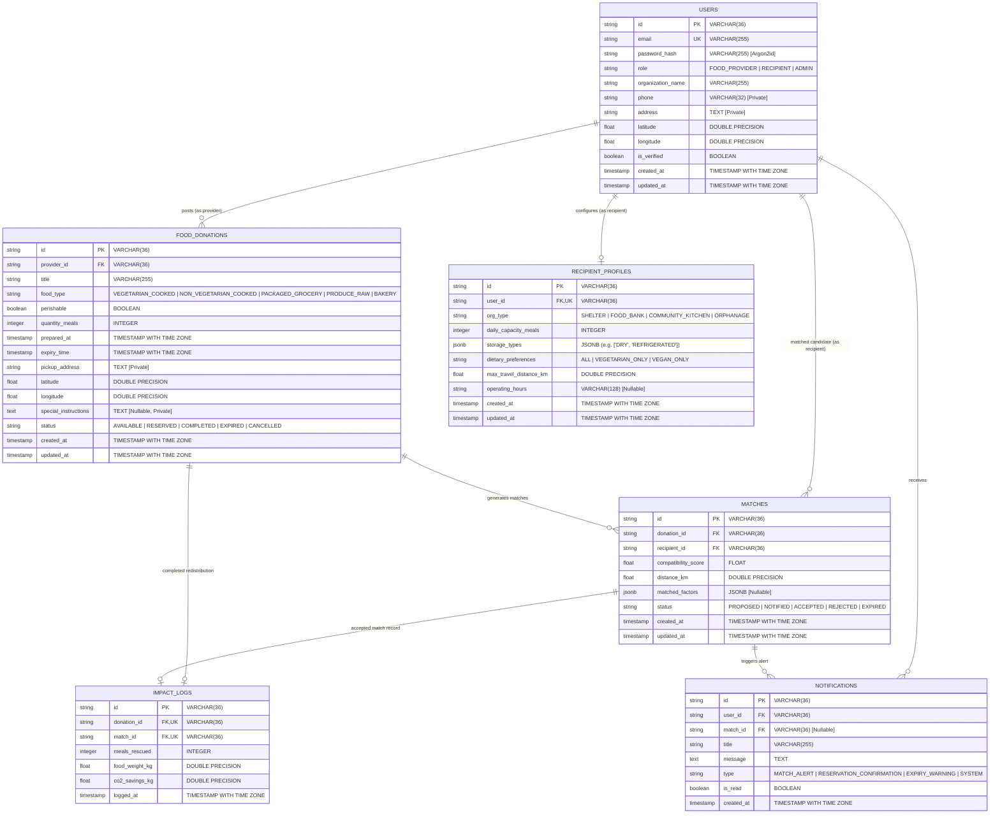

# Database Schema — FoodSync AI

> **Status**: Architecture Frozen — Single Authoritative Relational Schema  
> **Database Engine**: PostgreSQL 15+ ONLY  
> **ORM & Migrations**: SQLAlchemy 2.x + Alembic  
> **Module Owner**: Lokeshwari (`feature/database`)  
> **Repository**: [KShruti772/FoodSync-AI](https://github.com/KShruti772/FoodSync-AI)

---

## 1. Schema Invariants & Database Architecture

1. **Single Authoritative Schema**: This document represents the sole official relational schema for FoodSync AI MVP. No competing models, MongoDB, or alternate production databases are supported.
2. **PostgreSQL Selection Rationale**:
   - FoodSync AI operates heavily interconnected domain entities (`users`, `food_donations`, `recipient_profiles`, `matches`, `notifications`, `impact_logs`).
   - Requires robust relational integrity: strict foreign key constraints, column check constraints, ACID transactions, atomic conditional state updates (double-reservation prevention), and geospatial coordinates querying.
   - *Note on SQLite*: SQLite is never used for production and may only serve as an optional, isolated in-memory test fixture if strictly necessary.
3. **Naming Conventions**:
   - Table names: `plural_snake_case` (e.g. `users`, `food_donations`, `matches`)
   - Column names: `singular_snake_case` (e.g. `quantity_meals`, `expiry_time`)
   - Primary Keys: `id` (`VARCHAR(36)` UUID / CUID string)
   - Foreign Keys: `<referenced_table_singular>_id` (e.g. `provider_id`, `donation_id`)
4. **Unit Harmonization for Matching**:
   - To eliminate unit conversion errors during heuristic matching, all food quantities and recipient capacities are strictly stored in **`MEALS`** (`INTEGER`).
5. **Data Privacy Invariant**:
   - `pickup_address`, `phone`, and `special_instructions` are private, sensitive fields. The database stores these columns, but the FastAPI backend enforces application-level authorization (per [API_CONTRACT.md](API_CONTRACT.md)) to prevent public leakage.

---

## 2. Entity Relationship Diagram (ERD)



---

## 3. Detailed Table Definitions (MVP)

### 3.1 Table: `users`
Stores user credentials, organizational profiles, roles, and base geolocation coordinates.

| Column | Type | Nullable | Default & Constraints | Description |
| :--- | :--- | :---: | :--- | :--- |
| `id` | `VARCHAR(36)` | NO | `PRIMARY KEY` | Unique identifier (UUID/CUID) |
| `email` | `VARCHAR(255)` | NO | `UNIQUE`, `NOT NULL` | User email address (login credential) |
| `password_hash` | `VARCHAR(255)` | NO | `NOT NULL` | Hashed password (Argon2id) |
| `role` | `VARCHAR(32)` | NO | `CHECK (role IN ('FOOD_PROVIDER', 'RECIPIENT', 'ADMIN'))` | Role discriminator |
| `organization_name`| `VARCHAR(255)` | NO | `NOT NULL` | Official business or charity name |
| `phone` | `VARCHAR(32)` | NO | `NOT NULL` | Primary contact phone number (*Private*) |
| `address` | `TEXT` | NO | `NOT NULL` | Base street address (*Private*) |
| `latitude` | `DOUBLE PRECISION`| NO | `CHECK (latitude BETWEEN -90.0 AND 90.0)` | Geolocation latitude |
| `longitude` | `DOUBLE PRECISION`| NO | `CHECK (longitude BETWEEN -180.0 AND 180.0)` | Geolocation longitude |
| `is_verified` | `BOOLEAN` | NO | `DEFAULT FALSE` | Admin verification status |
| `created_at` | `TIMESTAMPTZ` | NO | `DEFAULT CURRENT_TIMESTAMP` | Account creation timestamp |
| `updated_at` | `TIMESTAMPTZ` | NO | `DEFAULT CURRENT_TIMESTAMP` | Profile update timestamp |

**Indexes & Constraints**:
- `CREATE UNIQUE INDEX idx_users_email ON users(email);`
- `CREATE INDEX idx_users_location ON users(latitude, longitude);`
- `CREATE INDEX idx_users_role ON users(role);`

---

### 3.2 Table: `food_donations`
Stores surplus food listings posted by Food Providers.

| Column | Type | Nullable | Default & Constraints | Description |
| :--- | :--- | :---: | :--- | :--- |
| `id` | `VARCHAR(36)` | NO | `PRIMARY KEY` | Unique donation identifier |
| `provider_id` | `VARCHAR(36)` | NO | `FOREIGN KEY (users.id) ON DELETE RESTRICT` | Creator provider user ID |
| `title` | `VARCHAR(255)` | NO | `NOT NULL` | Short title (e.g. "50 Veg Lunch Meals") |
| `food_type` | `VARCHAR(64)` | NO | `CHECK (food_type IN ('VEGETARIAN_COOKED', 'NON_VEGETARIAN_COOKED', 'PACKAGED_GROCERY', 'PRODUCE_RAW', 'BAKERY'))` | Dietary / food category |
| `perishable` | `BOOLEAN` | NO | `DEFAULT TRUE` | Whether food requires urgent pickup/refrigeration |
| `quantity_meals` | `INTEGER` | NO | `CHECK (quantity_meals > 0)` | Quantity of surplus meals (*Harmonized Unit*) |
| `prepared_at` | `TIMESTAMPTZ` | NO | `NOT NULL` | Preparation / cooking timestamp |
| `expiry_time` | `TIMESTAMPTZ` | NO | `NOT NULL` | Expiry cutoff time |
| `pickup_address` | `TEXT` | NO | `NOT NULL` | Physical location for pickup (*Private*) |
| `latitude` | `DOUBLE PRECISION`| NO | `CHECK (latitude BETWEEN -90.0 AND 90.0)` | Pickup location latitude |
| `longitude` | `DOUBLE PRECISION`| NO | `CHECK (longitude BETWEEN -180.0 AND 180.0)` | Pickup location longitude |
| `special_instructions`| `TEXT` | **YES** | `DEFAULT NULL` | Optional donor notes / handling instructions (*Private*) |
| `status` | `VARCHAR(32)` | NO | `DEFAULT 'AVAILABLE'`, `CHECK (status IN ('AVAILABLE', 'RESERVED', 'COMPLETED', 'EXPIRED', 'CANCELLED'))` | Validated lifecycle status |
| `created_at` | `TIMESTAMPTZ` | NO | `DEFAULT CURRENT_TIMESTAMP` | Creation timestamp |
| `updated_at` | `TIMESTAMPTZ` | NO | `DEFAULT CURRENT_TIMESTAMP` | Last status update timestamp |

**Indexes & Constraints**:
- `CREATE INDEX idx_donations_status ON food_donations(status);`
- `CREATE INDEX idx_donations_provider ON food_donations(provider_id);`
- `CREATE INDEX idx_donations_expiry ON food_donations(expiry_time);`
- `CREATE INDEX idx_donations_location ON food_donations(latitude, longitude);`

---

### 3.3 Table: `recipient_profiles`
Stores operational constraints and storage capacities for Recipient organizations.

| Column | Type | Nullable | Default & Constraints | Description |
| :--- | :--- | :---: | :--- | :--- |
| `id` | `VARCHAR(36)` | NO | `PRIMARY KEY` | Unique profile identifier |
| `user_id` | `VARCHAR(36)` | NO | `UNIQUE`, `FOREIGN KEY (users.id) ON DELETE CASCADE` | Linked recipient user account |
| `org_type` | `VARCHAR(64)` | NO | `CHECK (org_type IN ('SHELTER', 'FOOD_BANK', 'COMMUNITY_KITCHEN', 'ORPHANAGE'))` | Recipient organization category |
| `daily_capacity_meals`| `INTEGER` | NO | `CHECK (daily_capacity_meals >= 0)` | Daily meal distribution capacity |
| `storage_types` | `JSONB` | NO | `DEFAULT '["DRY"]'::jsonb` | Supported storage facilities (e.g. `["DRY", "REFRIGERATED", "FROZEN"]`) |
| `dietary_preferences` | `VARCHAR(64)` | NO | `DEFAULT 'ALL'`, `CHECK (dietary_preferences IN ('ALL', 'VEGETARIAN_ONLY', 'VEGAN_ONLY'))` | Dietary constraint filter |
| `max_travel_distance_km`| `DOUBLE PRECISION`| NO | `DEFAULT 15.0`, `CHECK (max_travel_distance_km > 0.0)` | Max radius recipient can travel |
| `operating_hours` | `VARCHAR(128)` | **YES** | `DEFAULT NULL` | Optional operating window (e.g. "08:00 - 20:00") |
| `created_at` | `TIMESTAMPTZ` | NO | `DEFAULT CURRENT_TIMESTAMP` | Profile creation timestamp |
| `updated_at` | `TIMESTAMPTZ` | NO | `DEFAULT CURRENT_TIMESTAMP` | Profile update timestamp |

**Indexes & Constraints**:
- `CREATE UNIQUE INDEX idx_recipient_profiles_user ON recipient_profiles(user_id);`

---

### 3.4 Table: `matches`
Stores pairings generated by the matching engine between donations and recipients.

| Column | Type | Nullable | Default & Constraints | Description |
| :--- | :--- | :---: | :--- | :--- |
| `id` | `VARCHAR(36)` | NO | `PRIMARY KEY` | Unique match identifier |
| `donation_id` | `VARCHAR(36)` | NO | `FOREIGN KEY (food_donations.id) ON DELETE CASCADE` | Matched food donation |
| `recipient_id` | `VARCHAR(36)` | NO | `FOREIGN KEY (users.id) ON DELETE CASCADE` | Candidate recipient organization |
| `compatibility_score` | `FLOAT` | NO | `CHECK (compatibility_score BETWEEN 0.0 AND 1.0)` | Multi-factor matching score |
| `distance_km` | `DOUBLE PRECISION`| NO | `CHECK (distance_km >= 0.0)` | Distance between provider and recipient |
| `matched_factors` | `JSONB` | **YES** | `DEFAULT NULL` | Sub-score breakdown (`distance_score`, `urgency_score`, `capacity_score`) |
| `status` | `VARCHAR(32)` | NO | `DEFAULT 'PROPOSED'`, `CHECK (status IN ('PROPOSED', 'NOTIFIED', 'ACCEPTED', 'REJECTED', 'EXPIRED'))` | Match lifecycle state |
| `created_at` | `TIMESTAMPTZ` | NO | `DEFAULT CURRENT_TIMESTAMP` | Match generation timestamp |
| `updated_at` | `TIMESTAMPTZ` | NO | `DEFAULT CURRENT_TIMESTAMP` | Match status change timestamp |

**Indexes & Constraints**:
- `CONSTRAINT uq_matches_donation_recipient UNIQUE (donation_id, recipient_id)` *(Prevents duplicate match entries)*
- `CREATE INDEX idx_matches_donation_status ON matches(donation_id, status);`
- `CREATE INDEX idx_matches_recipient_status ON matches(recipient_id, status);`
- `CREATE INDEX idx_matches_score ON matches(compatibility_score DESC);`

---

### 3.5 Table: `notifications`
Stores database-backed in-app alerts for users.

| Column | Type | Nullable | Default & Constraints | Description |
| :--- | :--- | :---: | :--- | :--- |
| `id` | `VARCHAR(36)` | NO | `PRIMARY KEY` | Unique notification identifier |
| `user_id` | `VARCHAR(36)` | NO | `FOREIGN KEY (users.id) ON DELETE CASCADE` | Recipient of the notification |
| `match_id` | `VARCHAR(36)` | **YES** | `FOREIGN KEY (matches.id) ON DELETE SET NULL` | Optional associated match (null for system alerts) |
| `title` | `VARCHAR(255)` | NO | `NOT NULL` | Short alert headline |
| `message` | `TEXT` | NO | `NOT NULL` | Alert body content |
| `type` | `VARCHAR(64)` | NO | `CHECK (type IN ('MATCH_ALERT', 'RESERVATION_CONFIRMATION', 'EXPIRY_WARNING', 'SYSTEM'))` | Notification category |
| `is_read` | `BOOLEAN` | NO | `DEFAULT FALSE` | Read status |
| `created_at` | `TIMESTAMPTZ` | NO | `DEFAULT CURRENT_TIMESTAMP` | Delivery timestamp |

**Indexes & Constraints**:
- `CREATE INDEX idx_notifications_user_unread ON notifications(user_id, is_read);`

---

### 3.6 Table: `impact_logs`
Stores immutable records of completed surplus redistribution.

| Column | Type | Nullable | Default & Constraints | Description |
| :--- | :--- | :---: | :--- | :--- |
| `id` | `VARCHAR(36)` | NO | `PRIMARY KEY` | Unique impact log identifier |
| `donation_id` | `VARCHAR(36)` | NO | `UNIQUE`, `FOREIGN KEY (food_donations.id) ON DELETE RESTRICT` | Completed donation |
| `match_id` | `VARCHAR(36)` | NO | `UNIQUE`, `FOREIGN KEY (matches.id) ON DELETE RESTRICT` | Accepted match pairing |
| `meals_rescued` | `INTEGER` | NO | `CHECK (meals_rescued > 0)` | Verified number of meals saved |
| `food_weight_kg` | `DOUBLE PRECISION`| NO | `CHECK (food_weight_kg > 0.0)` | Rescued food weight equivalent ($\text{meals} \times 0.5\text{ kg}$) |
| `co2_savings_kg` | `DOUBLE PRECISION`| NO | `CHECK (co2_savings_kg >= 0.0)` | Estimated $\text{CO}_2$ emissions prevented ($\text{kg} \times 2.5$) |
| `logged_at` | `TIMESTAMPTZ` | NO | `DEFAULT CURRENT_TIMESTAMP` | Impact logging timestamp |

**Indexes & Constraints**:
- `CREATE UNIQUE INDEX idx_impact_donation ON impact_logs(donation_id);`
- `CREATE UNIQUE INDEX idx_impact_match ON impact_logs(match_id);`

---

## 4. Phase 2 Deferred Schema (`recipient_requirements`)

> [!NOTE]
> The `recipient_requirements` table is explicitly deferred to Phase 2 to keep the MVP simple. In MVP, candidate filtering and ranking rely on `recipient_profiles` (capacity, storage, and dietary preferences).

```sql
-- Phase 2 Table (DEFERRED - NOT IN MVP)
CREATE TABLE recipient_requirements (
    id VARCHAR(36) PRIMARY KEY,
    recipient_id VARCHAR(36) NOT NULL REFERENCES users(id) ON DELETE CASCADE,
    food_type_needed VARCHAR(64) NOT NULL,
    quantity_meals_needed INTEGER NOT NULL CHECK (quantity_meals_needed > 0),
    urgency_level VARCHAR(32) NOT NULL CHECK (urgency_level IN ('LOW', 'MEDIUM', 'HIGH', 'CRITICAL')),
    needed_by_time TIMESTAMPTZ NOT NULL,
    status VARCHAR(32) NOT NULL DEFAULT 'ACTIVE' CHECK (status IN ('ACTIVE', 'FULFILLED', 'EXPIRED')),
    created_at TIMESTAMPTZ NOT NULL DEFAULT CURRENT_TIMESTAMP,
    updated_at TIMESTAMPTZ NOT NULL DEFAULT CURRENT_TIMESTAMP
);
```

---

## 5. Architectural Status

> [!IMPORTANT]
> **Architecture is frozen; no blocking architectural decisions remain.**
