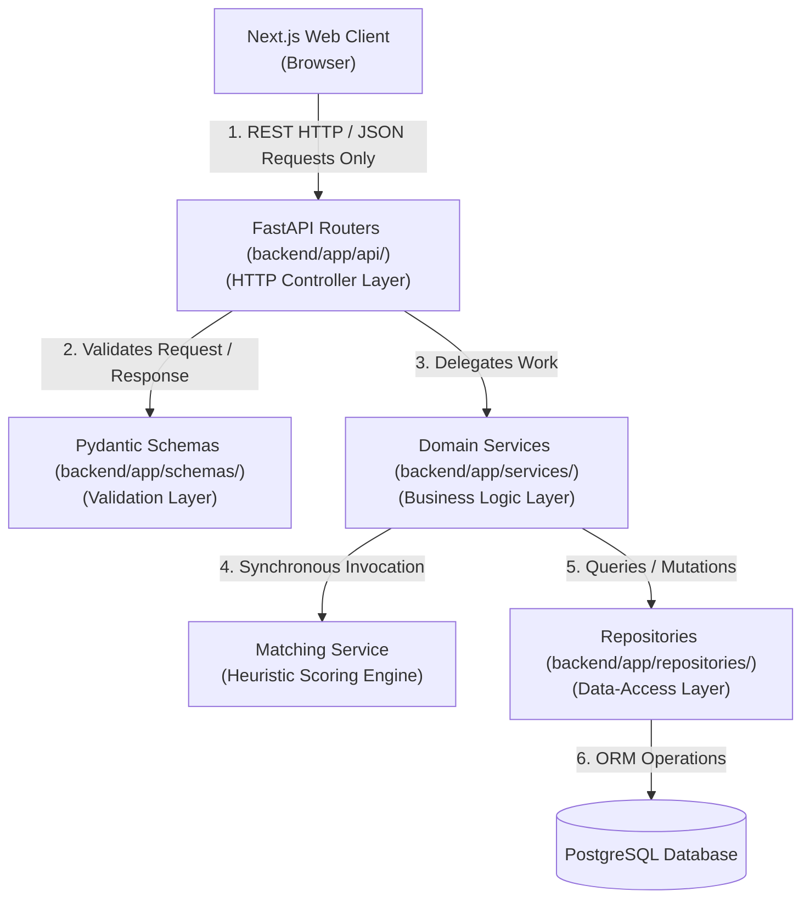
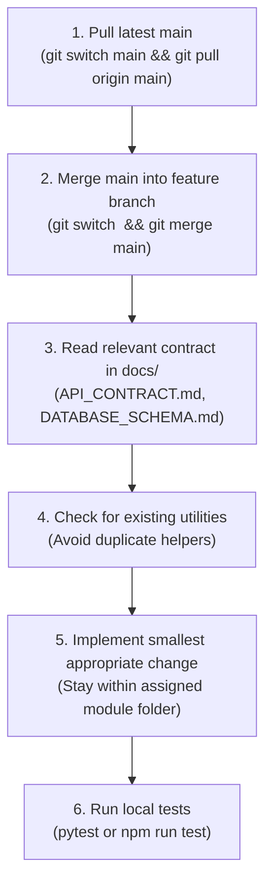

# Development Guide — FoodSync AI

> **Status**: Architecture Frozen — Developer Implementation Guide  
> **Repository**: [KShruti772/FoodSync-AI](https://github.com/KShruti772/FoodSync-AI)

---

## 1. Official Finalized Technology Stack

Every developer must adhere strictly to the frozen technology stack:

- **Frontend**: Next.js (TypeScript) + Tailwind CSS (App Router)
- **Backend**: Python + FastAPI + Pydantic + SQLAlchemy 2.x
- **Database & Migrations**: PostgreSQL 15+ + Alembic
- **Authentication**: Argon2id + Short-lived JWT access tokens
- **Testing**: Pytest + HTTPX (Backend), Vitest (Frontend), Playwright (E2E)
- **API Architecture**: REST (JSON over HTTP at `/api/v1`)

---

## 2. Standard Repository Structure

The physical repository structure is explicitly defined below. No alternative or competing directory layouts are permitted:

```
FoodSync-AI/
├── .gitignore                         # Git exclusion rules
├── .env.example                       # Environment variable template
├── README.md                          # Repository overview & navigation
├── docs/                              # System contracts and architecture specs
│   ├── PROJECT_OVERVIEW.md
│   ├── ARCHITECTURE.md
│   ├── DEVELOPMENT_GUIDE.md
│   ├── API_CONTRACT.md
│   ├── DATABASE_SCHEMA.md
│   ├── AI_MATCHING.md
│   ├── UI_GUIDELINES.md
│   ├── TESTING_GUIDE.md
│   ├── SECURITY_GUIDELINES.md
│   └── TEAM_WORKFLOW.md
│
├── frontend/                          # Next.js + TypeScript Web Client
│   ├── package.json
│   ├── tsconfig.json
│   ├── tailwind.config.ts
│   ├── postcss.config.mjs
│   ├── next.config.ts
│   ├── public/                        # Static assets (icons, logos)
│   ├── app/                           # Next.js App Router (pages & layouts)
│   │   ├── layout.tsx                 # Root layout with navbar & providers
│   │   ├── page.tsx                   # Public landing page
│   │   ├── login/page.tsx             # User login page
│   │   ├── register/page.tsx          # User registration (Provider/Recipient)
│   │   ├── provider/                  # Food Provider dashboard & donation forms
│   │   │   ├── page.tsx
│   │   │   └── create/page.tsx
│   │   └── recipient/                 # Recipient organization dashboard & claims
│   │       ├── page.tsx
│   │       └── profile/page.tsx
│   ├── components/                    # Reusable UI components
│   │   ├── common/                    # Button, Modal, StatusBadge, InputField, LoadingSkeleton
│   │   └── domain/                    # DonationCard, MatchCard, ClaimActionModal, ImpactWidget
│   ├── hooks/                         # Custom React hooks (useAuth, useNotifications)
│   ├── lib/                           # Frontend utility libraries & Tailwind helpers
│   ├── services/                      # API client fetch wrappers (calling FastAPI)
│   │   └── api.ts
│   └── types/                         # TypeScript interfaces matching API contracts
│       └── index.ts
│
├── backend/                           # FastAPI + Python Backend
│   ├── pyproject.toml                 # Backend dependencies and tools configuration
│   ├── requirements.txt               # Pinned pip dependencies
│   ├── alembic.ini                    # Alembic migration configuration
│   ├── alembic/                       # Migration scripts
│   │   ├── env.py
│   │   └── versions/
│   ├── app/
│   │   ├── main.py                    # FastAPI application initialization & router mounting
│   │   ├── api/                       # FastAPI route controllers (/api/v1)
│   │   │   ├── auth.py
│   │   │   ├── donations.py
│   │   │   ├── recipients.py
│   │   │   ├── matches.py
│   │   │   ├── notifications.py
│   │   │   └── impact.py
│   │   ├── core/                      # Core configuration, security, and database session
│   │   │   ├── config.py              # Pydantic BaseSettings environment loader
│   │   │   ├── database.py            # SQLAlchemy 2.x engine & sessionmaker factory
│   │   │   └── security.py            # Argon2id password hashing & JWT handling
│   │   ├── models/                    # SQLAlchemy 2.x ORM declarative models
│   │   │   ├── user.py
│   │   │   ├── donation.py
│   │   │   ├── recipient.py
│   │   │   ├── match.py
│   │   │   ├── notification.py
│   │   │   └── impact.py
│   │   ├── schemas/                   # Pydantic request/response validation schemas
│   │   │   ├── auth.py
│   │   │   ├── donation.py
│   │   │   ├── recipient.py
│   │   │   ├── match.py
│   │   │   ├── notification.py
│   │   │   └── impact.py
│   │   ├── repositories/              # Data-access layer (database queries & transactions)
│   │   │   ├── user_repo.py
│   │   │   ├── donation_repo.py
│   │   │   ├── recipient_repo.py
│   │   │   ├── match_repo.py
│   │   │   ├── notification_repo.py
│   │   │   └── impact_repo.py
│   │   ├── services/                  # Business domain logic layer
│   │   │   ├── auth_service.py
│   │   │   ├── donation_service.py
│   │   │   ├── recipient_service.py
│   │   │   ├── matching_service.py    # Deterministic multi-factor scoring engine
│   │   │   ├── claim_service.py       # Match accept / reject & reservation handling
│   │   │   ├── notification_service.py
│   │   │   └── impact_service.py
│   │   └── utils/                     # Pure helpers (Haversine formula, geo utilities)
│   │       └── geo.py
│   └── tests/                         # Pytest test suites
│       ├── conftest.py                # Pytest fixtures & TestClient setup
│       ├── unit/                      # Isolated unit tests
│       │   ├── test_matching_engine.py
│       │   └── test_schemas.py
│       └── integration/               # API endpoint integration tests
│           ├── test_auth_routes.py
│           ├── test_donations_routes.py
│           ├── test_claims_routes.py
│           └── test_notifications_routes.py
│
└── e2e/                               # End-to-End Browser Journeys (Playwright)
    └── flows/
        └── donation_to_claim.spec.ts
```

---

## 3. Strict Layer Boundaries & Communication Invariants



### Core Invariants:
1. **Frontend Never Accesses PostgreSQL Directly**: The Next.js frontend has zero direct connection to the database. All state queries and mutations occur strictly through FastAPI REST endpoints (`/api/v1`).
2. **Frontend Communicates Only with FastAPI**: The client-side application relies exclusively on the endpoints specified in [API_CONTRACT.md](file:///Users/shrutikondabathula/SIH26117/FoodSync-AI/docs/API_CONTRACT.md).
3. **Controllers / Routers Must NOT Contain Business Logic**: FastAPI route functions (`backend/app/api/`) are responsible only for parameter parsing, dependency injection, and invoking services. They must never contain raw business computations or SQL queries.
4. **Business Logic Belongs Strictly in Services**: All validation rules, state transitions (`AVAILABLE` $\rightarrow$ `RESERVED` $\rightarrow$ `COMPLETED`), permission checks, and coordination reside in `backend/app/services/`.
5. **Database Access Belongs in Repositories / Data-Access Layer**: Direct SQLAlchemy session queries (`select`, `add`, `commit`, `rollback`) belong inside `backend/app/repositories/` and `backend/app/models/`.
6. **Matching Logic Belongs Exclusively in `matching_service.py`**: The multi-factor scoring formula ($w_{dist}, w_{urg}, w_{cap}, w_{pref}$), Haversine distance calculations, and candidate ranking are encapsulated inside `matching_service.py`.

---

## 4. Code Ownership & Branch Assignments

| Feature / Responsibility | Designated Location | Owner & Branch |
| :--- | :--- | :--- |
| **Next.js UI & Components** | `frontend/app/`, `frontend/components/` | Atharva (`feature/frontend`) |
| **Frontend API Client** | `frontend/services/api.ts` | Atharva (`feature/frontend`) |
| **FastAPI Route Controllers** | `backend/app/api/` | Akanksha (`feature/backend`) |
| **Business Domain Services** | `backend/app/services/` | Akanksha (`feature/backend`) |
| **SQLAlchemy Models & Alembic** | `backend/app/models/`, `backend/alembic/` | Lokeshwari (`feature/database`) |
| **Data Repositories** | `backend/app/repositories/` | Lokeshwari (`feature/database`) |
| **AI Matching Engine** | `backend/app/services/matching_service.py` | Shruti (`feature/ai-matching`) |
| **Automated Test Suites** | `backend/tests/`, `frontend/components/__tests__/`, `e2e/` | Vishwajeet (`feature/ui-testing`) |
| **Architecture & Contracts** | `docs/*.md` | Shruti (Team Lead) / All |

---

## 5. Naming Conventions

- **Python (Backend & Tests)**:
  - Files & Modules: `snake_case.py` (e.g., `donation_service.py`, `test_matching_engine.py`)
  - Classes & Models: `PascalCase` (e.g., `FoodDonation`, `UserCreateSchema`)
  - Functions & Variables: `snake_case` (e.g., `calculate_distance()`, `current_user`)
  - Constants: `SCREAMING_SNAKE_CASE` (e.g., `DEFAULT_MAX_RADIUS_KM = 15.0`)
- **TypeScript / React (Frontend)**:
  - Component Files: `PascalCase.tsx` (e.g., `DonationCard.tsx`, `ClaimActionModal.tsx`)
  - Utility & Service Files: `camelCase.ts` or `kebab-case.ts` (e.g., `api.ts`, `formatters.ts`)
  - Functions & Variables: `camelCase` (e.g., `fetchDonations()`, `isLoading`)
  - Types & Interfaces: `PascalCase` (e.g., `DonationResponse`, `UserProfile`)
- **Database (PostgreSQL)**:
  - Tables: Plural `snake_case` (e.g., `food_donations`, `recipient_profiles`)
  - Columns: Singular `snake_case` (e.g., `expiry_time`, `is_verified`)

---

## 6. Reusable Utilities & "Don't Duplicate" Policy

Before writing any new helper function, check existing utilities in `backend/app/utils/` or `frontend/lib/`.

- **When to Create a Utility**:
  - The function is pure (deterministic output for given inputs, no side effects) and needed across multiple services/components (e.g. Haversine distance formula in `backend/app/utils/geo.py`).
- **When NOT to Create a Utility**:
  - The logic is specific to a single service or component.
  - An existing utility already performs the calculation (e.g. duplicating date formatters or distance math).

---

## 7. Mandatory "Before Coding" Checklist

Every developer must execute these steps before writing code:



---

## 8. Strict "Do Not" Rules

> [!CAUTION]
> Violating these core rules creates merge conflicts, architecture drift, and security vulnerabilities.

1. **DO NOT** rewrite unrelated code or refactor outside your assigned module scope.
2. **DO NOT** redesign the overall architecture or introduce unapproved frameworks.
3. **DO NOT** duplicate existing utility functions or create competing helper modules.
4. **DO NOT** change another teammate's active branch without direct coordination.
5. **DO NOT** introduce unnecessary third-party libraries (no Redis, Celery, Mongo, or custom microservices in MVP).
6. **DO NOT** hard-code secrets, passwords, or tokens in source code (use `.env` and `.env.example`).
7. **DO NOT** modify an API endpoint or payload without updating [API_CONTRACT.md](file:///Users/shrutikondabathula/SIH26117/FoodSync-AI/docs/API_CONTRACT.md) first.
8. **DO NOT** modify database models or schema without updating [DATABASE_SCHEMA.md](file:///Users/shrutikondabathula/SIH26117/FoodSync-AI/docs/DATABASE_SCHEMA.md) first.
9. **DO NOT** bypass service or repository layers to perform raw database operations inside API routes.

---

## 9. Code Quality & Linting Standards

- **Python Backend**: Format with `black` and lint with `flake8` / `ruff`.
- **TypeScript Frontend**: Format with `prettier` and lint with `eslint`.
- All code must pass linting and unit tests before a Pull Request is submitted to `main`.

---

## 10. Architectural Status

> [!IMPORTANT]
> **Architecture is frozen; no blocking architectural decisions remain.**
