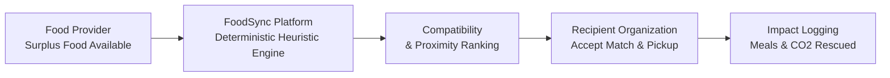
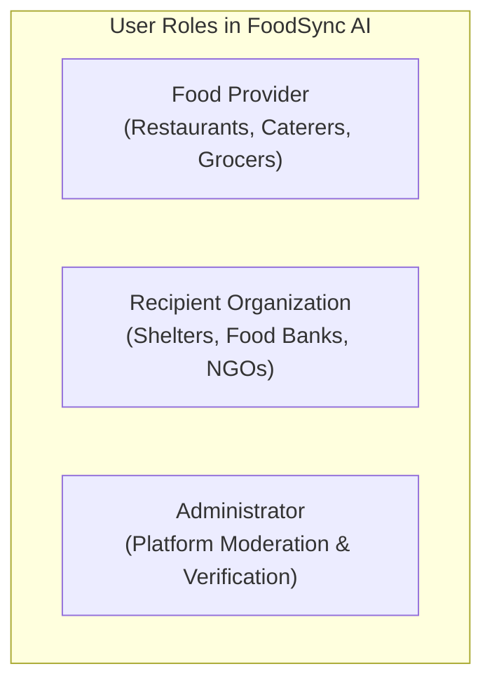
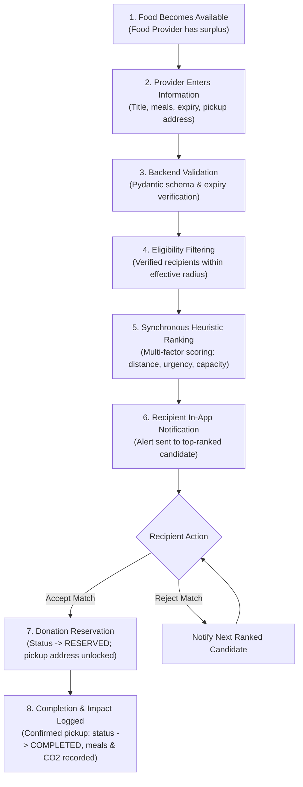

# Project Overview — FoodSync AI

> **Status**: Architecture Frozen — MVP Implementation Specification  
> **Repository**: [KShruti772/FoodSync-AI](https://github.com/KShruti772/FoodSync-AI)  
> **Stack**: Next.js (TypeScript + Tailwind CSS) • Python (FastAPI + Pydantic) • PostgreSQL (SQLAlchemy + Alembic) • Pytest + Vitest + Playwright

---

## 1. Problem Statement

Every day, commercial food providers (such as restaurants, caterers, grocery stores, and event organizers) produce surplus, edible food that goes to waste due to the lack of a rapid, reliable redistribution channel. At the same time, nearby recipient organizations (such as shelters, food banks, community kitchens, and orphanages) struggle with food insecurity and inconsistent supplies.

Key challenges in surplus food recovery:
- **Time Sensitivity**: Cooked and perishable foods have a short shelf-life and must be claimed and transported within hours.
- **Coordination Friction**: Manual phone calls and ad-hoc coordination lead to miscommunication, delayed pickups, and food spoilage.
- **Mismatch in Needs**: Donated food quantities and dietary types often do not match the immediate storage or distribution capacity of receiving organizations.
- **Lack of Tracking**: Donors and recipients have minimal visibility into redistribution metrics, rescue history, or quantified social and environmental impact.

---

## 2. Solution: FoodSync AI

**FoodSync AI** is a real-time food waste redistribution platform that bridges the gap between commercial food surplus and local community need.

Rather than relying on opaque deep learning or black-box neural networks, FoodSync AI employs a **transparent, deterministic multi-factor matching and ranking algorithm** (evaluating geographic proximity, food perishability/expiry urgency, recipient storage capacity, and dietary preferences) to connect food providers with the most suitable, nearby recipient organizations before food spoils.

---

## 3. Standard Project Terminology

To avoid confusion across team members, use only the following standardized terms across code, documentation, APIs, and UI:

| Term | Definition | Do NOT Use |
| :--- | :--- | :--- |
| **Food Provider** | The user/entity donating surplus food (e.g., restaurant, caterer, grocer, event host). | *Donor, Supplier, Vendor, Cook* |
| **Recipient** | The verified organization receiving surplus food (e.g., NGO, shelter, food bank). | *Receiver, Charity, Customer, Consumer* |
| **Administrator** | Platform operators managing users, verification, and system monitoring. | *Superuser, Root, Mod* |
| **Food Donation** | A single listing of surplus food made available by a Food Provider. | *Food Post, Item, Listing, Drop* |
| **Requirement** | A declared food request or ongoing capacity profile posted by a Recipient. | *Need, Order, Wishlist* |
| **Match** | An automated pairing between a Food Donation and a suitable Recipient. | *Pairing, Deal, Assignment* |

---

## 4. Main Users & Roles

### 1. Food Provider
- Registers an account (via `role: "FOOD_PROVIDER"`) and maintains an organization profile.
- Posts details of surplus food (type, quantity in meals, preparation time, expiry window, pickup location).
- Tracks status of posted donations (`AVAILABLE`, `RESERVED`, `COMPLETED`, `CANCELLED`).
- Views history of completed donations and basic impact metrics.

### 2. Recipient Organization
- Registers an account (via `role: "RECIPIENT"`) and configures organizational profile information.
- Sets up capacity parameters (daily meal capacity, storage facilities, dietary preferences, operating hours).
- Receives in-app notifications for suitable nearby surplus food matches.
- Accepts or declines proposed food matches and coordinates pickup.
- Confirms receipt of food to mark the donation as `COMPLETED`.

### 3. Administrator
- Reviews and verifies registered Recipient organizations to ensure legitimacy.
- Accounts are created strictly through a controlled deployment CLI seed script (no public self-registration).
- Monitors active listings, matches, and platform-wide aggregate impact metrics.
- Manages user account status and platform moderation.

---

## 5. Main Redistribution Workflow

The core redistribution lifecycle is structured into sequential, verifiable stages:

---

## 6. Project Scope: MVP vs. Phase 2

To ensure reliable delivery by a small student engineering team, the scope is strictly divided into the core MVP and deferred Phase 2 enhancements.

### 6.1 MVP Scope (Strictly Finalized)

| # | MVP Feature | Scope Description | Responsible Module / Branch |
| :-: | :--- | :--- | :--- |
| **1** | **User Registration & Login** | User signup (Provider/Recipient) with Argon2id password hashing and short-lived JWT access tokens. | `feature/backend-ai`, `feature/database` |
| **2** | **Role-Based Authorization** | Protected endpoints and service-level RBAC for `FOOD_PROVIDER`, `RECIPIENT`, and `ADMIN`. | `feature/backend-ai` |
| **3** | **Donation Creation & Management** | Food Providers can create, view, and cancel surplus listings (`quantity_meals > 0`, future expiry). | `feature/backend-ai`, `feature/frontend` |
| **4** | **Recipient Profile** | Recipients configure daily meal capacity, storage facilities (`JSONB`), and dietary preferences. | `feature/backend-ai`, `feature/database` |
| **5** | **Deterministic Heuristic Matching** | Multi-factor weighted scoring ($w_{dist}=0.35, w_{urg}=0.30, w_{cap}=0.20, w_{pref}=0.15$) executed synchronously. | `feature/backend-ai` |
| **6** | **Match Acceptance & Rejection** | Server-controlled atomic accept/reject endpoints (`/api/v1/matches/{id}/accept`, `/reject`). | `feature/backend-ai`, `feature/frontend` |
| **7** | **Donation Lifecycle State Machine** | Strict state transitions: `AVAILABLE` $\rightarrow$ `RESERVED` $\rightarrow$ `COMPLETED` (terminal: `EXPIRED`, `CANCELLED`). | `feature/backend-ai`, `feature/database` |
| **8** | **In-App Notifications** | Database-backed alerts fetched by frontend via REST polling (`GET /api/v1/notifications`). | `feature/backend-ai`, `feature/frontend` |
| **9** | **Basic Impact Metrics** | Transparent calculation of total meals rescued, food weight (kg), and $\text{CO}_2$ emissions prevented. | `feature/backend-ai` |
| **10** | **Automated Tests** | Pytest backend unit/integration tests, Vitest component tests, and Playwright E2E tests. | `feature/ui-testing` |

---

### 6.2 Phase 2 Scope (Deferred Post-MVP)

The following advanced capabilities are explicitly deferred to Phase 2 to prevent scope creep:
- **Predictive Machine Learning**: Demand forecasting, seasonal surplus volume estimation, and neural embeddings.
- **Route Optimization**: Multi-stop driver routing algorithms and real-time turn-by-turn navigation.
- **External Notifications**: Out-of-band delivery channels (Email, SMS, Webhooks, Push notifications).
- **Automatic Background Timeout Schedulers**: Background daemon workers (e.g. Celery/Redis) to auto-expire matches after 15 minutes.
- **Advanced Multi-Criteria Wishlists**: `recipient_requirements` table and complex partial-batch splitting.
- **Dispute Management**: Incident ticketing and formal escalation workflows.
- **Advanced Analytics**: Custom ESG compliance PDF export reports and trend modeling.

---

## 7. Architectural Status

> [!IMPORTANT]
> **Architecture is frozen; no blocking architectural decisions remain.**
> The team stack, data models, API endpoints, matching math, and security invariants are fully specified in `docs/`.
