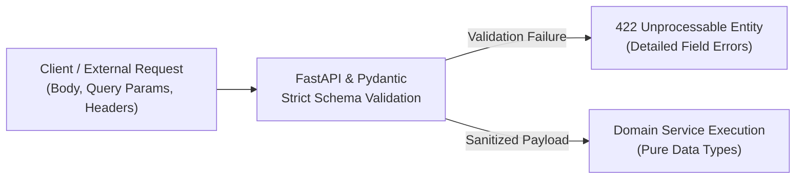
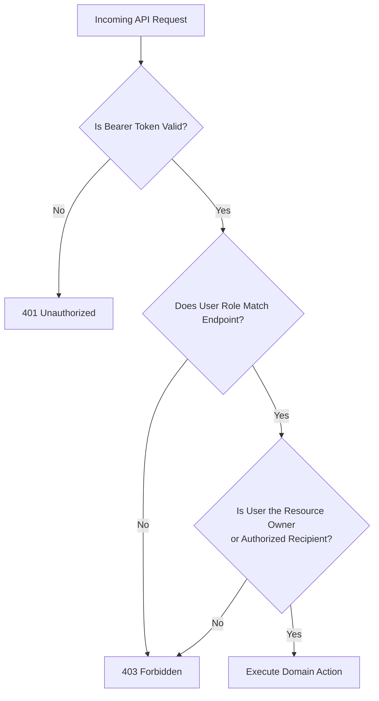

# Security Guidelines — FoodSync AI

> **Status**: Architecture Frozen — Single Source of Truth for Security Architecture  
> **Backend Framework**: Python (FastAPI)  
> **Hashing Algorithm**: Argon2id  
> **Module Owner**: Shruti (`feature/backend-ai`)  
> **Repository**: [KShruti772/FoodSync-AI](https://github.com/KShruti772/FoodSync-AI)

---

## 1. Secrets Management & Environment Isolation

> [!CAUTION]
> NEVER commit actual secrets, API keys, passwords, or connection strings to GitHub.

- **`.env` files**: All local environment files (`.env`, `.env.local`, `.env.production`) are excluded by `.gitignore`.
- **`.env.example`**: Only commit variable templates with dummy values to `.env.example`.
- **Pre-commit Checklist**:
  - Run `git status` and `git diff` before committing to ensure no sensitive keys or test tokens are staged.
  - If a secret is accidentally committed, immediately revoke the secret and notify the Team Lead (**Shruti**).

---

## 2. Authentication & Credential Security

- **Password Hashing (Argon2id)**:
  - All user passwords are encrypted using **Argon2id** (`passlib[argon2]`).
  - Plaintext passwords and raw hashes are **never** logged, cached, or returned in API responses.
- **Controlled Admin Provisioning**:
  - **Public `ADMIN` registration is strictly prohibited**.
  - `POST /api/v1/auth/register` accepts only `role: "FOOD_PROVIDER"` or `role: "RECIPIENT"`.
  - Administrator accounts can only be created through a controlled backend CLI seed script (e.g. `python -m app.cli create-admin`) during deployment.
- **Short-Lived JWT Access Tokens**:
  - Authentication issues signed JSON Web Tokens (JWT) using HMAC-SHA256 (`HS256`).
  - Standard claims: `sub` (User ID), `role`, `iat` (Issued At), `exp` (Expires At).
  - Token validity is strictly time-limited to **24 hours**.
- **Enumeration-Resistant Login**:
  - The login endpoint (`POST /api/v1/auth/login`) returns a generic error on failure:
    `"Invalid email or password"` (`INVALID_CREDENTIALS`).
  - It **never** reveals whether an email address exists in the database.

---

## 3. Zero-Trust Input Validation & XSS Defense



### Invariants:
1. **Zero Client Trust**: Frontend validation improves user experience; backend Pydantic validation guarantees security.
2. **Strict Plain-Text Policy & Contextual Escaping**:
   - All string inputs (titles, instructions, addresses, names) are strictly validated and parsed as plain text.
   - Rich HTML inputs are prohibited.
   - Next.js / React automatically escapes string variables in JSX/TSX, preventing Cross-Site Scripting (XSS). `dangerouslySetInnerHTML` is banned.
3. **Pydantic Bounds Enforcement**:
   - Positive quantities: `quantity_meals: int = Field(gt=0)`
   - Valid coordinates: `latitude: float = Field(ge=-90.0, le=90.0)`, `longitude: float = Field(ge=-180.0, le=180.0)`
   - Future expiry verification: `expiry_time > datetime.now(timezone.utc) + timedelta(minutes=30)`

---

## 4. Role-Based Access Control (RBAC) & Ownership Verification

Authentication verifies *who* the user is; Authorization verifies *what* they are allowed to do.



### Access Control Matrix:

| Action / Endpoint | Food Provider | Recipient | Admin | Ownership Rule |
| :--- | :---: | :---: | :---: | :--- |
| **Register User** (`POST /api/v1/auth/register`) | ✅ | ✅ | ❌ | Open to public (Provider / Recipient only) |
| **Post Surplus Donation** (`POST /api/v1/donations`) | ✅ | ❌ | ❌ | Provider role required |
| **Cancel Donation** (`POST /api/v1/donations/{id}/cancel`) | ✅ | ❌ | ✅ | Must be donation creator |
| **Accept / Reject Match** (`POST /api/v1/matches/{match_id}/*`) | ❌ | ✅ | ❌ | Must be candidate recipient assigned to match |
| **Complete Donation** (`POST /api/v1/donations/{id}/complete`) | ✅ | ✅ | ✅ | Must be donor or recipient of `RESERVED` match |
| **Update Recipient Profile** (`PUT /api/v1/recipients/profile`) | ❌ | ✅ | ✅ | Must be owner of recipient profile |

---

## 5. Race Condition & Double-Reservation Prevention

To prevent two recipient organizations from reserving the same surplus food donation simultaneously via `POST /api/v1/matches/{match_id}/accept`, the backend uses **atomic database transactions with conditional row updates**:

```python
# Atomic reservation in donation_repo.py / reservation handling
result = db_session.execute(
    update(FoodDonation)
    .where(FoodDonation.id == donation_id, FoodDonation.status == "AVAILABLE")
    .values(status="RESERVED", updated_at=datetime.now(timezone.utc))
)

if result.rowcount == 0:
    db_session.rollback()
    raise HTTPException(status_code=409, detail="DONATION_ALREADY_RESERVED")
```

---

## 6. Database Parameterization & SQL Injection Defense

- **SQLAlchemy 2.0 Parameterization**: All queries use SQLAlchemy ORM expressions or parameterized queries (`session.execute(select(...))`).
- **Strict Prohibition**: Raw SQL string concatenation (e.g. `f"SELECT * FROM users WHERE email = '{email}'"`) is strictly forbidden.

---

## 7. Data Privacy & Pickup Address Masking

1. **Before Match Acceptance / Public Browsing**:
   - `GET /api/v1/donations` strips `pickup_address`, contact `phone`, and private `special_instructions`.
   - The UI renders only approximate area and distance (e.g. *"Pune Central • 2.4 km away"*).
2. **After Match Acceptance**:
   - Exact `pickup_address`, donor telephone, and private handling instructions are revealed **only** to the recipient organization holding an `ACCEPTED` match on that donation (`RESERVED` status).

---

## 8. Error Handling & Zero Information Leakage

- **User-Facing Responses**: Return structured JSON with standardized error codes and safe messages.
- **Never expose to clients**:
  - Raw database error messages, connection strings, or table names.
  - Python stack traces, internal module paths, or file line numbers.
  - JWT secret keys or Argon2id password hashes.
- **Internal Logging**: Detailed stack traces are written exclusively to server-side logs via Python's standard `logging` module.

---

## 9. Network & Rate Limiting Controls

- **CORS Restriction**:
  - FastAPI `CORSMiddleware` is configured strictly to allow only the frontend origin defined in `CLIENT_URL` (e.g. `http://localhost:3000`).
  - Wildcard `allow_origins=["*"]` is strictly forbidden in production.
- **In-Memory Rate Limiting (MVP)**:
  - In-memory rate limiting (using `slowapi` or FastAPI middleware) protects auth endpoints:
    - `POST /api/v1/auth/login`: Maximum **5 requests per minute** per IP address.
    - `POST /api/v1/auth/register`: Maximum **3 requests per minute** per IP address.
  - No external Redis infrastructure is required for the MVP.

---

## 10. Architectural Status

> [!IMPORTANT]
> **Architecture is frozen; no blocking architectural decisions remain.**
