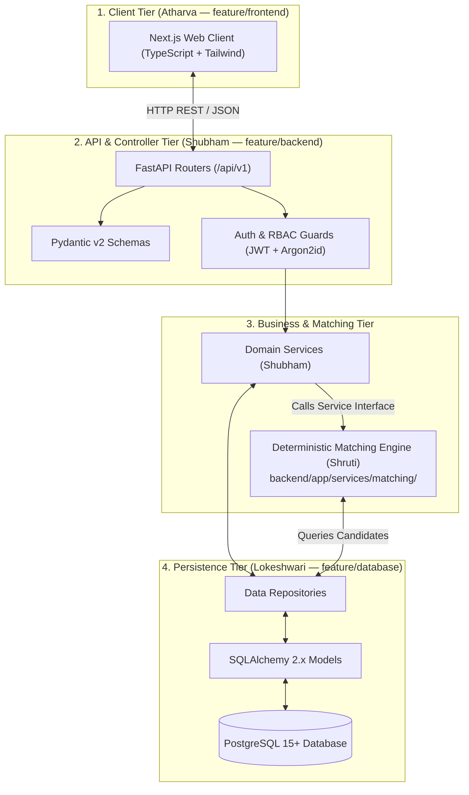
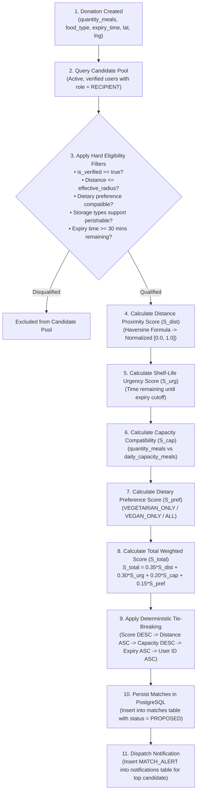
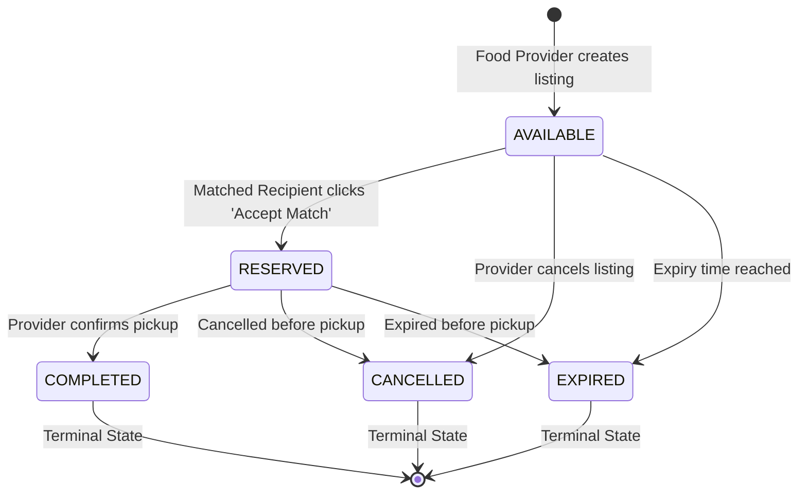

# Shruti's Developer & Team Lead Guide — FoodSync AI

> **Status**: Architecture Frozen — Authoritative Handbook for Technical Leadership & AI Architecture  
> **Target Audience**: Shruti (Team Lead / AI / System Architecture)  
> **Assigned Working Branch**: `feature/ai-matching`  
> **Primary Role**: Team Lead & AI / Matching Architect (Deterministic Matching Engine, Mathematical Scoring, System Architecture, Cross-Team Technical Direction)  
> **Primary Codebase Area**: `backend/app/services/matching/`  
> **Repository**: [KShruti772/FoodSync-AI](https://github.com/KShruti772/FoodSync-AI)

---

## 🌟 Core Team Principle

> **"Shruti leads the technical direction, system architecture, and the deterministic matching engine. She designs and owns the matching algorithms, mathematical scoring weights, and cross-module interface boundaries. Shubham implements the production FastAPI backend, REST controllers, and business services. Lokeshwari designs the database schema, models, repositories, and migrations. Atharva implements the Next.js frontend. Vishwajeet leads UI/UX design specifications, wireframes, and QA testing across all test suites."**

---

## 👥 Final Team Ownership Model

| Teammate | Role | Assigned Branch | Scope & Owned Codebase Directories |
| :--- | :--- | :--- | :--- |
| **Shruti** | **Team Lead / AI / Architecture** | `feature/ai-matching` | `backend/app/services/matching/` *(Matching Algorithm & Scoring Logic)*<br>System Architecture, Technical Direction, Cross-Layer Coordination |
| **Shubham** | **Backend Developer** | `feature/backend` | `backend/app/api/`<br>`backend/app/core/`<br>`backend/app/schemas/`<br>`backend/app/services/` *(Domain Services except matching logic)*<br>`backend/app/utils/`<br>`backend/app/main.py` |
| **Atharva** | **Frontend Developer** | `feature/frontend` | `frontend/app/`<br>`frontend/components/`<br>`frontend/hooks/`<br>`frontend/lib/`<br>`frontend/services/`<br>`frontend/types/`<br>*(Next.js Frontend Implementation)* |
| **Lokeshwari** | **Database Developer** | `feature/database` | `backend/app/models/`<br>`backend/app/repositories/`<br>`backend/alembic/`<br>*(PostgreSQL Schema, SQLAlchemy 2.x Models & Migrations)* |
| **Vishwajeet** | **UI/UX + Testing / QA Lead** | `feature/ui-testing` | `frontend/components/__tests__/` *(UI/Component Tests)*<br>`backend/tests/` *(Backend Unit & Integration Tests)*<br>`tests/e2e/` *(Playwright Browser E2E Tests)*<br>`docs/` *(UI/UX Specs, Test Matrices & User Flows)* |

---

# SECTION 1 — Your Role & Core Responsibilities

Welcome, Shruti! As the **Team Lead and AI / System Architect**, you provide the overarching technical vision and oversee the mathematical intelligence of FoodSync AI.

### Your High-Level Responsibilities:
1. **AI / Matching Architecture**: Design, implement, and evaluate the deterministic multi-factor matching engine under `backend/app/services/matching/`.
2. **System Architecture Governance**: Ensure all team implementations strictly adhere to the frozen 3-tier architecture without introducing undocumented dependencies or security gaps.
3. **Cross-Team Technical Coordination**: Review integration contracts between Frontend (Atharva), Backend (Shubham), Database (Lokeshwari), and QA Testing (Vishwajeet).
4. **Architectural Decision-Making**: Guard against scope creep, maintain clean interface boundaries, and evaluate all proposals for new libraries or structural changes.
5. **Data Privacy & Security Enforcement**: Ensure system-wide compliance with location privacy invariants (exact pickup addresses remain protected until an authorized match is accepted).

---

# SECTION 2 — Most Important Architectural Boundary: Shruti vs. Shubham

To maintain clear operational velocity, understand this vital division of responsibilities:

```text
┌─────────────────────────────────────────────────────────────┐
│ SHRUTI (Team Lead / AI / Architecture)                      │
│ • Designs and owns matching architecture and scoring logic. │
│ • Primary Codebase: backend/app/services/matching/          │
│ • Defines matching service interfaces and input/output DTOs.│
│ • Guides Shubham on how backend calls the matching engine. │
├─────────────────────────────────────────────────────────────┤
│ SHUBHAM (Backend Developer)                                 │
│ • Owns production FastAPI backend implementation.           │
│ • Primary Codebase: backend/app/api/, core/, schemas/,      │
│   services/ (domain services), utils/, and main.py          │
│ • Implements REST routes, Pydantic schemas, and auth/JWT.   │
│ • Integrates matching service into donation creation flow.  │
└─────────────────────────────────────────────────────────────┘
```

> [!IMPORTANT]
> **Key Rule**: Shruti does **not** implement general FastAPI route controllers, database connection pools, or Pydantic validation schemas. Shubham owns backend implementation and consumes Shruti's matching engine via its defined Python service interface.

---

# SECTION 3 — Where Your Work Belongs

- **Primary Codebase Area**: [`backend/app/services/matching/`](file:///Users/shrutikondabathula/FoodSync-AI/backend/app/services/matching)  
  Contains the matching engine service, mathematical heuristic calculators, candidate filters, and tie-breaking algorithms.
- **Architectural Oversight Area**: Reviewing integration across `backend/app/`, `docs/`, `frontend/`, `backend/alembic/`, and `tests/`.
- **Branch**: You work strictly on `feature/ai-matching`.

---

# SECTION 4 — Complete FoodSync AI Architecture

FoodSync AI is organized into a clean 3-tier unidirectional architecture:



### Complete End-to-End Operational Lifecycle:
1. **Donation Creation**: Food Provider submits surplus listing $\rightarrow$ Shubham's `POST /api/v1/donations` router receives payload.
2. **Matching Engine Invocation**: `donation_service.py` synchronously invokes Shruti's `matching_service.find_and_create_matches()`.
3. **Candidate Filtering & Scoring**: Matching engine filters active recipients within effective radius and computes normalized sub-scores.
4. **Ranking & Tie-Breaking**: Candidates are ranked by compatibility score and deterministic tie-breakers.
5. **Match Persistence**: Top matches are persisted in PostgreSQL (`matches` table) via Lokeshwari's repository with status `PROPOSED`.
6. **In-App Notification**: Top-ranked recipient receives an alert (`MATCH_ALERT`) in the `notifications` table.
7. **Recipient Decision**: Recipient opens match in Next.js frontend (Atharva) and clicks "Accept Match" (`POST /api/v1/matches/{id}/accept`).
8. **Atomic Reservation**: Backend locks donation row (`status = RESERVED`), unlocks exact pickup address, and updates match to `ACCEPTED`.
9. **Physical Pickup & Completion**: Food Provider confirms handover $\rightarrow$ status transitions to `COMPLETED` $\rightarrow$ Impact logged.

---

# SECTION 5 — The Deterministic Matching Engine

The MVP matching algorithm is a **transparent, deterministic multi-factor heuristic scoring engine**, NOT a trained machine learning black box or Large Language Model.

$$\text{Score} = 0.35 \times S_{dist} + 0.30 \times S_{urg} + 0.20 \times S_{cap} + 0.15 \times S_{req}$$
$$S_{total} = w_{dist} \cdot S_{dist} + w_{urg} \cdot S_{urg} + w_{cap} \cdot S_{cap} + w_{req} \cdot S_{req}$$

### Final Default Heuristic Weights:
$$\sum w_i = 1.00 \quad \implies \quad w_{dist} = 0.35, \quad w_{urg} = 0.30, \quad w_{cap} = 0.20, \quad w_{req} = 0.15$$

*(All weights are configurable in `.env` via `MATCH_WEIGHT_DISTANCE`, `MATCH_WEIGHT_URGENCY`, `MATCH_WEIGHT_CAPACITY`, and `MATCH_WEIGHT_REQUIREMENT`).*

---

# SECTION 6 — Complete Matching Pipeline Flow



---

# SECTION 7 — Mathematical Scoring Framework Breakdown

### 1. Distance Calculation (Haversine Formula) & Proximity Score ($S_{dist}$)
Physical distance $d$ (in km) between provider coordinates $(\text{lat}_D, \text{lng}_D)$ and recipient coordinates $(\text{lat}_R, \text{lng}_R)$ is calculated using Earth's mean radius $r = 6371.0\text{ km}$:

$$d = 2r \arcsin \left( \sqrt{\sin^2\left(\frac{\Delta \text{lat}}{2}\right) + \cos(\text{lat}_D)\cos(\text{lat}_R)\sin^2\left(\frac{\Delta \text{lng}}{2}\right)} \right)$$

- **Effective Radius Rule**:
  $$\text{effective\_radius} = \min(\text{system\_max\_radius}, \; R.\text{max\_travel\_distance\_km})$$
  *(Default `system_max_radius = 15.0 km`)*.
- **Hard Filter**: If $d > \text{effective\_radius}$, candidate is **hard-disqualified**.
- **Normalized Score**:
  $$S_{dist} = 1.0 - \frac{d}{\text{effective\_radius}} \quad \in [0.0, 1.0]$$

### 2. Expiry & Shelf-Life Urgency Score ($S_{urg}$)
Calculated from time remaining $T_{remain} = T_{expiry} - T_{current}$:

$$S_{urg} = 
\begin{cases} 
0.0 & \text{if } T_{remain} < 30\text{ minutes} \quad \text{(Disqualified: insufficient time to transport)} \\
1.0 & \text{if } 30\text{ minutes} \le T_{remain} \le 2\text{ hours} \quad \text{(Critical Urgency)} \\
0.8 & \text{if } 2\text{ hours} < T_{remain} \le 6\text{ hours} \quad \text{(High Urgency)} \\
0.5 & \text{if } 6\text{ hours} < T_{remain} \le 24\text{ hours} \quad \text{(Moderate Urgency)} \\
0.3 & \text{if } T_{remain} > 24\text{ hours} \quad \text{(Stable / Non-urgent)}
\end{cases}$$

### 3. Quantity & Capacity Fit Score ($S_{cap}$)
Compares donation quantity $Q_D$ (`quantity_meals`) against recipient capacity $C_R$ (`daily_capacity_meals`) — *both in harmonized integer meals*:

$$S_{cap} = 
\begin{cases}
1.0 & \text{if } 0.5 \cdot C_R \le Q_D \le C_R \quad \text{(Ideal Fit: 50\%–100\% capacity utilization)} \\
\dfrac{Q_D}{0.5 \cdot C_R} & \text{if } Q_D < 0.5 \cdot C_R \quad \text{(Under-utilization: small batch for large organization)} \\
\max\left(0.0, \; 1.0 - \dfrac{Q_D - C_R}{C_R}\right) & \text{if } Q_D > C_R \quad \text{(Capacity Overrun: partial batch required)}
\end{cases}$$

### 4. Dietary Preference Compatibility Score ($S_{pref}$)
- `ALL`: $S_{pref} = 1.0$ for all food types.
- `VEGETARIAN_ONLY`: $S_{pref} = 1.0$ for vegetarian cooked, produce, grocery, bakery; **Disqualified** ($S_{pref} = 0.0$) if non-vegetarian.
- `VEGAN_ONLY`: $S_{pref} = 1.0$ if plant-based; **Disqualified** otherwise.

### 5. Storage Type Hard Filter
If `perishable == true` and recipient's `storage_types` (JSONB) lacks `"REFRIGERATED"` or `"FROZEN"`, the candidate is **hard-disqualified**.

---

# SECTION 8 — Deterministic Tie-Breaking Protocol

To guarantee 100% reproducible results in testing and production, identical scores ($S_{total}$) are broken strictly in this priority order:

```text
1. Compatibility Score (Descending)     -> Highest S_total first
2. Distance (Ascending)                 -> Nearest geographic candidate first
3. Recipient Daily Capacity (Descending)-> Larger distribution capacity first
4. Earlier Expiry Time (Ascending)      -> Most urgent distribution window first
5. Recipient User ID (Ascending)        -> Alphabetical string sort (Strict Determinism)
```

---

# SECTION 9 — Strict Donation Lifecycle



> [!CAUTION]
> **NO `CLAIMED` State**: The donation lifecycle is strictly `AVAILABLE` $\rightarrow$ `RESERVED` $\rightarrow$ `COMPLETED`. Any legacy references to `CLAIMED` or `/claim` are documentation bugs.

---

# SECTION 10 — Match Acceptance & Concurrency Contract

The REST endpoints for match decisions are:
- `POST /api/v1/matches/{match_id}/accept`
- `POST /api/v1/matches/{match_id}/reject`

### Shruti's Architectural Requirements for Acceptance:
1. **Server-Side Authority**: Acceptance must be authenticated via JWT and validated server-side.
2. **Recipient Verification**: The authenticated user must match `match.recipient_id`.
3. **Atomic State Update**: Must execute within an atomic database transaction with row-level locking (`with_for_update()`) on `food_donations`.
4. **Double-Reservation Defense**: If two recipients attempt to accept the same donation simultaneously, the first transaction transitions status to `RESERVED`; the second receives `409 Conflict ("DONATION_ALREADY_RESERVED")`.
5. **Privacy Unlock**: Exact street address and donor phone are revealed **only** upon successful acceptance.

---

# SECTION 11 — Location Privacy Architecture

> [!IMPORTANT]
> **Frontend is NOT the Security Boundary**:
> - The backend is the authorization boundary.
> - Before match acceptance, public feeds and match inboxes display only approximate location (e.g. *"Pune Central • 2.4 km away"*). Exact street address and donor phone are hidden.
> - After authorized acceptance, the backend unlocks exact pickup details exclusively to the accepted recipient.
> - Shruti ensures the architecture enforces this boundary; Shubham implements it in response schemas; Vishwajeet validates it via QA.

---

# SECTION 12 — Working with Shubham (Backend Developer)

```text
┌─────────────────────────────────────────────────────────────┐
│ SHRUTI (Team Lead / AI Architect)                           │
│ • Owns matching engine logic in backend/app/services/matching/│
│ • Defines matching service signature & input/output DTOs    │
│ • Guides Shubham on error codes and concurrency behavior    │
├─────────────────────────────────────────────────────────────┤
│ SHUBHAM (Backend Developer — feature/backend)               │
│ • Owns FastAPI route controllers (/api/v1)                  │
│ • Implements Pydantic validation schemas & auth/JWT         │
│ • Invokes matching engine upon donation creation            │
│ • Integrates database repositories with business services   │
└─────────────────────────────────────────────────────────────┘
```

### Protocol for Interface Changes:
1. Discuss proposed change and agree on data structures.
2. Update [`docs/API_CONTRACT.md`](file:///Users/shrutikondabathula/FoodSync-AI/docs/API_CONTRACT.md) or [`docs/AI_MATCHING.md`](file:///Users/shrutikondabathula/FoodSync-AI/docs/AI_MATCHING.md).
3. Shruti implements matching logic on `feature/ai-matching`; Shubham implements backend integration on `feature/backend`.
4. Merge via Pull Request review. **Never edit Shubham's active branch directly.**

---

# SECTION 13 — Working with Lokeshwari (Database Developer)

Lokeshwari (`feature/database`) owns `backend/app/models/`, `backend/app/repositories/`, and `backend/alembic/`.

### Coordination Points:
- **Candidate Query Optimization**: Request repository methods in `recipient_repo.py` that filter active, verified recipients with matching dietary preferences.
- **Indexes**: Ensure composite indexes (`idx_matches_score`, `idx_donations_location`, `idx_recipient_profiles_user`) support heuristic ranking queries.
- **Transactional Atomicity**: Ensure repository updates support `with_for_update()` row locking.

---

# SECTION 14 — Working with Atharva (Frontend Developer)

Atharva (`feature/frontend`) owns `frontend/app/`, `frontend/components/`, `frontend/hooks/`, and `frontend/services/`.

### Coordination Points:
- **Score Factor Breakdown**: Clarify how `matched_factors` (distance, urgency, capacity fit) are structured for visual display.
- **Action Terminology**: Ensure buttons use **"Accept Match"** and **"Decline"** (`MatchActionModal`).
- **Zero Direct DB Access**: Ensure the frontend interacts exclusively via Shubham's REST API.

---

# SECTION 15 — Working with Vishwajeet (UI/UX & Testing / QA Lead)

Vishwajeet (`feature/ui-testing`) owns `frontend/components/__tests__/`, `backend/tests/`, `tests/e2e/`, and UI/UX design specs in `docs/`.

### Coordination Points:
- **Matching Unit Tests**: Provide mathematical test scenarios (`TC-MAT-01` through `TC-MAT-09`) for isolated engine validation.
- **Deterministic Assertions**: Ensure tests check exact score outputs and tie-breaking order.
- **E2E Validation**: Coordinate full browser journeys (Provider posting $\rightarrow$ Matching $\rightarrow$ Recipient accepting $\rightarrow$ Address reveal $\rightarrow$ Completion).

---

# SECTION 16 — Testing the Matching Engine

As AI Architect, verify matching engine behavior across 8 core test dimensions:

```text
┌──────────────────────────────────────┬────────────────────────────────────────────────────────────┐
│ Test Dimension                       │ What the Test Must Prove                                   │
├──────────────────────────────────────┼────────────────────────────────────────────────────────────┤
│ 1. Proximity Scoring (S_dist)        │ d = 0 km -> S_dist = 1.0; d = 15 km -> S_dist = 0.0        │
│ 2. Radius Exclusion (Hard Filter)    │ d = 15.1 km -> Candidate completely excluded from matches  │
│ 3. Shelf-Life Urgency (S_urg)        │ <30 mins -> Excluded; 30m-2h -> 1.0; 2h-6h -> 0.8         │
│ 4. Capacity Compatibility (S_cap)    │ 50%-100% capacity -> 1.0; over-capacity penalized          │
│ 5. Dietary Compatibility (S_pref)    │ Non-veg food with VEGETARIAN_ONLY recipient -> Disqualified│
│ 6. Storage Type Compatibility        │ Perishable meal with '["DRY"]' recipient -> Disqualified   │
│ 7. Deterministic Tie-Breaking        │ Equal S_total resolved: Distance ASC -> Capacity DESC      │
│ 8. Repeated Execution Determinism    │ Running algorithm 100 times yields identical sorted output │
└──────────────────────────────────────┴────────────────────────────────────────────────────────────┘
```

---

# SECTION 17 — Practical Debugging Guide

| Symptom | First Check | Second Check | Action / Contact |
| :--- | :--- | :--- | :--- |
| **1. Unexpected Candidate Ranking** | Check `matched_factors` sub-scores in match response. | Check tie-breaking priority order. | Verify formula math in `backend/app/services/matching/`. |
| **2. No Candidates Matched** | Check if candidates are within `effective_radius`. | Check if candidate `is_verified == true`. | Inspect hard filters in `AI_MATCHING.md`. |
| **3. Distance Math Looks Wrong** | Check latitude/longitude coordinate order. | Verify radian conversion in Haversine formula. | Check `backend/app/utils/geo.py`. |
| **4. Match Acceptance Returns 409** | Check if donation status is already `RESERVED`. | Verify transaction lock timing. | Coordinate with Shubham (`feature/backend`). |
| **5. Database Lacks Match Records** | Check if `donation_service` called matching engine. | Check if transaction was committed. | Coordinate with Shubham and Lokeshwari. |
| **6. Frontend Shows Wrong Match State**| Inspect raw API JSON response in Network tab. | Check if client state updated on mutation. | Coordinate with Atharva (`feature/frontend`). |
| **7. Pytest Suite Fails** | Check test fixtures and expected score assertions. | Verify `.env` weight constants. | Coordinate with Vishwajeet (`feature/ui-testing`). |

---

# SECTION 18 — Daily Development Workflow

```bash
# 1. Start of day: Verify clean working tree
git status

# 2. Switch to main and pull latest team integration
git switch main
git pull origin main

# 3. Switch to your feature branch and merge latest main
git switch feature/ai-matching
git merge main

# 4. Implement or refine matching logic in backend/app/services/matching/

# 5. Run matching unit tests locally
pytest backend/tests/unit/test_matching_engine.py

# 6. Review your changes
git status
git diff

# 7. Commit with conventional commit messages
git add backend/app/services/matching/ docs/
git commit -m "feat(matching): implement capacity fit scoring and dietary hard filter"

# 8. Push to remote feature branch
git push origin feature/ai-matching

# 9. Open a Pull Request on GitHub (feature/ai-matching -> main)
```

---

# SECTION 19 — Git Governance Rules

- ❌ **NO direct pushes to `main`**.
- ❌ **NO `git push --force`** on shared branches.
- ❌ **NO committing `.env` files, passwords, or secret tokens**.
- ❌ **NO editing other teammates' active branches directly**.
- ✅ **Keep PRs small, focused, and well-documented**.

---

# SECTION 20 — Pull Request Checklist for Shruti

Before opening a PR from `feature/ai-matching`:
- [ ] Working branch is strictly `feature/ai-matching`.
- [ ] Changes are scoped strictly to matching logic, AI architecture, or documentation.
- [ ] Deterministic matching mathematical calculations pass isolated unit tests.
- [ ] No hardcoded coordinates, passwords, or secrets exist in code.
- [ ] `git diff` reviewed for clean formatting and absence of unintended file modifications.
- [ ] PR description clearly explains what changed, why, and any cross-team impact.

---

# SECTION 21 — When to STOP Coding and Discuss First

> [!WARNING]
> **Clarify Before Implementing!** Stop coding and hold a team discussion when encountering:
1. **API Contract Conflict**: Frontend expectations differ from `docs/API_CONTRACT.md`.
2. **Database Schema Conflict**: Matching requires a column not present in `docs/DATABASE_SCHEMA.md`.
3. **Privacy / Security Uncertainty**: Unclear whether a data field is public or private.
4. **Teammate Ownership Overlap**: Code change falls into Shubham's, Lokeshwari's, or Atharva's domain.
5. **Proposal for New Architecture**: A suggestion to introduce Celery, Redis, MongoDB, or external ML APIs.

---

# SECTION 22 — Architecture Decision Filter (7-Question Rule)

Before approving or introducing any new technology, library, or architectural pattern:
1. **Is it strictly required for the MVP?**
2. **Is it already supported by our frozen stack (FastAPI + PostgreSQL + Next.js)?**
3. **Does it solve a concrete problem without adding unnecessary maintenance overhead?**
4. **Does it preserve deterministic explainability?**
5. **Does it create security or data leakage risks?**
6. **Does it impact another teammate's domain or active branch?**
7. **Has the architecture documentation been updated and approved first?**

---

# SECTION 23 — Team Lead Security Mindset

As Team Lead, actively monitor for:
- 🔒 **Data Leakage**: Ensuring unreserved listings never expose exact pickup addresses.
- 🔒 **Zero-Trust Client**: Rejecting client-supplied user IDs or roles; enforcing server-side JWT verification.
- 🔒 **No Secrets in Repositories**: Preventing passwords, API keys, or `.env` files from entering Git.
- 🔒 **Concurrency Safety**: Protecting donation acceptance against double-reservation race conditions.
- 🔒 **No Admin Self-Registration**: Rejecting public registration with `role: ADMIN`.

---

# SECTION 24 — Common Beginner Mistakes to Avoid

1. ❌ **Calling the MVP matching engine "Machine Learning"**: It is a deterministic multi-factor heuristic ranking algorithm.
2. ❌ **Writing backend controllers instead of coordinating with Shubham**: Respect the separation of concerns.
3. ❌ **Directly editing database models without Lokeshwari**: Maintain schema authority.
4. ❌ **Using the prohibited word `CLAIMED`**: The donation lifecycle is `AVAILABLE` $\rightarrow$ `RESERVED` $\rightarrow$ `COMPLETED`.
5. ❌ **Hardcoding heuristic weights in code**: Always load weights from environment variables (`.env`).
6. ❌ **Comparing mismatched quantity units**: All quantities must be measured in integer `meals`.

---

# SECTION 25 — First-Day Checklist for Shruti

- [ ] Clone the repository and checkout `feature/ai-matching`.
- [ ] Read [`README.md`](file:///Users/shrutikondabathula/FoodSync-AI/README.md) and [`docs/PROJECT_OVERVIEW.md`](file:///Users/shrutikondabathula/FoodSync-AI/docs/PROJECT_OVERVIEW.md).
- [ ] Review [`docs/AI_MATCHING.md`](file:///Users/shrutikondabathula/FoodSync-AI/docs/AI_MATCHING.md) and [`docs/ARCHITECTURE.md`](file:///Users/shrutikondabathula/FoodSync-AI/docs/ARCHITECTURE.md).
- [ ] Inspect existing matching scaffolding in `backend/app/services/matching/`.
- [ ] Verify team ownership model alignment with Shubham, Lokeshwari, Atharva, and Vishwajeet.

---

# SECTION 26 — Quick Reference Table

| Topic / Domain | Module Owner | Working Branch | Primary Codebase Location |
| :--- | :--- | :--- | :--- |
| **System Architecture & AI Matching** | **Shruti** | `feature/ai-matching` | `backend/app/services/matching/` & `docs/` |
| **FastAPI Backend & Domain Services** | **Shubham** | `feature/backend` | `backend/app/api/`, `core/`, `schemas/`, `services/` |
| **PostgreSQL Schema & Migrations** | **Lokeshwari**| `feature/database` | `backend/app/models/`, `repositories/`, `alembic/` |
| **Next.js Frontend & TypeScript UI** | **Atharva** | `feature/frontend` | `frontend/app/`, `components/`, `hooks/`, `services/` |
| **QA Test Suites & UI/UX Specs** | **Vishwajeet** | `feature/ui-testing` | `frontend/components/__tests__/`, `backend/tests/`, `tests/e2e/`, `docs/` |

---

# SECTION 27 — Documentation Issues Found

During repository inspection, the following historical documentation discrepancies were identified:
1. **Historical Branch References**: Earlier versions of `docs/AI_MATCHING.md` and `docs/DEVELOPMENT_GUIDE.md` referenced `feature/backend-ai` before the backend implementation and AI matching responsibilities were cleanly separated into `feature/backend` (Shubham) and `feature/ai-matching` (Shruti).
2. **Modal Naming Inconsistency**: Occasional historical references used `ClaimActionModal` instead of the standardized `MatchActionModal` (flagged for future naming cleanup).
3. **Obsolete Teammates**: All references to inactive team members (Akanksha) have been removed from active handbooks.
