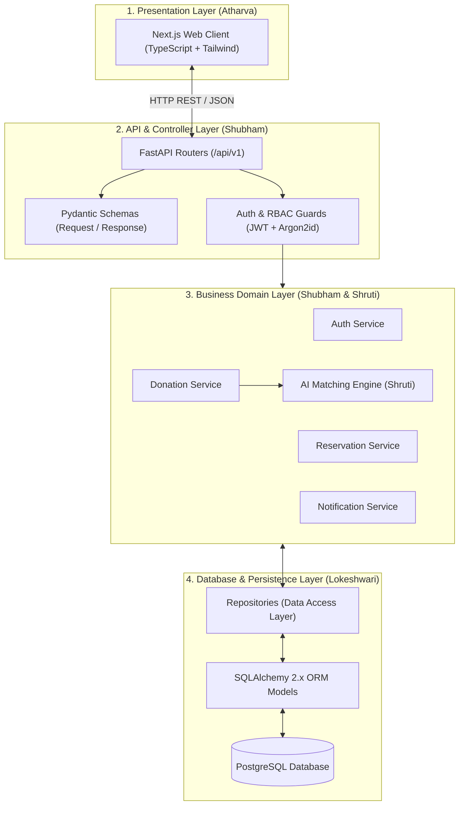
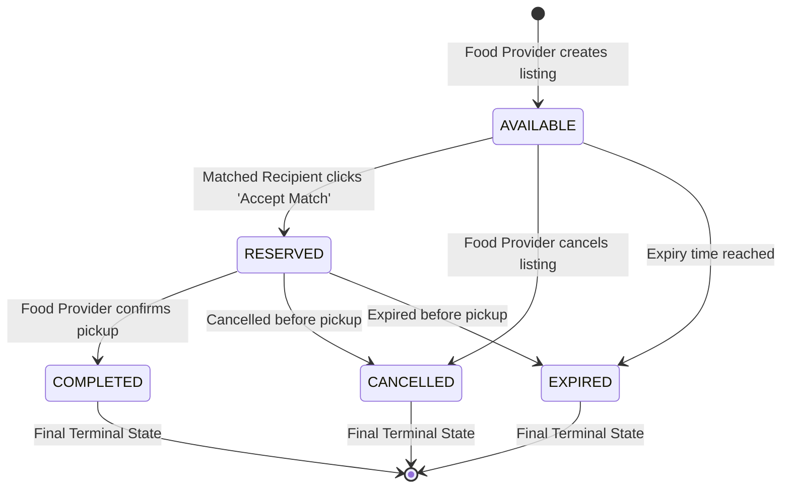
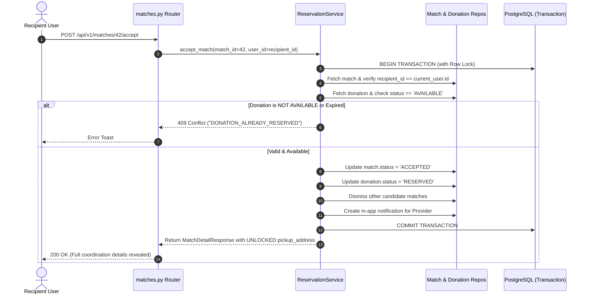
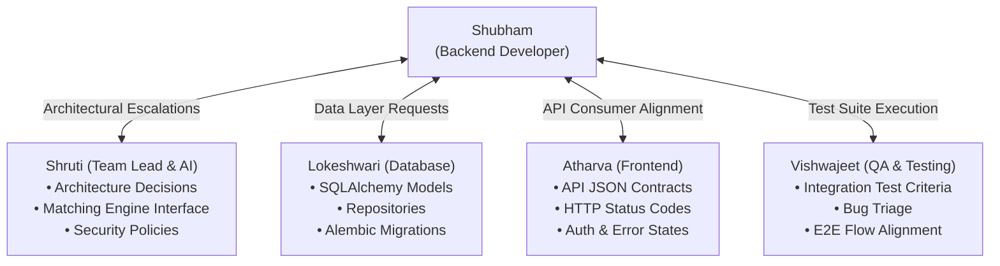

# Shubham's Backend Developer Guide — FoodSync AI

> **Status**: Architecture Frozen — Authoritative Handbook for Backend Development  
> **Target Audience**: Shubham (Backend Developer)  
> **Assigned Working Branch**: `feature/backend`  
> **Primary Role**: Backend Developer (FastAPI, Core, API Routes, Pydantic Schemas, Business Services, Integration)  
> **Primary Repository Codebase Area**: `backend/app/`  
> **Repository**: [KShruti772/FoodSync-AI](https://github.com/KShruti772/FoodSync-AI)

---

## 🌟 Core Team Principle

> **"Shubham is responsible for implementing the production FastAPI backend, REST API routers, Pydantic validation schemas, business domain services, authentication/authorization enforcement, and integrating the database layer with the matching engine. Shruti leads the team, system architecture, and the AI matching engine. Atharva implements the Next.js frontend. Lokeshwari builds the database models, repositories, and migrations. Vishwajeet leads UI/UX design specifications and QA testing across all test suites."**

---

## 👥 Final Team Ownership Model

| Teammate | Role | Assigned Branch | Scope & Owned Directories |
| :--- | :--- | :--- | :--- |
| **Shruti** | **Team Lead / AI / Architecture** | `feature/ai-matching` | `backend/app/services/matching/` *(Matching Algorithm & Scoring Logic)*<br>System Architecture, Project Lead, Cross-Layer Coordination |
| **Shubham** | **Backend Developer** | `feature/backend` | `backend/app/api/`<br>`backend/app/core/`<br>`backend/app/schemas/`<br>`backend/app/services/` *(Domain Services except matching engine)*<br>`backend/app/utils/`<br>`backend/app/main.py` |
| **Atharva** | **Frontend Developer** | `feature/frontend` | `frontend/app/`<br>`frontend/components/`<br>`frontend/hooks/`<br>`frontend/lib/`<br>`frontend/services/`<br>*(Next.js App Router, TypeScript & Tailwind CSS)* |
| **Lokeshwari** | **Database Developer** | `feature/database` | `backend/app/models/`<br>`backend/app/repositories/`<br>`backend/alembic/`<br>*(PostgreSQL Schema, SQLAlchemy 2.x Models & Migrations)* |
| **Vishwajeet** | **UI/UX + Testing / QA Lead** | `feature/ui-testing` | `backend/tests/` *(Backend Unit & Integration Tests)*<br>`tests/e2e/` *(Playwright Browser E2E Tests)*<br>`frontend/components/__tests__/` *(Component UI Tests)*<br>`docs/` *(UI/UX Specs, Test Matrices & User Flows)* |

---

# SECTION 1 — Welcome & Role Definition

Welcome to the **FoodSync AI** engineering team, Shubham!

As the **Backend Developer**, you are the engine room of the platform. Your mission is to build a robust, secure, high-performance, and maintainable REST API that powers surplus food redistribution in real time.

### Your High-Level Responsibilities:
1. **API Router Implementation**: Build structured, versioned REST controllers (`/api/v1`) in FastAPI.
2. **Data Validation & Serialization**: Construct strict Pydantic v2 schemas for all incoming HTTP requests and outgoing responses.
3. **Authentication & Authorization**: Enforce Argon2id password hashing, JWT token validation, Role-Based Access Control (RBAC), and strict resource ownership checks.
4. **Business Domain Logic**: Implement domain service classes managing donation lifecycles, reservation handling, notification dispatch, and impact metric tracking.
5. **System Integration**: Wire together Lokeshwari's database repository layer (`backend/app/repositories/`) and Shruti's heuristic matching engine (`backend/app/services/matching/`).
6. **Error Handling & API Security**: Provide standardized JSON error responses, enforce rate limiting, configure secure CORS headers, and defend sensitive location privacy.

---

# SECTION 2 — What You Own

Shubham has primary development and implementation ownership over the following backend directories:

```text
backend/app/
├── main.py                            # ⭐ FastAPI application factory, middleware, router mounting
├── api/                               # ⭐ FastAPI HTTP route controllers
│   └── v1/                            # Version 1 API routers
│       ├── auth.py                    # Registration, login, current user (/auth)
│       ├── donations.py               # Surplus food listing CRUD & cancellation (/donations)
│       ├── recipients.py              # Recipient organization profile & capacity (/recipients)
│       ├── matches.py                 # Match feeds, acceptance & rejection (/matches)
│       ├── notifications.py           # In-app notification polling & read status (/notifications)
│       └── impact.py                  # Rescued meals & CO2 savings analytics (/impact)
│
├── core/                              # ⭐ Core application infrastructure
│   ├── config.py                      # Pydantic BaseSettings environment loader (.env)
│   ├── database.py                    # SQLAlchemy engine & session dependency factory
│   └── security.py                    # Argon2id password hashing, JWT encode/decode, auth dependencies
│
├── schemas/                           # ⭐ Pydantic request/response validation models
│   ├── auth.py                        # Token, UserCreate, UserLogin, UserResponse
│   ├── donation.py                    # DonationCreate, DonationUpdate, DonationResponse, DonationDetailResponse
│   ├── recipient.py                   # RecipientProfileUpdate, RecipientProfileResponse
│   ├── match.py                       # MatchResponse, MatchDetailResponse, MatchDecisionRequest
│   ├── notification.py                # NotificationResponse, NotificationListResponse
│   └── impact.py                      # ImpactSummaryResponse, UserImpactResponse
│
├── services/                          # ⭐ Business domain logic layer
│   ├── auth_service.py                # User registration, password verification, JWT issuance
│   ├── donation_service.py            # Surplus validation, lifecycle transitions, provider rules
│   ├── recipient_service.py           # Capacity & dietary preferences management
│   ├── reservation_service.py         # Match acceptance/rejection & reservation atomicity
│   ├── notification_service.py        # In-app notification generation and mark-as-read
│   └── impact_service.py              # Rescued meals, beneficiary count, and CO2 calculation
│
└── utils/                             # ⭐ Pure utility helpers
    └── geo.py                         # Haversine distance calculations & coordinates validation
```

---

# SECTION 3 — What You Do NOT Own

To prevent merge conflicts and preserve architectural boundaries, Shubham does **not** directly implement or modify the following areas:

| Area / Directory | Primary Owner | Why Shubham Does NOT Own It |
| :--- | :--- | :--- |
| `backend/app/services/matching/` | **Shruti** (`feature/ai-matching`) | Shruti designs the AI matching heuristic algorithm, mathematical scoring weights, and ranking formulas. Shubham calls her matching service via its defined interface. |
| `backend/app/models/` | **Lokeshwari** (`feature/database`) | Lokeshwari designs the SQLAlchemy declarative database models, table relationships, foreign keys, and indexes. |
| `backend/app/repositories/` | **Lokeshwari** (`feature/database`) | Lokeshwari implements the database query layer, SQL transactions, and data access methods. |
| `backend/alembic/` | **Lokeshwari** (`feature/database`) | Lokeshwari manages database schema migrations, revision scripts, and version tracking. |
| `backend/tests/` | **Vishwajeet** (`feature/ui-testing`) | Vishwajeet owns test case design, Pytest unit/integration test suites, and QA criteria. (Shubham runs these tests locally to verify his code). |
| `frontend/` | **Atharva** (`feature/frontend`) | Atharva implements all client pages, components, hooks, and TypeScript API clients in Next.js. |

---

# SECTION 4 — FoodSync AI Architecture

FoodSync AI follows a clean **3-Tier Layered Architecture** with strict unidirectional data flow:



### Complete Request-Response Lifecycle:
1. **Incoming Request**: Next.js frontend sends `POST /api/v1/donations` with JSON payload and `Authorization: Bearer <token>` header.
2. **Middleware & Security**: FastAPI parses JWT, validates token expiration/signature, and injects current authenticated `User` via `Depends(get_current_active_user)`.
3. **Pydantic Validation**: `DonationCreate` schema validates payload types, required fields, and boundary constraints ($quantity > 0$, future expiry).
4. **Service Execution**: `donation_service.create_donation()` validates provider role, stores record via `donation_repo`, and calls Shruti's `matching_service.generate_matches()`.
5. **Database Transaction**: Repository persists the entity in PostgreSQL using SQLAlchemy within an atomic transaction.
6. **Outgoing Response**: The service returns data serialized through `DonationResponse` Pydantic model (with exact street address securely masked for general browsing).

---

# SECTION 5 — What the Backend Is (Beginner's Guide)

If you are new to professional web systems, here is a foundational breakdown of core backend concepts:

### 1. What is a Backend?
The backend is the server-side engine running behind the scenes. It handles business logic, security authentication, database transactions, calculations, and data privacy. The browser/frontend **never** talks directly to the database; it always communicates through the backend.

### 2. Why does FoodSync AI need a Backend?
- **Security & Authorization**: To ensure food recipients cannot edit food listings, providers cannot approve their own donations, and unverified users cannot access system data.
- **Privacy Protection**: To prevent exact street addresses and donor phone numbers from leaking over the internet before a match is accepted.
- **Intelligent Matching**: To calculate compatibility scores between surplus meals and local charities in milliseconds.
- **Concurrency Control**: To prevent "double-reservations" where two charities attempt to accept the same 50 meals at the same moment.

### 3. Key Concepts Glossary

| Concept | Plain English Definition | FoodSync AI Example |
| :--- | :--- | :--- |
| **API Endpoint** | A specific URL on the server designed to receive requests and return data. | `POST /api/v1/donations` |
| **HTTP Method** | The verb indicating the action to perform (`GET`, `POST`, `PUT`, `PATCH`, `DELETE`). | `GET` to view matches, `POST` to accept a match |
| **REST** | A standard architectural style for organizing web APIs around nouns/resources. | `/api/v1/donations/{id}` |
| **JSON** | A lightweight text format for exchanging structured data over HTTP. | `{"title": "50 Veg Meals", "quantity_meals": 50}` |
| **Pydantic** | Python data validation library that automatically enforces data types and shapes. | Rejecting `-10` meals before it hits business logic |
| **SQLAlchemy** | Python library that maps Python classes to SQL database tables (ORM). | Converting a `Donation` Python object into a SQL `INSERT` |
| **Alembic** | Version control for database tables (tracks schema changes over time). | Adding a new column `dietary_type` to PostgreSQL |

---

# SECTION 6 — Backend Technology Stack

FoodSync AI uses a modern, lightweight, asynchronous Python stack:

```text
┌─────────────────────────────────────────────────────────────┐
│ Fast, Async REST API Framework : FastAPI 0.110+              │
├─────────────────────────────────────────────────────────────┤
│ Data Validation & Serialization: Pydantic v2.6+             │
├─────────────────────────────────────────────────────────────┤
│ Database ORM & Session Factory : SQLAlchemy 2.0+            │
├─────────────────────────────────────────────────────────────┤
│ Production Relational Database : PostgreSQL 15+             │
├─────────────────────────────────────────────────────────────┤
│ Database Schema Migrations     : Alembic 1.13+              │
├─────────────────────────────────────────────────────────────┤
│ Password Hashing Algorithm     : Passlib + Argon2id         │
├─────────────────────────────────────────────────────────────┤
│ Token Authentication Standard  : PyJWT / python-jose (HS256)│
├─────────────────────────────────────────────────────────────┤
│ Production ASGI Web Server     : Uvicorn 0.28+              │
└─────────────────────────────────────────────────────────────┘
```

> [!IMPORTANT]
> **No Node.js, Express, MongoDB, or SQLite in Production**: FoodSync AI backend is strictly built with Python, FastAPI, and PostgreSQL.

---

# SECTION 7 — Detailed Repository Structure

```text
FoodSync-AI/
├── .env.example                       # Environment variables template
├── README.md                          # Repository overview
├── docs/                              # Frozen architectural contracts
│   ├── API_CONTRACT.md                # Complete HTTP request/response specs
│   ├── DATABASE_SCHEMA.md             # Tables, columns, foreign keys, indexes
│   ├── AI_MATCHING.md                 # Heuristic formulas and matching weights
│   ├── SECURITY_GUIDELINES.md         # RBAC, JWT, hashing, rate limiting
│   └── SHUBHAM_BACKEND_DEVELOPER_GUIDE.md # This guide
│
├── backend/
│   ├── alembic/                       # Database migrations (Lokeshwari)
│   │   ├── env.py
│   │   └── versions/
│   │
│   ├── app/
│   │   ├── main.py                    # FastAPI entrypoint (Shubham)
│   │   ├── api/                       # API Route Controllers (Shubham)
│   │   │   └── v1/
│   │   │       ├── auth.py
│   │   │       ├── donations.py
│   │   │       ├── recipients.py
│   │   │       ├── matches.py
│   │   │       ├── notifications.py
│   │   │       └── impact.py
│   │   │
│   │   ├── core/                      # Infrastructure & Security (Shubham)
│   │   │   ├── config.py              # Pydantic BaseSettings (.env loading)
│   │   │   ├── database.py            # Engine, sessionmaker, get_db dependency
│   │   │   └── security.py            # Password hashing, JWT, auth dependencies
│   │   │
│   │   ├── models/                    # SQLAlchemy ORM Models (Lokeshwari)
│   │   │   ├── user.py
│   │   │   ├── donation.py
│   │   │   ├── recipient.py
│   │   │   ├── match.py
│   │   │   ├── notification.py
│   │   │   └── impact.py
│   │   │
│   │   ├── repositories/              # Database Access Layer (Lokeshwari)
│   │   │   ├── user_repo.py
│   │   │   ├── donation_repo.py
│   │   │   ├── recipient_repo.py
│   │   │   ├── match_repo.py
│   │   │   ├── notification_repo.py
│   │   │   └── impact_repo.py
│   │   │
│   │   ├── schemas/                   # Pydantic Request/Response Models (Shubham)
│   │   │   ├── auth.py
│   │   │   ├── donation.py
│   │   │   ├── recipient.py
│   │   │   ├── match.py
│   │   │   ├── notification.py
│   │   │   └── impact.py
│   │   │
│   │   ├── services/                  # Business Logic Layer (Shubham & Shruti)
│   │   │   ├── auth_service.py
│   │   │   ├── donation_service.py
│   │   │   ├── recipient_service.py
│   │   │   ├── reservation_service.py # Match accept/reject & reservation handling
│   │   │   ├── notification_service.py
│   │   │   ├── impact_service.py
│   │   │   └── matching/              # AI Matching Engine (Shruti)
│   │   │       └── matching_service.py
│   │   │
│   │   └── utils/                     # Utility Helpers (Shubham)
│   │       └── geo.py                 # Haversine distance formulas
│   │
│   └── tests/                         # Pytest Test Suites (Vishwajeet)
│       ├── unit/                      # Unit tests
│       └── integration/               # API endpoint integration tests
│
└── frontend/                          # Next.js Web Client (Atharva)
```

---

# SECTION 8 — FastAPI Application Structure (`backend/app/main.py`)

Shubham maintains `backend/app/main.py` as the application factory:

```python
# backend/app/main.py
from fastapi import FastAPI
from fastapi.middleware.cors import CORSMiddleware
from app.core.config import settings
from app.api.v1 import auth, donations, recipients, matches, notifications, impact

app = FastAPI(
    title=settings.PROJECT_NAME,
    version="1.0.0",
    description="FoodSync AI REST API — Connecting surplus food with communities in need.",
    docs_url="/docs",
    redoc_url="/redoc",
    openapi_url="/api/v1/openapi.json",
)

# CORS Configuration
app.add_middleware(
    CORSMiddleware,
    allow_origins=settings.ALLOWED_ORIGINS,
    allow_credentials=True,
    allow_methods=["*"],
    allow_headers=["*"],
)

# Include API v1 Routers
app.include_router(auth.router, prefix="/api/v1/auth", tags=["Authentication"])
app.include_router(donations.router, prefix="/api/v1/donations", tags=["Donations"])
app.include_router(recipients.router, prefix="/api/v1/recipients", tags=["Recipients"])
app.include_router(matches.router, prefix="/api/v1/matches", tags=["Matches"])
app.include_router(notifications.router, prefix="/api/v1/notifications", tags=["Notifications"])
app.include_router(impact.router, prefix="/api/v1/impact", tags=["Impact Analytics"])

@app.get("/health", tags=["Health"])
async def health_check():
    return {"status": "healthy", "service": "foodsync-backend"}
```

---

# SECTION 9 — API Layer & Routing (`backend/app/api/v1/`)

All endpoints are strictly defined in [`docs/API_CONTRACT.md`](file:///Users/shrutikondabathula/FoodSync-AI/docs/API_CONTRACT.md). Below is the route implementation summary:

### 1. Authentication (`/api/v1/auth`)
- `POST /api/v1/auth/register` $\rightarrow$ Register `FOOD_PROVIDER` or `RECIPIENT` (No admin registration).
- `POST /api/v1/auth/login` $\rightarrow$ Validate credentials and return JWT bearer token.
- `GET /api/v1/auth/me` $\rightarrow$ Fetch current authenticated user profile.

### 2. Food Donations (`/api/v1/donations`)
- `POST /api/v1/donations` $\rightarrow$ Create surplus listing (`status: AVAILABLE`) & trigger matching.
- `GET /api/v1/donations` $\rightarrow$ Public/Recipient listing feed (exact pickup address masked).
- `GET /api/v1/donations/{id}` $\rightarrow$ Single donation details (address masked unless user is authorized).
- `DELETE /api/v1/donations/{id}` $\rightarrow$ Cancel listing (`status: CANCELLED`), only if owner and `AVAILABLE`.

### 3. Recipients (`/api/v1/recipients`)
- `GET /api/v1/recipients/profile` $\rightarrow$ Fetch capacity, dietary filters, storage capabilities.
- `PUT /api/v1/recipients/profile` $\rightarrow$ Update capacity in meals and search radius.

### 4. Matches & Reservations (`/api/v1/matches`)
- `GET /api/v1/matches/my-matches` $\rightarrow$ Fetch incoming ranked matches for logged-in recipient.
- `POST /api/v1/matches/{id}/accept` $\rightarrow$ Atomically reserve donation, unlock address, notify provider.
- `POST /api/v1/matches/{id}/reject` $\rightarrow$ Dismiss match, notify next candidate.

### 5. In-App Notifications (`/api/v1/notifications`)
- `GET /api/v1/notifications` $\rightarrow$ Fetch notification feed with unread count.
- `PATCH /api/v1/notifications/{id}/read` $\rightarrow$ Mark single alert as read.
- `PATCH /api/v1/notifications/read-all` $\rightarrow$ Mark all alerts as read.

### 6. Impact Analytics (`/api/v1/impact`)
- `GET /api/v1/impact/summary` $\rightarrow$ Global platform metrics (meals rescued, $\text{CO}_2$ saved).
- `GET /api/v1/impact/me` $\rightarrow$ User-specific contribution metrics.

---

# SECTION 10 — Pydantic Schemas & Request Validation (`backend/app/schemas/`)

Pydantic schemas enforce type safety, input boundaries, and sanitize output JSON:

```python
# backend/app/schemas/donation.py
from pydantic import BaseModel, Field, ConfigDict
from datetime import datetime
from typing import Optional
from app.models.enums import FoodType, DonationStatus

class DonationCreate(BaseModel):
    title: str = Field(..., min_length=3, max_length=255, description="Brief summary of surplus food")
    food_type: FoodType
    quantity_meals: int = Field(..., gt=0, description="Quantity in meal equivalents; must be > 0")
    perishable: bool = True
    preparation_time: datetime
    expiry_time: datetime = Field(..., description="Must be at least 30 mins in future")
    pickup_address: str = Field(..., min_length=5, max_length=500)
    city_area: str = Field(..., min_length=2, max_length=100, description="Public approximate area, e.g. Pune Central")
    latitude: float = Field(..., ge=-90.0, le=90.0)
    longitude: float = Field(..., ge=-180.0, le=180.0)
    special_notes: Optional[str] = Field(None, max_length=1000)

class DonationResponse(BaseModel):
    id: int
    provider_id: int
    title: str
    food_type: FoodType
    quantity_meals: int
    status: DonationStatus
    city_area: str                         # ✅ Public approximate location
    pickup_address: Optional[str] = None   # 🔒 Masked unless authorized!
    expiry_time: datetime
    created_at: datetime

    model_config = ConfigDict(from_attributes=True)
```

---

# SECTION 11 — Authentication & Authorization (`backend/app/core/security.py`)

FoodSync AI uses **Argon2id** password hashing and **JWT Bearer Tokens**:

```python
# backend/app/core/security.py
from passlib.context import CryptContext
import jwt
from datetime import datetime, timedelta, timezone
from fastapi import Depends, HTTPException, status
from fastapi.security import OAuth2PasswordBearer
from app.core.config import settings

pwd_context = CryptContext(schemes=["argon2"], deprecated="auto")
oauth2_scheme = OAuth2PasswordBearer(tokenUrl="/api/v1/auth/login")

def hash_password(password: str) -> str:
    return pwd_context.hash(password)

def verify_password(plain_password: str, hashed_password: str) -> bool:
    return pwd_context.verify(plain_password, hashed_password)

def create_access_token(data: dict, expires_delta: Optional[timedelta] = None) -> str:
    to_encode = data.copy()
    expire = datetime.now(timezone.utc) + (expires_delta or timedelta(minutes=settings.ACCESS_TOKEN_EXPIRE_MINUTES))
    to_encode.update({"exp": expire})
    return jwt.encode(to_encode, settings.SECRET_KEY, algorithm=settings.ALGORITHM)
```

### Role-Based Access Control (RBAC) Dependency:
```python
def require_role(allowed_roles: list[str]):
    def role_checker(current_user: User = Depends(get_current_active_user)):
        if current_user.role not in allowed_roles:
            raise HTTPException(
                status_code=status.HTTP_403_FORBIDDEN,
                detail=f"Access forbidden: requires one of {allowed_roles}"
            )
        return current_user
    return role_checker
```

---

# SECTION 12 — Business Domain Services (`backend/app/services/`)

Route handlers must remain thin. All business logic lives in domain service classes:

```python
# backend/app/services/donation_service.py
from sqlalchemy.orm import Session
from fastapi import HTTPException, status
from datetime import datetime, timezone
from app.schemas.donation import DonationCreate
from app.repositories.donation_repo import DonationRepository
from app.services.matching.matching_service import MatchingService

class DonationService:
    def __init__(self, db: Session):
        self.db = db
        self.repo = DonationRepository(db)
        self.matching_service = MatchingService(db)

    def create_donation(self, provider_id: int, data: DonationCreate):
        # 1. Enforce business validation
        if data.expiry_time <= datetime.now(timezone.utc):
            raise HTTPException(
                status_code=status.HTTP_422_UNPROCESSABLE_ENTITY,
                detail="Expiry time must be in the future."
            )
        
        # 2. Persist donation via repository
        donation = self.repo.create(provider_id=provider_id, data=data)
        
        # 3. Synchronously trigger matching engine (Shruti's component)
        self.matching_service.generate_matches(donation_id=donation.id)
        
        return donation
```

---

# SECTION 13 — Strict Donation Lifecycle

The system supports **only** 5 lifecycle states. There is **NO `CLAIMED` status**:



### Permitted State Transition Rules:
1. `AVAILABLE` $\rightarrow$ `RESERVED`: Triggered strictly by `POST /api/v1/matches/{id}/accept`.
2. `AVAILABLE` $\rightarrow$ `CANCELLED`: Triggered strictly by provider via `DELETE /api/v1/donations/{id}`.
3. `RESERVED` $\rightarrow$ `COMPLETED`: Triggered by provider upon physical pickup handover.
4. `*` $\rightarrow$ `EXPIRED`: Triggered when system clock $> expiry\_time$.

---

# SECTION 14 — Match Acceptance & Concurrency Handling

Handling `POST /api/v1/matches/{match_id}/accept` is one of Shubham's most critical responsibilities:



### Backend Invariants for Acceptance:
- Must execute inside an **atomic database transaction** (`with db.begin():`).
- Must verify that `donation.status == AVAILABLE` with a row-level lock (`with_for_update()`) to prevent race conditions.
- If two recipients click "Accept" at the exact same millisecond, the first transaction wins; the second receives `409 Conflict`.

---

# SECTION 15 — Integrating Shruti's AI Matching Engine

The matching engine is designed and maintained by **Shruti** (`backend/app/services/matching/matching_service.py`).

### How Shubham Integrates It:
1. **Calling the Interface**: After a donation is created, Shubham's `donation_service.py` invokes:
   ```python
   matches = self.matching_service.generate_matches(donation_id=donation.id)
   ```
2. **Deterministic Multi-Factor Scoring**:
   $$\text{Score} = 0.35 \times S_{dist} + 0.30 \times S_{urg} + 0.20 \times S_{cap} + 0.15 \times S_{req}$$
3. **Persisting Matches**: The matching engine computes scores and returns ranked recipient pairs. Shubham ensures match records are stored via `match_repo` and triggers in-app notification creation.

---

# SECTION 16 — Notifications Integration

FoodSync AI uses an in-app notification model polled over REST:

- **When to create a notification**:
  - `MATCH_FOUND`: Sent to Recipient when a new compatible donation is published.
  - `RESERVATION_CONFIRMED`: Sent to Food Provider when a Recipient accepts a match.
  - `DONATION_CANCELLED`: Sent to Recipient if Provider cancels an active reservation.
  - `DONATION_COMPLETED`: Sent to both parties when pickup is finalized.
- **REST Polling Endpoints**: Atharva's frontend polls `GET /api/v1/notifications` every 30 seconds.

---

# SECTION 17 — Database Interaction (Working with Lokeshwari's Layer)

Shubham consumes database models and repositories created by **Lokeshwari** (`feature/database`):

```python
# How Shubham consumes Lokeshwari's repository in a service:
from app.repositories.donation_repo import DonationRepository

class DonationService:
    def __init__(self, db: Session):
        self.donation_repo = DonationRepository(db)

    def get_donation(self, donation_id: int):
        donation = self.donation_repo.get_by_id(donation_id)
        if not donation:
            raise HTTPException(status_code=404, detail="Donation listing not found")
        return donation
```

> [!CAUTION]
> **Do NOT write raw SQL in route controllers.** Always use Lokeshwari's repository methods or SQLAlchemy ORM query builders. If you need a new query or column, request it from Lokeshwari.

---

# SECTION 18 — Privacy & Backend Security Invariants

### 1. Data Privacy Model
- **Public / Browse Mode**:
  `GET /api/v1/donations` and `GET /api/v1/matches/my-matches` MUST return `pickup_address = None` and `provider_phone = None`. Only `city_area` (e.g. *"Pune Central • 2.4 km away"*) is visible.
- **Authorized Unlocked Mode**:
  Exact `pickup_address` and contact details are included in the response JSON **only** when the requesting user is:
  - The Food Provider who owns the donation, OR
  - The Recipient holding an `ACCEPTED` match on that `RESERVED` donation.

### 2. Core Security Checklist
- [ ] **No Secrets in Git**: Never hardcode database passwords, JWT secrets, or API keys. Always use `settings.SECRET_KEY` loaded from `.env`.
- [ ] **Zero-Trust Client**: Never trust role headers or user IDs sent in the request body. Always read identity from the validated JWT token (`current_user.id`).
- [ ] **No Admin Self-Registration**: Reject any `POST /api/v1/auth/register` with `role: "ADMIN"`. Admin accounts are created exclusively via backend CLI seed scripts.
- [ ] **Generic Auth Errors**: Always return `"Invalid email or password"` on failed login to prevent username harvesting.
- [ ] **Rate Limiting**: Apply SlowAPI limits (`100/minute` general, `5/minute` on login/register).

---

# SECTION 19 — Standardized Error Handling

All error responses from the backend must follow a consistent JSON structure:

```json
{
  "error_code": "RESOURCE_NOT_FOUND",
  "message": "The requested donation listing does not exist or has expired.",
  "timestamp": "2026-09-03T22:30:00Z"
}
```

### Standard HTTP Status Codes to Use:
- `200 OK`: Successful fetch or state update.
- `201 Created`: Successful creation of user or donation listing.
- `400 Bad Request`: Malformed request or illegal argument.
- `401 Unauthorized`: Missing, expired, or invalid JWT token.
- `403 Forbidden`: Authenticated user lacks required role or resource ownership.
- `404 Not Found`: Target entity ID does not exist in database.
- `409 Conflict`: Business rule violation (e.g., attempting to reserve an already reserved listing).
- `422 Unprocessable Entity`: Pydantic input validation failure.
- `500 Internal Server Error`: Unexpected server exception (logged, never exposed raw to client).

---

# SECTION 20 — Testing Strategy & Working with Vishwajeet

**Vishwajeet** (`feature/ui-testing`) is the primary owner and author of test suites under `backend/tests/`.

### Shubham's Testing Workflow:
1. **Local Test Verification**: Before opening a Pull Request, Shubham runs the Pytest test suites locally:
   ```bash
   pytest backend/tests/
   ```
2. **Cooperative Triage**: If an API integration test fails in `backend/tests/integration/`:
   - Check if your route implementation matches [`docs/API_CONTRACT.md`](file:///Users/shrutikondabathula/FoodSync-AI/docs/API_CONTRACT.md).
   - If the code has a bug, fix it on `feature/backend`.
   - If the test scenario has an outdated expectation, coordinate with Vishwajeet.

---

# SECTION 21 — Working with Other Teammates



---

# SECTION 22 — Git Workflow for `feature/backend`

Shubham works exclusively on `feature/backend`. **Never commit or push directly to `main`**.

### Daily Step-by-Step Git Commands:

```bash
# 1. Start of day: Check working directory is clean
git status

# 2. Switch to main and pull latest team integration
git switch main
git pull origin main

# 3. Switch to your backend feature branch and merge main
git switch feature/backend
git merge main

# 4. Implement your backend routers, schemas, or services under backend/app/

# 5. Run tests locally to verify correctness
pytest backend/tests/

# 6. Check what files you modified
git status
git diff

# 7. Stage and commit with conventional commit messages
git add backend/app/
git commit -m "feat(donations): implement donation creation route and validation"

# 8. Push to your remote feature branch
git push origin feature/backend

# 9. Open a Pull Request on GitHub (feature/backend -> main)
```

### Strict Git Rules:
- ❌ **NO `git push --force`** on any branch.
- ❌ **NO direct pushes to `main`**.
- ❌ **NO committing `.env` files or secrets**.
- ❌ **NO editing other teammates' active branches**.

---

# SECTION 23 — Daily Workflow Routine

1. **Pull & Sync**: Merge the latest `main` into `feature/backend`.
2. **Review Spec**: Open [`docs/API_CONTRACT.md`](file:///Users/shrutikondabathula/FoodSync-AI/docs/API_CONTRACT.md) for the endpoint assigned today.
3. **Build Schemas**: Define Pydantic request and response models in `backend/app/schemas/`.
4. **Build Service**: Implement domain logic in `backend/app/services/`.
5. **Build Router**: Mount route handler in `backend/app/api/v1/` with auth and dependency injection.
6. **Test Locally**: Run `pytest backend/tests/` and verify interactive Swagger docs at `http://localhost:8000/docs`.
7. **Commit & Push**: Commit with conventional messages and push to `feature/backend`.
8. **Update Team**: Notify Atharva and Vishwajeet that the endpoint is ready for integration.

---

# SECTION 24 — First-Day Checklist for Shubham

- [ ] Clone the repository and checkout `feature/backend`.
- [ ] Create a local virtual environment: `python -m venv venv && source venv/bin/activate`.
- [ ] Read [`docs/PROJECT_OVERVIEW.md`](file:///Users/shrutikondabathula/FoodSync-AI/docs/PROJECT_OVERVIEW.md) and [`docs/API_CONTRACT.md`](file:///Users/shrutikondabathula/FoodSync-AI/docs/API_CONTRACT.md).
- [ ] Review `backend/app/core/config.py` and create your local `.env` file from `.env.example`.
- [ ] Inspect the placeholder files in `backend/app/api/`, `backend/app/schemas/`, and `backend/app/services/`.
- [ ] Run `pytest backend/tests/` to verify local test runner execution.

---

# SECTION 25 — Common Beginner Mistakes to Avoid

1. ❌ **Putting SQL queries inside route controllers**: Always delegate data access to Lokeshwari's repository layer.
2. ❌ **Trusting user-supplied IDs from request body**: Always verify ownership against `current_user.id` decoded from the JWT token.
3. ❌ **Leaking exact addresses in public feeds**: Always ensure `DonationResponse` outputs `None` for `pickup_address` unless authorized.
4. ❌ **Hardcoding passwords or secret keys**: Always load configuration via `app.core.config.settings`.
5. ❌ **Using the prohibited word `CLAIMED`**: The donation state is strictly `RESERVED` upon match acceptance.
6. ❌ **Mutating database state without a transaction**: Always wrap multi-table state updates in an atomic session block.

---

# SECTION 26 — Questions & Escalation Decision Guide

```text
Have an API route, Pydantic schema, or service logic question?
      ↓
You own it! Check docs/API_CONTRACT.md and build it.

Have an AI matching algorithm or mathematical scoring question?
      ↓
Contact SHRUTI (feature/ai-matching)

Have a database model, table relationship, or migration question?
      ↓
Contact LOKESHWARI (feature/database)

Have a frontend API integration or UI feedback state question?
      ↓
Contact ATHARVA (feature/frontend)

Have a test failure, Pytest fixture, or QA matrix question?
      ↓
Contact VISHWAJEET (feature/ui-testing)

Have a core architecture, security policy, or scope change question?
      ↓
Contact SHRUTI (Team Lead)
```
