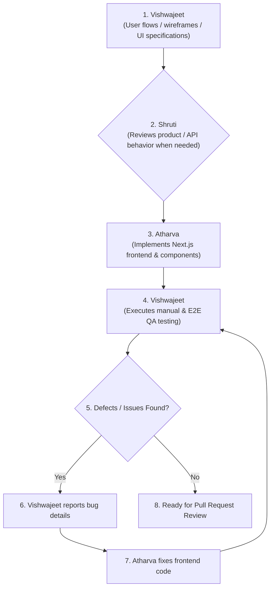
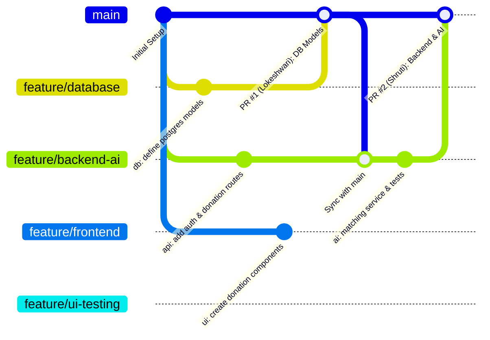
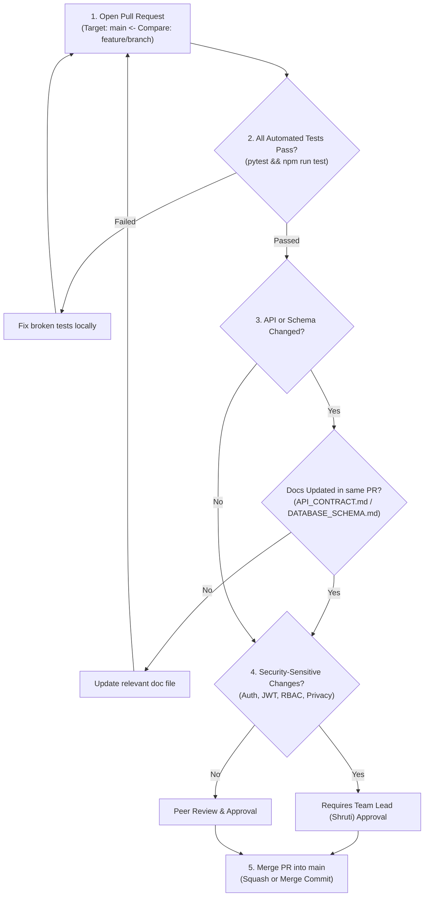

# Team Workflow & Git Collaboration — FoodSync AI

> **Status**: Architecture Frozen — Single Source of Truth for Team Git Workflow  
> **Repository**: [KShruti772/FoodSync-AI](https://github.com/KShruti772/FoodSync-AI)  
> **Team Lead**: Shruti

---

## 1. Team Roles & Branch Ownership

FoodSync AI follows a simple, beginner-friendly feature branch workflow. The `main` branch is the **shared, protected integration branch** for the entire team; it is **never** used as an individual developer's personal working branch.

| Teammate | Role | Primary Assigned Branch | Scope & Responsibilities |
| :--- | :--- | :--- | :--- |
| **Shruti** | **Team Lead / Backend + AI / System Architecture** | `feature/backend-ai` | Backend implementation, authentication, APIs, business services, AI matching engine, system architecture |
| **Lokeshwari** | **Database Developer** | `feature/database` | PostgreSQL schema, SQLAlchemy models, repositories, Alembic migrations, database integrity |
| **Atharva** | **Frontend Developer** | `feature/frontend` | Next.js frontend implementation, UI components, client state, API integration, responsive UI, bug fixes |
| **Vishwajeet** | **UI/UX Design & QA / Testing** | `feature/ui-testing` | UI/UX design and review, user flows, wireframes, screen requirements, UX consistency, accessibility/responsive reviews, test-case design, manual testing, E2E tests, bug reporting & regression testing |
| **All Team** | **Integration / Staging** | `main` *(Protected)* | Stable production-ready codebase; updated exclusively via reviewed Pull Requests |

### 1.1 Role Boundaries: Vishwajeet vs. Atharva

#### Vishwajeet (`feature/ui-testing`): UI/UX Design & QA / Testing
- **Primary Responsibilities**:
  1. UI/UX design and review
  2. User flows and user journey mapping
  3. Wireframes and screen specifications
  4. Screen requirements and design token consistency
  5. UX consistency across all portals
  6. Accessibility review (WCAG 2.1 AA, keyboard navigation, ARIA)
  7. Responsive-design review across mobile, tablet, and desktop viewports
  8. Manual exploratory, functional, and edge-case testing
  9. Test-case design and test matrices
  10. E2E and user-flow testing (`tests/e2e/`)
  11. Bug reporting, defect logging, and regression testing
- **NOT His Responsibility**:
  - Backend implementation
  - FastAPI routes and controllers
  - Business domain logic
  - AI matching engine
  - Database implementation
  - SQLAlchemy ORM models
  - Alembic database migrations
  - PostgreSQL management
  - Authentication implementation
  - Frontend architecture ownership
  - Building Atharva's frontend code unless explicitly agreed

#### Atharva (`feature/frontend`): Frontend Developer
- **Primary Responsibilities**:
  1. Implement the production frontend based on Vishwajeet's UI/UX specification
  2. Build Next.js pages and reusable UI components
  3. Integrate backend REST APIs (`/api/v1`)
  4. Handle frontend states (loading, empty, error, success, disabled, unauthorized)
  5. Implement responsive UI with Tailwind CSS
  6. Fix frontend bugs and layout defects reported by Vishwajeet

### 1.2 Team Collaboration Flow


---

## 2. Git Branching Strategy



### Core Collaboration Rules:
1. **Protected `main` Branch**: **NEVER commit or push directly to `main`**. All updates to `main` must occur through reviewed Pull Requests.
2. **Dedicated Feature Branches**: Every teammate works exclusively within their assigned feature branch or a short-lived sub-feature branch (e.g. `feature/frontend-login`).
3. **No Force Pushing**: `git push --force` is strictly banned on `main` and all shared remote branches.
4. **Zero Secrets in Git**: Never commit `.env` files, actual passwords, or JWT secrets. Check `git status` before staging.

---

## 3. Mandatory PR & Merge Criteria

Before any Pull Request is merged into `main`, it must fulfill these criteria:



### Merge Checklist:
- [ ] **Tests Pass**: All unit and integration tests pass locally (`pytest` and `cd frontend && npm run test`).
- [ ] **Documentation Synchronized**: If endpoints or database fields changed, [API_CONTRACT.md](API_CONTRACT.md) and [DATABASE_SCHEMA.md](DATABASE_SCHEMA.md) are updated in the same PR.
- [ ] **Security Review**: Changes affecting authentication, password hashing, JWT tokens, or pickup address privacy require review from **Shruti**.
- [ ] **Clean Git History**: Meaningful commit messages adhering to conventional commit standards.

---

## 4. Daily Developer Git Workflow

### Step 1: Start of Day (Sync with `main`)
Always integrate the latest approved work from teammates before writing new code:
```bash
# 1. Ensure working directory is clean
git status

# 2. Pull the latest main
git switch main
git pull origin main

# 3. Switch to your feature branch and merge latest main
git switch <your-feature-branch>
git merge main
```

### Step 2: Implement & Test Locally
Make small, focused changes inside your designated module folder:
```bash
# Run tests after writing code
pytest backend/tests/unit/
```

### Step 3: Stage & Commit
Review your changes and commit with conventional messages:
```bash
# 1. Review status and diffs
git status
git diff

# 2. Stage only intentional changes (never stage .env)
git add .

# 3. Commit with conventional commit format
git commit -m "feat(matching): add haversine distance calculation"
```

### Step 4: Push & Open Pull Request
```bash
# Push to your remote feature branch
git push origin <your-feature-branch>
```
1. Open a PR at [KShruti772/FoodSync-AI/pulls](https://github.com/KShruti772/FoodSync-AI/pulls).
2. Set Base: `main` $\leftarrow$ Compare: `<your-feature-branch>`.
3. Fill out the PR summary (what was implemented, contract followed, test results).
4. Request review from **Shruti** or the relevant feature partner.

---

## 5. Commit Message Conventions

Use **Conventional Commits** for clear, structured history:

- `feat(scope)`: A new feature or endpoint (e.g. `feat(donation): add quantity validation`)
- `fix(scope)`: A bug fix (e.g. `fix(auth): correct argon2 hashing verification`)
- `docs(scope)`: Documentation updates (e.g. `docs(api): update donation status enum`)
- `test(scope)`: Adding or updating test cases (e.g. `test(reservation): add double reservation concurrency test`)
- `refactor(scope)`: Restructuring code without changing functionality (e.g. `refactor(repo): extract query filters`)

---

## 6. Merge Conflict Resolution Protocol

When merge conflicts occur during `git merge main`:
1. **Never guess or blindly overwrite a teammate's logic**.
2. Run `git status` to identify conflicting files.
3. Open conflicting files and inspect conflict markers (`<<<<<<<`, `=======`, `>>>>>>>`).
4. Coordinate directly with the author of the conflicting code.
5. Resolve the conflict, run all tests locally, stage with `git add <file>`, and commit the merge.

---

## 7. Architectural Status

> [!IMPORTANT]
> **Architecture is frozen; no blocking architectural decisions remain.**
