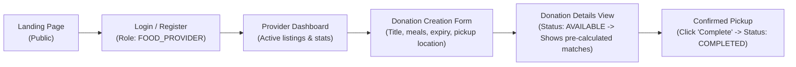
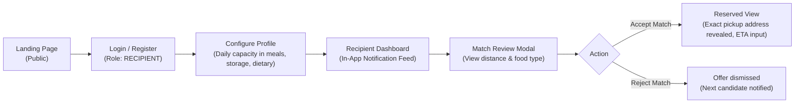
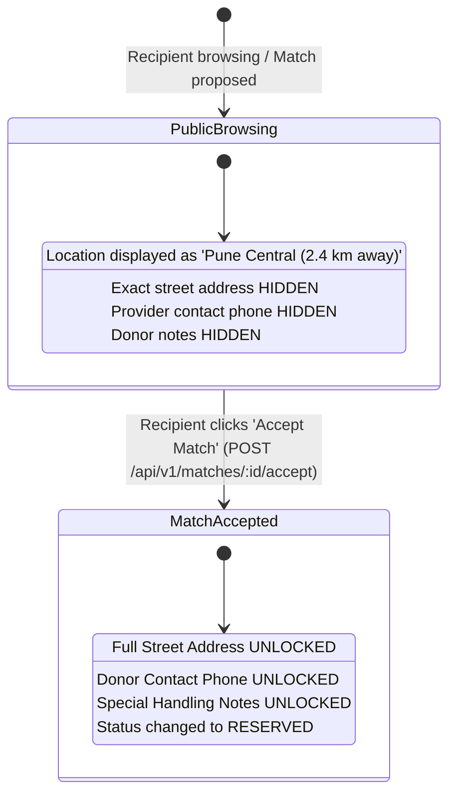

# UI & UX Guidelines — FoodSync AI

> **Status**: Architecture Frozen — Single Source of Truth for Frontend Architecture  
> **Frontend Stack**: Next.js (App Router) + TypeScript + Tailwind CSS  
> **Module Owner**: Vishwajeet (`feature/ui-testing`) & Atharva (`feature/frontend`)  
> **Repository**: [KShruti772/FoodSync-AI](https://github.com/KShruti772/FoodSync-AI)

---

## 1. UI Engineering Invariants & Architectural Boundaries

1. **Backend Authoritative Principle**:
   - The frontend client **never** performs authorization decisions, role verification, or matching calculations itself.
   - The FastAPI backend is the sole authority on donation states, claim validity, and user permissions.
   - The frontend's role is strictly presentation, client-side input validation, and rendering backend state.
2. **Location & Contact Privacy Rules in UI**:
   - **Before Match Acceptance / General Browse**: The UI displays only approximate geographic locations and distance (e.g. *"Pune Central • 2.4 km away"*). The exact street address, donor phone number, and private notes are hidden.
   - **After Match Acceptance**: Once a recipient explicitly clicks "Accept Match" and the backend transitions the donation to `RESERVED`, the UI renders the full pickup address, donor telephone, and thermal handling instructions in the active coordination card.
3. **No Heavy External UI Component Libraries**:
   - The MVP uses clean, custom Tailwind CSS utility classes. Do not install heavy component frameworks (e.g. MUI, AntD, Chakra) to keep bundle sizes minimal and student development manageable.
4. **Mobile-First Responsive Design**:
   - All layouts must adapt fluidly from mobile devices ($375\text{px}+$ width) to desktop screens ($1440\text{px}+$ width).

---

## 2. Design System & Tailwind CSS Tokens

### 2.1 Color Palette (Tailwind CSS Mapping)

| Palette Role | Tailwind Class | Hex Equivalent | Usage |
| :--- | :--- | :--- | :--- |
| **Brand Primary** | `bg-emerald-500` / `text-emerald-500` | `#10B981` | Primary action buttons, active navigation, brand accents |
| **Brand Primary Hover** | `hover:bg-emerald-600` | `#059669` | Button hover and focus states |
| **Secondary Accent** | `bg-teal-600` / `text-teal-600` | `#0D9488` | Secondary action buttons, match score badges |
| **Background Light** | `bg-slate-50` | `#F8FAFC` | Main application page background |
| **Surface / Card** | `bg-white` | `#FFFFFF` | Card containers, modal overlays, form input backgrounds |
| **Main Text** | `text-slate-900` | `#0F172A` | Primary headlines, table data, form labels |
| **Muted Text** | `text-slate-500` | `#64748B` | Subheadings, timestamps, placeholder text |
| **Borders** | `border-slate-200` | `#E2E8F0` | Card borders, dividers, form input outlines |
| **Warning** | `bg-amber-500` / `text-amber-600` | `#F59E0B` | Expiring soon pills (< 2 hrs remaining), pending match status |
| **Danger / Error** | `bg-red-500` / `text-red-600` | `#EF4444` | Expired tags, cancel buttons, form error banners |
| **Success** | `bg-emerald-100 text-emerald-800` | `#D1FAE5` | Completed donation pills, verified organization badges |

---

### 2.2 Typography Scale
- **Font Family**: Standard sans-serif stack via Tailwind: `font-sans` (`Inter` with system fallbacks).
- **Scale**:
  - `Page Title (H1)`: `text-2xl font-bold md:text-3xl text-slate-900`
  - `Section Header (H2)`: `text-xl font-semibold text-slate-800`
  - `Card Header (H3)`: `text-lg font-medium text-slate-800`
  - `Body Text`: `text-sm font-normal text-slate-700`
  - `Small / Metadata`: `text-xs font-normal text-slate-500`

---

## 3. Frontend Architecture & Component Directory

All frontend code follows the standard Next.js App Router structure:

```
frontend/
├── app/                               # Next.js App Router (pages & layouts)
│   ├── layout.tsx                     # Root shell with navbar & notification polling
│   ├── page.tsx                       # Landing page with impact summary
│   ├── login/page.tsx                 # User authentication
│   ├── register/page.tsx              # Provider & Recipient registration
│   ├── provider/                      # Provider portal
│   │   ├── page.tsx                   # Active listings dashboard
│   │   └── create/page.tsx            # Donation creation form
│   └── recipient/                     # Recipient portal
│       ├── page.tsx                   # Match inbox & active reservations
│       └── profile/page.tsx           # Capacity & dietary settings
│
├── components/                        # Reusable modular UI components
│   ├── common/
│   │   ├── Button.tsx                 # Primary, Secondary, Outline, Danger variants
│   │   ├── InputField.tsx             # Text, Number, DateTime inputs with error labels
│   │   ├── SelectDropdown.tsx         # Accessible role & category selectors
│   │   ├── StatusBadge.tsx            # Color-coded pill tags (AVAILABLE, RESERVED, COMPLETED)
│   │   ├── Modal.tsx                  # Accessible dialog overlay for confirmations
│   │   ├── LoadingSkeleton.tsx        # Animated skeleton cards for loading state
│   │   └── EmptyState.tsx             # Illustrated fallback when lists have 0 items
│   ├── navigation/
│   │   ├── Navbar.tsx                 # Header bar with user profile & role indicators
│   │   └── Sidebar.tsx                # Responsive navigation menu
│   └── domain/
│       ├── DonationCard.tsx           # Summary card with masked address for public browsing
│       ├── MatchCard.tsx              # Recipient card showing match score & factor breakdown
│       ├── ClaimActionModal.tsx       # Recipient Accept/Reject match dialogue
│       ├── ImpactWidget.tsx           # Stat cards for rescued meals and CO2 savings
│       └── NotificationBell.tsx       # REST-polling in-app notification dropdown
│
├── hooks/                             # React custom hooks (useAuth, useNotifications)
├── lib/                               # Tailwind utilities and formatters
├── services/                          # REST client fetch wrappers (calling FastAPI)
└── types/                             # TypeScript interfaces matching API contracts
```

---

## 4. Key User Journeys & Screen Specifications

### 4.1 Food Provider Flow


---

### 4.2 Recipient Organization Flow


---

## 5. UI Privacy & Address Reveal Invariant



---

## 6. Standardized UI States & Feedback Rules

Every screen or data-fetching view must handle all 4 fundamental UI states:

| UI State | Visual Representation | Implementation Invariant |
| :--- | :--- | :--- |
| **1. Loading** | `LoadingSkeleton` placeholder cards with pulse animation (`animate-pulse`). | Never render a blank screen or raw spinner during API fetch. |
| **2. Empty** | `EmptyState` component with a clear icon, explanatory text, and Call-to-Action. | e.g. *"No active donations found in your radius. We will notify you when surplus is posted."* |
| **3. Error** | Alert container in red (`bg-red-50 text-red-700 border-red-200`) with a "Retry" button. | Display user-friendly error messages; never display raw HTTP tracebacks. |
| **4. Success** | Clean rendered cards/tables with clear typography and color-coded `StatusBadge`. | Provide toast alerts on state mutations (e.g. *"Match accepted! Pickup reserved."*). |

---

## 7. Accessibility (a11y) Standards

- **Semantic HTML**: Use `<header>`, `<nav>`, `<main>`, `<section>`, `<article>`, `<button>`, `<dialog>` appropriately.
- **Form Controls**: Every input element must have an associated `<label>` or explicit `aria-label`.
- **Color Contrast**: All text must satisfy WCAG 2.1 AA minimum contrast ratios ($4.5:1$ for body text against backgrounds).
- **Keyboard Navigation**: All interactive components (modals, dropdowns, buttons) must support focus outlines (`focus:ring-2 focus:ring-emerald-500`) and standard `Tab`, `Enter`, and `Escape` keyboard triggers.

---

## 8. Architectural Status

> [!IMPORTANT]
> **Architecture is frozen; no blocking architectural decisions remain.**
