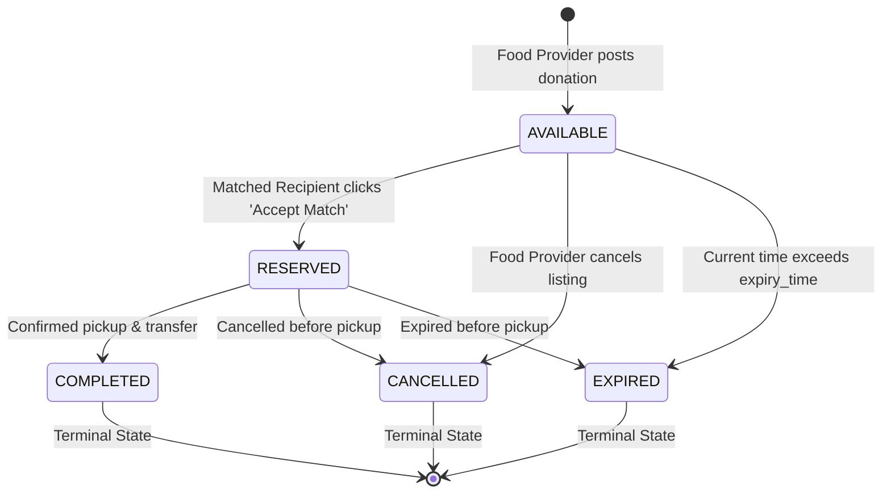
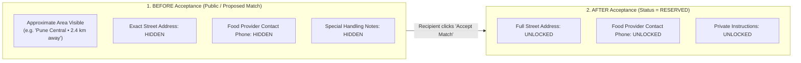
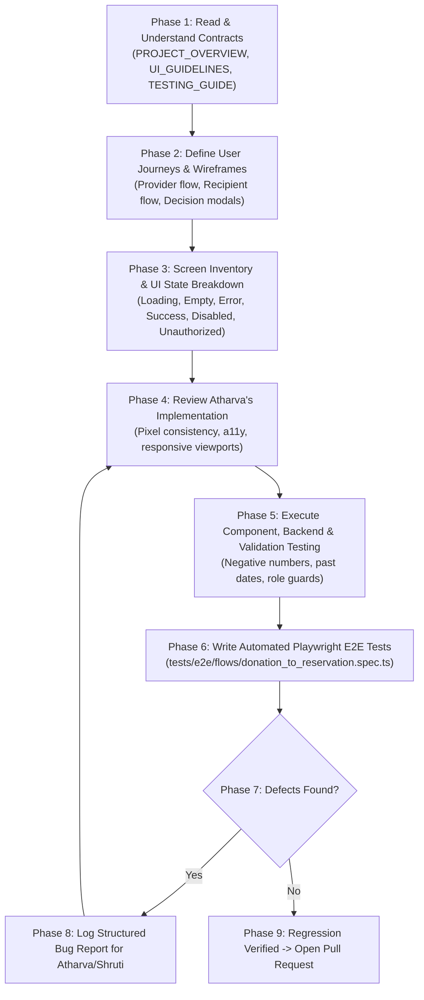

# Vishwajeet's Complete Role & Work Guide — FoodSync AI

> **Status**: Architecture Frozen — Authoritative Handbook for UI/UX Design & QA Testing  
> **Target Audience**: Vishwajeet  
> **Assigned Working Branch**: `feature/ui-testing`  
> **Primary Role**: UI/UX Designer & QA / Testing Lead  
> **Primary Repository Testing & Design Areas**: `frontend/components/__tests__/`, `backend/tests/`, `tests/e2e/`, and `docs/`  
> **Repository**: [KShruti772/FoodSync-AI](https://github.com/KShruti772/FoodSync-AI)

---

## 🌟 Core Team Principle

> **"Vishwajeet is responsible for making sure FoodSync AI is understandable, usable, accessible, testable, and behaves correctly from the user's perspective. He owns UI/UX design specifications, component-level UI tests, backend tests, and automated E2E browser journeys. Atharva is responsible for implementing the production frontend. Shruti owns the backend, business logic, and AI matching engine implementation. Lokeshwari owns the database, models, and migrations."**

---

## 👥 Final Team Ownership Model

| Teammate | Role | Assigned Branch | Scope & Owned Directories |
| :--- | :--- | :--- | :--- |
| **Shruti** | **Team Lead / Backend / AI / Architecture** | `feature/backend-ai` | `backend/app/api/`<br>`backend/app/core/`<br>`backend/app/schemas/`<br>`backend/app/services/` (inc. `services/matching/`)<br>`backend/app/utils/`<br>*(Backend & AI Implementation)* |
| **Atharva** | **Frontend Developer** | `feature/frontend` | `frontend/app/`<br>`frontend/components/`<br>`frontend/hooks/`<br>`frontend/lib/`<br>`frontend/services/`<br>*(Next.js Frontend Implementation)* |
| **Lokeshwari** | **Database Developer** | `feature/database` | `backend/app/models/`<br>`backend/app/repositories/`<br>`backend/alembic/`<br>*(PostgreSQL Schema & Migrations)* |
| **Vishwajeet** | **UI/UX + Testing / QA Lead** | `feature/ui-testing` | `frontend/components/__tests__/` *(UI/Component Tests)*<br>`backend/tests/` *(Backend Unit & Integration Tests)*<br>`tests/e2e/` *(Playwright E2E Tests)*<br>`docs/` *(UI/UX Specs, Test Matrices & User Flows)* |

---

# SECTION 1 — Where Vishwajeet Works

Vishwajeet works strictly on the `feature/ui-testing` branch. His assigned testing and specification directories in the repository are:

```text
FoodSync-AI/
│
├── frontend/components/__tests__/     # ⭐ UI / COMPONENT-LEVEL TESTS (Vitest)
│   ├── DonationCard.test.tsx          # Component rendering & privacy masking tests
│   └── MatchActionModal.test.tsx      # Modal accept/reject interaction tests
│
├── backend/tests/                     # ⭐ BACKEND UNIT & INTEGRATION TESTS (Pytest + HTTPX)
│   ├── unit/                          # Isolated unit tests (matching scoring math, schema bounds)
│   └── integration/                   # Endpoint integration tests (auth, donation CRUD, match accept/reject)
│
├── tests/e2e/                         # ⭐ FULL E2E BROWSER TESTS (Playwright)
│   └── flows/
│       └── donation_to_reservation.spec.ts # Real browser end-to-end user journeys
│
└── docs/                              # ⭐ UI/UX SPECIFICATIONS & TEST MATRICES
    ├── UI_GUIDELINES.md               # Design tokens, screen specs, UI states, privacy rules
    ├── TESTING_GUIDE.md               # Test matrices, execution 
    commands, QA checklists
    └── VISHWAJEET_GUIDE.md            # This complete operational guide
```

- **UI/UX Work**: Produced and documented in `docs/` as specifications, user flows, wireframe breakdowns, and review checklists.
- **Frontend Component Tests (`frontend/components/__tests__/`)**: Tests individual React/Next.js UI components in isolation (mocking props, testing click interactions, verifying privacy masking).
- **Backend Tests (`backend/tests/`)**: Tests backend/API behavior according to the project's testing strategy (unit tests for matching formula math and schema validation, integration tests for REST routes and status transitions).
- **Automated E2E Tests (`tests/e2e/`)**: Tests complete real user journeys in a real browser using Playwright.
- **No Extra Folders**: Do not invent separate application code folders. Atharva implements all production frontend code inside `frontend/`, and Shruti implements backend code inside `backend/app/`.

---

# SECTION 2 — Explain UI and UX Like a Beginner

If you are new to software engineering terms, here is the easiest way to understand the difference between **UI** and **UX**:

### What is UI (User Interface)?
> **UI is what the user SEES.**
- Visual elements: Buttons, input fields, cards, navigation menus, colors, typography, icons, status badges, and layout positioning.
- *FoodSync Example*: The green `#10B981` color on the **"Accept Match"** button, the rounded card container showing food details, and the text font size.

### What is UX (User Experience)?
> **UX is how EASY and CLEAR the product is to USE.**
- Usability factors: Can a food provider manager create a donation in under 60 seconds without confusion? Does a shelter manager understand what happens when they click "Accept Match"? Is there clear feedback when an API call fails? Is sensitive address information kept private until a match is confirmed?
- *FoodSync Example*: When a recipient clicks "Accept Match", the button shows a loading spinner so they don't click twice, followed by a clear success message revealing the exact pickup address and food provider contact phone number.

```text
┌─────────────────────────────────────────────────────────────┐
│ UI = The Appearance (Colors, Shapes, Fonts, Buttons, Cards) │
├─────────────────────────────────────────────────────────────┤
│ UX = The Feeling & Clarity (Intuitive, Safe, Fast, Clear)   │
└─────────────────────────────────────────────────────────────┘
```

---

# SECTION 3 — Vishwajeet's Core Responsibilities

## A. Understand the Domain & Standard Terminology

Always use the official project terms across all documentation, test cases, and communication:

| Standard Term | Meaning in FoodSync AI | Do NOT Use |
| :--- | :--- | :--- |
| **Food Provider** | Commercial food entity posting surplus food (restaurant, caterer, grocer). | *Donor, Supplier, Vendor, Cook* |
| **Recipient** | Verified charity receiving surplus food (shelter, food bank, orphanage). | *Receiver, Charity, Customer* |
| **Administrator** | Platform operator managing verification (provisioned via CLI). | *Superuser, Root, Mod* |
| **Food Donation** | A single listing of surplus meals. | *Food Post, Item, Drop* |
| **Match** | An automated compatibility pairing between a donation and recipient. | *Pairing, Deal, Assignment* |
| **Reservation** | An accepted match holding surplus food for pickup. | *Claim, Hold* |

### Strict Donation Lifecycle
The system recognizes **only** these 5 lifecycle states:



> [!CAUTION]
> **NEVER use the word `CLAIMED` anywhere in test cases, UI text, or documentation. The state machine strictly transitions from `AVAILABLE` $\rightarrow$ `RESERVED` $\rightarrow$ `COMPLETED`.**

---

## B. Master the Core User Flows

### 1. Food Provider Flow
```text
[Register as FOOD_PROVIDER]
       ↓
[Login with Email & Password]
       ↓
[Provider Dashboard]
       ↓
[Click "Create Donation"]
       ↓
[Fill Details: Title, Food Type, Quantity Meals, Expiry Time, Pickup Address]
       ↓
[Submit Form]
       ↓
[Backend Validates & Runs Synchronous AI Matching]
       ↓
[Donation Created with Status: AVAILABLE]
       ↓
[Recipient Accepts Match -> Status changes to: RESERVED]
       ↓
[Recipient arrives for pickup]
       ↓
[Click "Complete Pickup" -> Status changes to: COMPLETED -> Impact Logged]
```

### 2. Recipient Organization Flow
```text
[Register as RECIPIENT]
       ↓
[Login with Email & Password]
       ↓
[Configure Profile: Daily Meal Capacity, Storage Facilities (Dry/Refrigerated), Dietary Preference]
       ↓
[Recipient Dashboard]
       ↓
[Receive In-App Notification of Ranked Match]
       ↓
[Open Match Card -> Inspect Compatibility Score & Masked Approximate Location]
       ↓
[Decision Modal: Accept or Reject?]
   ├── If ACCEPT: Match becomes ACCEPTED, Donation becomes RESERVED -> Full Address Unlocked -> Coordinate Pickup
   └── If REJECT: Match becomes REJECTED -> Offer dismissed -> Next ranked recipient notified
```

---

# SECTION 4 — Screen Inventory (Role-by-Role)

Atharva will implement these exact screens. Vishwajeet must inspect, review, and test every single one:

### 1. Public & Authentication Screens
- `frontend/app/page.tsx`: Public Landing Page with platform impact metrics (meals rescued, $\text{CO}_2$ saved).
- `frontend/app/login/page.tsx`: Authentication screen (Email & Password input).
- `frontend/app/register/page.tsx`: Registration screen with Role selector (`FOOD_PROVIDER` or `RECIPIENT`).

### 2. Food Provider Portal
- `frontend/app/provider/page.tsx`: Provider Dashboard displaying active surplus listings, match statuses, and completed history.
- `frontend/app/provider/create/page.tsx`: Donation Creation Form with real-time validation.

### 3. Recipient Organization Portal
- `frontend/app/recipient/page.tsx`: Recipient Dashboard displaying incoming match notifications, compatibility breakdown, and active reservations.
- `frontend/app/recipient/profile/page.tsx`: Capacity profile management (daily meals capacity, storage options, dietary filters, travel radius).

> [!IMPORTANT]
> **No Admin UI Screens in MVP**: Administrator accounts are managed exclusively via backend CLI seed scripts (`docs/SECURITY_GUIDELINES.md`). Do not invent or test unapproved Admin web screens.

---

# SECTION 5 — Wireframes & UI Screen Specifications

When reviewing a screen before and after Atharva builds it, Vishwajeet must verify every item in this specification format:

```text
Screen Name:           [e.g., Create Donation Screen]
URL Path:              [e.g., /provider/create]
Primary User:          [e.g., FOOD_PROVIDER]
Purpose:               [Allow food providers to list surplus meals before they spoil]

Main Components:
- Navbar with Provider profile and active role badge
- Multi-field Donation Form
- Submit button with disabled loading state
- Cancel / Back button

Input Fields & Validations:
1. Title: Text, required, max 255 chars (e.g. "50 Packed Veg Biryani Meals")
2. Food Type: Select dropdown (VEGETARIAN_COOKED, NON_VEGETARIAN_COOKED, PACKAGED_GROCERY, PRODUCE_RAW, BAKERY)
3. Quantity Meals: Number, required, must be an integer > 0
4. Perishable: Checkbox (default: checked)
5. Preparation Time: DateTime picker, required
6. Expiry Cutoff: DateTime picker, required, must be at least 30 minutes in the future
7. Pickup Address: Text, required (street address)
8. Special Notes: Textarea, optional (e.g. "Bring insulated transport containers")

Expected UI Feedback States:
- Loading: Submit button shows spinner and disables
- Success: Green toast alert ("Donation created successfully! Matching with local recipients...") -> redirects to /provider
- Validation Error: Red helper text beneath invalid input (e.g. "Quantity must be greater than 0")
- Server Error: Top banner alert ("Unable to create donation. Please check your connection and retry.")
- Unauthorized: If a RECIPIENT tries to visit /provider/create, display 403 Forbidden banner or redirect to /login
```

---

# SECTION 6 — Design System Consistency

Vishwajeet ensures the frontend strictly follows the design system tokens defined in [`docs/UI_GUIDELINES.md`](file:///Users/shrutikondabathula/FoodSync-AI/docs/UI_GUIDELINES.md):

- **Primary Brand Color**: Emerald (`#10B981` / `bg-emerald-500`, hover: `#059669` / `hover:bg-emerald-600`)
- **Secondary Accent**: Teal (`#0D9488` / `bg-teal-600`)
- **Background Light**: Slate-50 (`#F8FAFC` / `bg-slate-50`)
- **Card Surface**: Pure White (`#FFFFFF` / `bg-white`, border: `#E2E8F0` / `border-slate-200`)
- **Typography**: Clean sans-serif (`Inter`) with strict hierarchy ($H_1: 24-30\text{px}$, $H_2: 20\text{px}$, $H_3: 18\text{px}$, Body: $14\text{px}$, Small: $12\text{px}$).
- **Status Badges Consistency**:
  - `AVAILABLE`: Blue / Sky pill (`bg-sky-100 text-sky-800`)
  - `RESERVED`: Amber / Yellow pill (`bg-amber-100 text-amber-800`)
  - `COMPLETED`: Emerald / Green pill (`bg-emerald-100 text-emerald-800`)
  - `CANCELLED` / `EXPIRED`: Slate / Red pill (`bg-slate-100 text-slate-700`)

---

# SECTION 7 — Matching UI & Explainability

The MVP matching algorithm is a **transparent, deterministic multi-factor formula**, NOT a black-box machine learning model:

$$\text{Score} = 0.35 \times S_{dist} + 0.30 \times S_{urg} + 0.20 \times S_{cap} + 0.15 \times S_{req}$$

### What Vishwajeet Must Check in Match UI:
1. **Score Display**: Ensure the match compatibility percentage is rendered clearly (e.g., `"92% Compatibility Score"`).
2. **Score Factor Breakdown**: Verify the sub-scores are visible to the recipient:
   - **Distance**: e.g., *"2.4 km away (Within travel radius)"*
   - **Urgency**: e.g., *"Expires in 3 hours"*
   - **Capacity**: e.g., *"50 meals requested (Fits your daily capacity of 100)"*
   - **Dietary Fit**: e.g., *"Vegetarian matches your organization preference"*
3. **Understandability**: The user must immediately understand *why* this match was recommended.

---

# SECTION 8 — Privacy UX & Address Reveal Invariant

> [!CAUTION]
> **Data Privacy is a core security invariant. Hiding text with CSS is NOT security.**

Vishwajeet must verify that private data is never exposed prematurely:



### Vishwajeet's Testing Checklist for Privacy:
- [ ] Inspect browser Network tab (`GET /api/v1/donations`): Ensure `pickup_address` is not present in raw JSON before match acceptance.
- [ ] Ensure food provider contact phone number is not visible to general authenticated users.
- [ ] Confirm full address unlocks instantly upon successful match acceptance (`POST /api/v1/matches/{id}/accept`).

---

# SECTION 9 — Form Validation & Error UX

Vishwajeet tests forms to ensure users receive immediate, helpful feedback:

| Input Field | Invalid Input Scenario | Bad Error Message (Reject) | Good Error Message (Approve) |
| :--- | :--- | :--- | :--- |
| **Quantity** | User enters `-5` or `0` | `"Error"` | `"Quantity must be greater than 0 meals."` |
| **Expiry Time**| User selects a past timestamp | `"Invalid date"` | `"Expiry time must be at least 30 minutes in the future."` |
| **Email** | User enters `"user@"` | `"Invalid"` | `"Please enter a valid email address (e.g. name@charity.org)."` |
| **Password** | User enters 3 characters | `"Wrong password"` | `"Password must be at least 8 characters long."` |
| **Required** | User leaves title blank | `"Missing field"` | `"Title is required."` |

---

# SECTION 10 — Vishwajeet's Testing Responsibilities & Testing Layers

### Understanding the 3 Testing Layers in FoodSync AI

| Testing Layer | Directory | Framework | What It Checks | FoodSync AI Example |
| :--- | :--- | :--- | :--- | :--- |
| **1. UI / Component Test** | `frontend/components/__tests__/` | Vitest / React Testing Library | **What the user sees and clicks in a single UI component.** | Renders `DonationCard.tsx` with mock data and verifies that `pickup_address` is masked with `"Pune Central • 2.4 km away"` instead of the real street address. |
| **2. Backend / API Test** | `backend/tests/` | Pytest + HTTPX | **The communication and business rules between client and server.** | Sends `POST /api/v1/donations` with `quantity_meals = -5` and verifies the server returns `422 Unprocessable Entity` with a clear validation error. |
| **3. End-to-End (E2E) Test**| `tests/e2e/` | Playwright | **A complete real-world user journey across the full running system.** | Opens Chromium browser, logs in as Food Provider, posts 50 meals, logs in as Recipient, opens match alert, clicks "Accept Match", and verifies status changes to `RESERVED` and full address unlocks. |

### 10 Testing Categories Covered by Vishwajeet:
1. **Functional Testing**: Verifying every button, dropdown, form, and link works as specified.
2. **UI Visual Testing**: Verifying pixel alignment, font consistency, colors, and borders.
3. **UX Usability Testing**: Verifying workflow clarity, navigation smoothness, and friction-free interactions.
4. **Validation Testing**: Verifying boundary conditions, negative numbers, empty inputs, and long strings.
5. **Responsive Testing**: Testing viewports at $375\text{px}$ (mobile), $768\text{px}$ (tablet), and $1440\text{px}+$ (desktop).
6. **Accessibility Testing (a11y)**: Keyboard navigation (`Tab`, `Enter`, `Esc`), color contrast (WCAG 2.1 AA), screen reader `aria-label` tags.
7. **Privacy Testing**: Ensuring unreserved listings mask street addresses and contact phones.
8. **Regression Testing**: Re-running previous tests after Atharva fixes a bug to ensure nothing broke.
9. **End-to-End (E2E) Testing**: Automated browser user journeys with Playwright (`tests/e2e/`).
10. **Error-State Testing**: Simulating server errors (500), network disconnects, and unauthorized actions (401/403).

---

# SECTION 11 — The 6 Mandatory UI States

For **every single screen**, Vishwajeet verifies that all 6 UI states are handled cleanly:

```text
┌─────────────────┬────────────────────────────────────────────────────────────┐
│ UI State        │ Expected Visual Appearance                                 │
├─────────────────┼────────────────────────────────────────────────────────────┤
│ 1. Loading      │ Animated skeleton pulse cards (LoadingSkeleton.tsx).       │
│                 │ Never render a blank white screen or raw freezing text.    │
├─────────────────┼────────────────────────────────────────────────────────────┤
│ 2. Empty        │ Illustrated empty box with friendly CTA (EmptyState.tsx). │
│                 │ "No active donations found in your radius."                │
├─────────────────┼────────────────────────────────────────────────────────────┤
│ 3. Error        │ Clean red alert banner with "Retry" button.                │
│                 │ Never display raw Python/JSON stack traces to the user.    │
├─────────────────┼────────────────────────────────────────────────────────────┤
│ 4. Success      │ Rendered data cards with status badge + green toast alert. │
│                 │ "Match accepted! Pickup coordination details unlocked."    │
├─────────────────┼────────────────────────────────────────────────────────────┤
│ 5. Disabled     │ Form submit buttons styled with disabled:opacity-50.       │
│                 │ Prevents accidental double-clicks during API calls.        │
├─────────────────┼────────────────────────────────────────────────────────────┤
│ 6. Unauthorized │ Clean permission banner or automated redirect to /login.   │
│                 │ Never allow a Recipient into /provider/create.             │
└─────────────────┴────────────────────────────────────────────────────────────┘
```

---

# SECTION 12 — Standard Test Case Structure & Examples

Every test case written by Vishwajeet must follow this standard format:

```text
Test ID:          TC-AUTH-01
Feature:          User Login
Role:             FOOD_PROVIDER
Precondition:     User account exists in database (email: provider@cafe.com)
Action:           Enter email, valid password, and click "Sign In"
Expected Result:  HTTP 200, JWT stored securely, redirected to /provider dashboard
Actual Result:    As expected.
Status:           PASS
Bug Reference:    None
```

```text
Test ID:          TC-DON-03
Feature:          Donation Validation (Negative Meals)
Role:             FOOD_PROVIDER
Precondition:     User is logged in on /provider/create
Action:           Enter quantity_meals = -10 and click "Publish Donation"
Expected Result:  Form submission blocked. Inline error: "Quantity must be greater than 0"
Actual Result:    Button was clickable and caused API 422 error banner.
Status:           FAIL
Bug Reference:    BUG-014 (Reported to Atharva)
```

---

# SECTION 13 — Important FoodSync Test Scenarios

### 1. Authentication Scenarios
- `TC-SEC-01`: Attempt admin self-registration (`role: ADMIN`) $\rightarrow$ Must be rejected (`400 Bad Request`).
- `TC-SEC-02`: Valid provider registration $\rightarrow$ `201 Created`, JWT returned, redirects to `/provider`.
- `TC-SEC-03`: Invalid password login $\rightarrow$ `"Invalid email or password"` generic message (no user enumeration).

### 2. Food Donation Scenarios
- `TC-DON-01`: Create valid donation (meals = 50, future expiry) $\rightarrow$ `201 Created`, status `AVAILABLE`.
- `TC-DON-02`: Missing required fields $\rightarrow$ Form blocks submission with inline error labels.
- `TC-DON-04`: Past expiry time $\rightarrow$ Blocked with `"Expiry time must be in the future"`.

### 3. Matching Engine & UI Scenarios
- `TC-MAT-01`: Provider & Recipient in same area $\rightarrow$ Displays high compatibility score ($>90\%$).
- `TC-MAT-03`: Recipient outside radius ($>15\text{ km}$) $\rightarrow$ Candidate omitted from match inbox.
- `TC-MAT-05`: Dietary mismatch (non-veg food $\rightarrow$ vegetarian-only recipient) $\rightarrow$ Disqualified.

### 4. Acceptance & Concurrency Scenarios
- `TC-RES-01`: Valid match acceptance $\rightarrow$ Status $\rightarrow$ `RESERVED`, full address unlocked.
- `TC-RES-02`: Double-reservation concurrency $\rightarrow$ If Recipient B tries to accept an already `RESERVED` donation, system responds `409 Conflict ("DONATION_ALREADY_RESERVED")`.
- `TC-RES-04`: Valid match rejection $\rightarrow$ Offer dismissed from inbox, next ranked candidate notified.

### 5. In-App Notifications Scenarios
- `TC-NOT-01`: New match generated $\rightarrow$ In-app notification bell counter increments.
- `TC-NOT-02`: Click notification $\rightarrow$ Opens match modal and marks notification as read.

---

# SECTION 14 — Automated End-to-End (E2E) Testing

Automated E2E tests live under [`tests/e2e/`](file:///Users/shrutikondabathula/FoodSync-AI/tests/e2e) and run Playwright against the full application:

```typescript
// tests/e2e/flows/donation_to_reservation.spec.ts
import { test, expect } from '@playwright/test';

test('Full journey: Provider posts surplus -> Recipient accepts reservation', async ({ page }) => {
  // Load credentials from environment variables / test fixtures (never hardcode secrets)
  const testEmail = process.env.TEST_PROVIDER_EMAIL || 'provider@restaurant.com';
  const testPassword = process.env.TEST_PROVIDER_PASSWORD || 'TestProviderPassword!123';

  // 1. Provider logs in
  await page.goto('/login');
  await page.fill('input[type="email"]', testEmail);
  await page.fill('input[type="password"]', testPassword);
  await page.click('button[type="submit"]');
  await expect(page).toHaveURL('/provider');

  // 2. Provider creates donation
  await page.goto('/provider/create');
  await page.fill('input[name="title"]', '40 Fresh Lunch Boxes');
  await page.fill('input[name="quantity_meals"]', '40');
  await page.click('button[type="submit"]');
  await expect(page.locator('.status-badge')).toHaveText('AVAILABLE');

  // 3. Recipient inspects match and accepts
  // (Full journey validation with address reveal)
});
```

> [!CAUTION]
> **Never commit passwords, API keys, JWT secrets, database credentials, or other secrets to Git.** Always load test credentials from environment variables or mock test fixtures.

---

# SECTION 15 — Collaboration with Atharva (Frontend)

Vishwajeet and Atharva work as close partners, but with strict separation of duties:

```text
┌──────────────────────────────────────┐     ┌──────────────────────────────────────┐
│ VISHWAJEET                           │     │ ATHARVA                              │
│ • Defines what the user sees & feels │     │ • Implements Next.js components      │
│ • Creates user flows & wireframes    │ ──> │ • Writes TypeScript & Tailwind CSS   │
│ • Specifies required UI states       │     │ • Connects FastAPI endpoints         │
│ • Tests the built UI & reports bugs  │ <── │ • Fixes frontend defects & crashes   │
└──────────────────────────────────────┘     └──────────────────────────────────────┘
```

### The 7-Step Collaboration Cycle:
1. **Vishwajeet** writes user flows and wireframe requirements.
2. **Shruti** reviews product/API behavior when needed.
3. **Atharva** builds the Next.js pages and reusable components on `feature/frontend`.
4. **Vishwajeet** tests Atharva's implementation across viewports, states, and accessibility.
5. **Vishwajeet** files a structured bug report if defects are found.
6. **Atharva** fixes the code on his branch.
7. **Vishwajeet** retests and verifies the fix.

> **Rule**: Vishwajeet should **not** edit Atharva's frontend code directly unless explicitly agreed.

---

# SECTION 16 — Collaboration with Shruti (Backend / AI / Lead)

Contact **Shruti** (`feature/backend-ai`) for:
- API endpoint contracts, request payloads, and response JSON formats.
- Authentication & JWT token behavior.
- AI matching formula questions and score breakdowns.
- Data privacy rules and authorization checks.
- System integration decisions.

*Example*: If you are unsure whether the pickup address should appear on a rejected match, ask **Shruti** (Answer: No, it must remain private).

---

# SECTION 17 — Collaboration with Lokeshwari (Database)

Contact **Lokeshwari** (`feature/database`) for:
- Database test data fixtures and seed accounts.
- Verifying database constraints (e.g. `quantity_meals > 0`, foreign key cascades).
- Donation status persistence in PostgreSQL.

> **Rule**: Never edit files in `backend/app/models/`, `backend/app/repositories/`, or `backend/alembic/`.

---

# SECTION 18 — Repository Folder Ownership Matrix

| Repository Folder | Primary Owner | Vishwajeet's Role & Access |
| :--- | :--- | :--- |
| `frontend/app/` | **Atharva** | Review UI/UX & test user flows; do NOT own production code |
| `frontend/components/` | **Atharva** | Review visual design & accessibility; do NOT own production code |
| `frontend/components/__tests__/` | **Vishwajeet** | ⭐ **PRIMARY OWNER**: Write and maintain Vitest component UI tests |
| `frontend/hooks/` | **Atharva** | Client state management; do NOT own code |
| `frontend/lib/` | **Atharva** | Frontend utilities; do NOT own code |
| `frontend/services/` | **Atharva** | Review API fetch wrappers; do NOT own code |
| `backend/app/api/` | **Shruti** | Verify API contracts against docs; do NOT modify |
| `backend/app/core/` | **Shruti** | Config & security middleware; do NOT modify |
| `backend/app/schemas/`| **Shruti** | Pydantic validation schemas; do NOT modify |
| `backend/app/services/`| **Shruti** | Business logic & matching engine; do NOT modify |
| `backend/app/models/` | **Lokeshwari**| SQLAlchemy ORM models; do NOT modify |
| `backend/app/repositories/` | **Lokeshwari**| Database access layer; do NOT modify |
| `backend/alembic/` | **Lokeshwari**| Database migrations; do NOT modify |
| `backend/tests/` | **Vishwajeet** | ⭐ **PRIMARY OWNER**: Write and maintain Pytest unit & integration tests |
| `tests/e2e/` | **Vishwajeet** | ⭐ **PRIMARY OWNER**: Write and maintain Playwright E2E browser tests |
| `docs/` | **All / Lead** | ⭐ **PRIMARY UI/QA CONTRIBUTOR**: Maintain UI & testing guides |

---

# SECTION 19 — Git Workflow for `feature/ui-testing`

Vishwajeet works strictly on his assigned branch `feature/ui-testing`. **Never commit or push directly to `main`**.

### Daily Step-by-Step Git Commands:

```bash
# 1. Start of day: Check working directory is clean
git status

# 2. Switch to main and pull latest team integration
git switch main
git pull origin main

# 3. Switch to your feature branch and merge latest main
git switch feature/ui-testing
git merge main

# 4. Work on your tests in frontend/components/__tests__/, backend/tests/, tests/e2e/, or docs in docs/

# 5. Run tests locally to make sure everything passes
pytest
npx playwright test

# 6. Check what files you modified
git status
git diff

# 7. Stage and commit with conventional messages
git add frontend/components/__tests__/ backend/tests/ tests/e2e/ docs/
git commit -m "test(e2e): add provider creation and match acceptance journey"

# 8. Push to remote feature branch
git push origin feature/ui-testing

# 9. Open a Pull Request on GitHub (feature/ui-testing -> main)
```

### Strict Git Rules:
- ❌ **NO `git push --force`** on any branch.
- ❌ **NO direct pushes to `main`**.
- ❌ **NO committing `.env` files, passwords, or secret tokens**.
- ❌ **NO editing other teammates' active branches**.

---

# SECTION 20 — What Vishwajeet Must NOT Do

To maintain system stability and prevent merge conflicts, Vishwajeet must **NEVER**:
1. ❌ Implement FastAPI backend routes or business domain logic.
2. ❌ Modify database models, SQL queries, or Alembic migrations.
3. ❌ Implement Argon2id hashing or JWT authentication mechanics.
4. ❌ Modify production Next.js frontend code unless explicitly coordinated with Atharva.
5. ❌ Change business rules or API responses just to make a test pass.
6. ❌ Expose private pickup address or phone data before a match is accepted.
7. ❌ Invent unsupported product features (e.g. Admin UI screens, external SMS integrations).
8. ❌ Use the prohibited status `CLAIMED` anywhere.

---

# SECTION 21 — Vishwajeet's Step-by-Step Working Order



---

# SECTION 22 — Definition of Done (DoD)

A task assigned to Vishwajeet is complete only when:
- [ ] User flow and wireframe requirements are documented and aligned with API contracts.
- [ ] All 6 UI states (Loading, Empty, Error, Success, Disabled, Unauthorized) are verified on the screen.
- [ ] Responsive layout adapts cleanly across mobile ($375\text{px}$), tablet ($768\text{px}$), and desktop ($1440\text{px}$).
- [ ] Accessibility review passes (WCAG 2.1 AA contrast, full keyboard navigation).
- [ ] Location privacy invariant is verified (masked address before acceptance, unlocked after).
- [ ] Component-level UI tests pass in `frontend/components/__tests__/`.
- [ ] Backend unit/integration tests pass in `backend/tests/`.
- [ ] Automated Playwright E2E test runs successfully in `tests/e2e/`.
- [ ] Any discovered defects are reported and verified after fixes.
- [ ] Changes are committed with conventional messages and pushed to `feature/ui-testing`.
- [ ] Pull Request is opened against `main` and reviewed.

---

# SECTION 23 — Beginner Glossary of Terms

| Term | Simple Explanation | FoodSync AI Example |
| :--- | :--- | :--- |
| **Repository (Repo)** | The complete project folder tracked by Git. | `FoodSync-AI` |
| **Branch** | An isolated copy of the code where a developer works safely. | `feature/ui-testing` |
| **Commit** | A saved snapshot of changes with an explanatory message. | `git commit -m "test: add donation flow"` |
| **Pull Request (PR)** | A request to merge approved changes from a feature branch into `main`. | `feature/ui-testing` $\rightarrow$ `main` |
| **Frontend** | The client application running in the user's browser. | Next.js App Router in `frontend/` |
| **Backend** | The server processing logic, authentication, and matching. | FastAPI server in `backend/` |
| **API** | The communication bridge between frontend and backend. | REST JSON endpoints at `/api/v1` |
| **Test Case** | A step-by-step procedure verifying a specific feature works. | `TC-DON-01` (Create valid donation) |
| **Regression Testing**| Re-running tests to ensure new changes didn't break existing features. | Checking login after updating the donation form |
| **E2E Testing** | Testing an entire real user journey from start to finish in a real browser. | Playwright running login $\rightarrow$ create $\rightarrow$ accept |

---

# SECTION 24 — Daily Work Routine for Vishwajeet

1. **Pull `main`**: Sync the latest approved changes into `feature/ui-testing`.
2. **Review Tasks**: Identify which screen, user flow, component test, or backend test suite needs work today.
3. **Read Contracts**: Re-read the relevant section in `docs/API_CONTRACT.md` or `docs/UI_GUIDELINES.md`.
4. **Inspect UI**: Run the frontend locally and inspect Atharva's latest components.
5. **Execute QA**: Test the 6 UI states, form validation, responsiveness, and accessibility.
6. **Log Defects**: If something is broken, write a clear bug report with steps to reproduce.
7. **Write Tests**: Add or update test suites under `frontend/components/__tests__/`, `backend/tests/`, or `tests/e2e/`.
8. **Retest Fixes**: Confirm Atharva's or Shruti's bug fixes resolve the reported issues.
9. **Commit & Push**: Push clean, tested work to `origin/feature/ui-testing`.
10. **Open / Update PR**: Submit changes for team review.

---

# SECTION 25 — Communication Decision Guide

```text
Have a UI/UX layout or usability question?
      ↓
Contact VISHWAJEET & ATHARVA

Have a frontend component or TypeScript question?
      ↓
Contact ATHARVA (feature/frontend)

Have an API route, auth, JWT, or matching algorithm question?
      ↓
Contact SHRUTI (feature/backend-ai)

Have a database model, schema constraint, or test data question?
      ↓
Contact LOKESHWARI (feature/database)

Have a security, privacy rule, or project architecture question?
      ↓
Contact SHRUTI (Team Lead)
```

---

## ❓ Open Questions

1. **E2E Test File Structure**:
   - The team should decide whether to keep automated journeys in a unified file (`tests/e2e/flows/donation_to_reservation.spec.ts`) or split them into role-specific specs (`provider.spec.ts`, `recipient.spec.ts`).
2. **Phase 2 Scope Reminder**:
   - Advanced features (predictive ML, multi-stop route optimization, SMS gateways, and recipient wishlists) are deferred to Phase 2. The MVP strictly focuses on deterministic matching and in-app notifications.
